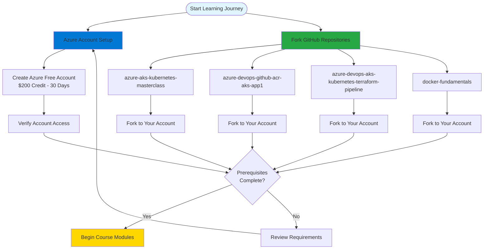

# Pre-requisites

## 📊 Architecture & Workflow Diagram

### Understanding the Diagram

- **Azure Free Account**: Get started with **$200 USD credit** valid for **30 days**, perfect for completing all hands-on labs in this course
- **Fork Strategy**: Create **personal copies** of all **4 GitHub repositories** to ensure you can modify and track your own progress independently
- **Main Repository**: The **azure-aks-kubernetes-masterclass** contains all course materials, manifests, and **250+ slide presentation**
- **DevOps Integration**: Repository for **Azure DevOps** pipeline examples that demonstrate **CI/CD workflows** with ACR and AKS
- **Terraform Automation**: Dedicated repository for **Infrastructure as Code** examples to provision **AKS clusters** using Terraform
- **Docker Foundation**: Separate repository covering **Docker fundamentals** needed before working with **Kubernetes containers**
- **Parallel Setup**: Both **Azure account** and **repository forks** can be completed **simultaneously** to save time
- **Verification Checkpoint**: Ensure **Azure portal access** and **repository ownership** before proceeding to course modules
- **Ready State**: All **prerequisites complete** means you have both the **cloud infrastructure** and **code repositories** ready for hands-on practice
- **Iterative Review**: If any prerequisite is **incomplete**, the workflow guides you back to address **missing requirements**

---

## Step-01: Azure Cloud Subscription
- [Azure Free Account](https://azure.microsoft.com/en-in/free/)
- 200 dollar credit for first 30 days

## Step-02: Fork Course Github Repositories
- [Azure Kubernetes Service with Azure DevOps and Terraform](https://github.com/stacksimplify/azure-aks-kubernetes-masterclass)
- [Azure DevOps for Kubernetes Workloads running on Azure AKS Cluster](https://github.com/stacksimplify/azure-devops-github-acr-aks-app1)
- [Provision Azure AKS Cluster using Terraform and Azure DevOps](https://github.com/stacksimplify/azure-devops-aks-kubernetes-terraform-pipeline)
- [Docker Fundamentals](https://github.com/stacksimplify/docker-fundamentals)
- [Presentation with 250 Slides outlining the various architectures and designs we are going to do in this course](https://github.com/stacksimplify/azure-aks-kubernetes-masterclass/tree/master/ppt-presentation)
- **Important Note:** Please go to these repositories and FORK these repositories and make use of them during the course.
