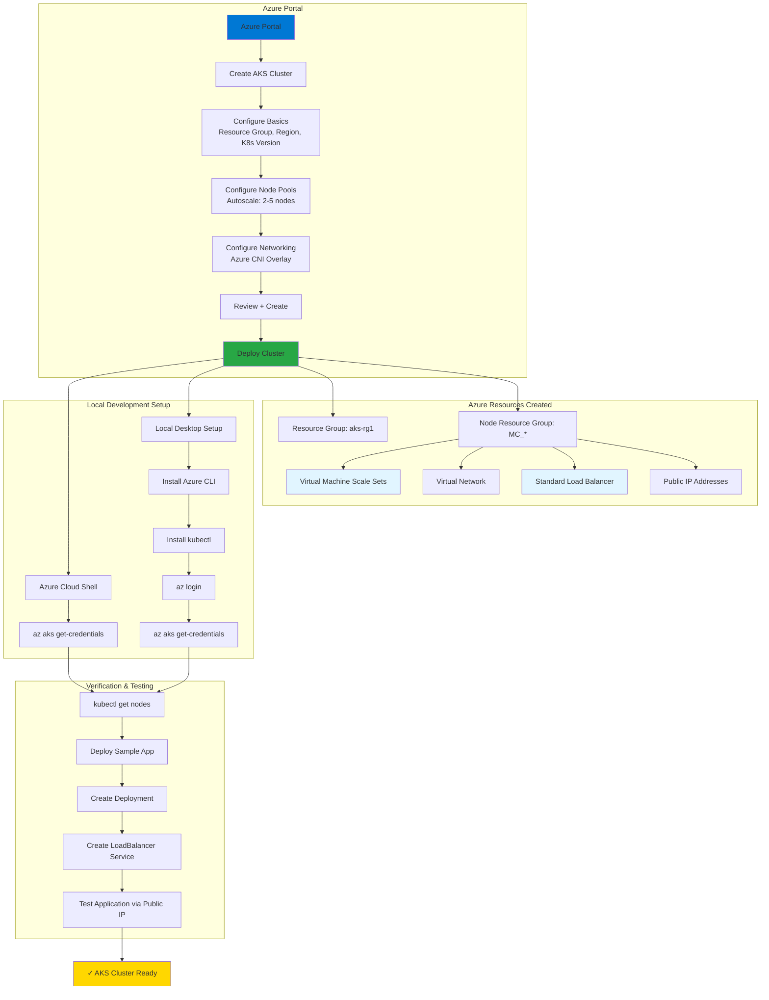

# Create AKS Cluster

## 📊 Architecture & Workflow Diagram



### Understanding the Diagram

- **Azure Portal Workflow**: Create your **AKS cluster** through the **Azure Portal UI** by configuring **basics, node pools, networking, and integrations** in a step-by-step wizard
- **Resource Groups**: AKS creates **two resource groups** - your main **aks-rg1** and an auto-managed **MC_*** group containing all infrastructure resources
- **Node Pool Configuration**: Set up **autoscaling** with a minimum of **2 nodes** and maximum of **5 nodes** using **Standard D2ls v6** instances for cost-effective learning
- **Networking Stack**: Uses **Azure CNI Overlay** for pod networking with a dedicated **Virtual Network**, **Standard Load Balancer**, and **public IP addresses**
- **Dual Access Methods**: Connect to your cluster via **Azure Cloud Shell** (browser-based) or **local desktop** (requires Azure CLI and kubectl installation)
- **Credential Configuration**: Use **az aks get-credentials** command to download the **kubeconfig file** and configure **kubectl** to communicate with your cluster
- **Verification Steps**: Run **kubectl get nodes** to verify **worker nodes** are in **Ready** state and confirm cluster connectivity
- **Sample Deployment**: Test the cluster by deploying a **sample application** with both a **Deployment** and **LoadBalancer Service** to verify end-to-end functionality
- **Infrastructure Components**: Behind the scenes, Azure provisions **Virtual Machine Scale Sets** for nodes, **load balancers** for traffic distribution, and **networking infrastructure**
- **Production Ready**: Once verified, your cluster is ready for deploying **production workloads** with features like **autoscaling**, **monitoring**, and **security** enabled

---

## Step-01: Introduction
- Create Azure AKS Cluster
- Connect to Azure AKS Cluster using Azure Cloud Shell
- Explore Azure AKS Cluster Resources using kubectl cli and Azure Portal
- Install Azure CLI, kubectl CLI on local desktop and connect to Azure AKS Cluster using Azure CLI from local desktop
- Deploy Sample Application on AKS Cluster and test
- Clean-up Kubernetes resources deployed as part of this demo

## Step-02: Create AKS Cluster
- Create Kubernetes Cluster
### Basics
- **Subscription:** StackSimplify-Paid-Subscription
- **Resource Group:** Creat New: aks-rg1
- **Cluster preset configuration:** Dev/Test
- **Kubernetes Cluster Name:** aksdemo1  
- **Region:** (US) East US
- **Fleet Manager:** NONE (LEAVE TO DEFAULT)
- **Availability zones:** NONE (LEAVE TO DEFAULT)
- **AKS Pricing Tier:** Free
- **Kubernetes Version:** Select what ever is latest stable version
- **Automatic upgrade:** Enabled with patch (recommended)
- **Node security channel type:** Node Image (LEAVE TO DEFAULT)
  - **Security channel scheduler:** Every week on Sunday (recommended)
- **Authentication and Authorization:** 	Local accounts with Kubernetes RBAC    
### Node Pools
- In Nodepools, **Update node pool**
  - **Node pool name:** agentpool (LEAVE TO DEFAULT)
  - **Mode:** system (LEAVE TO DEFAULT)
  - **OS SKU:** Ubuntu Linux  (LEAVE TO DEFAULT)
  - **Availability zones:** ZONES 1,2,3 (LEAVE TO DEFAULT)
  - **Node size:** Standard D2ls v6 (2 vcpus, 4 GiB memory)
  - **Scale method:** Autoscale
  - **Minimum node count:** 2
  - **Maximum node count:** 5
  - REST ALL LEAVE TO DEFAULTS
  - Click on **UPDATE**
- REST ALL LEAVE TO DEFAULTS
### Networking
- **Private access**
  - Enable private cluster: UNCHECKED (LEAVE TO DEFAULTS)
- **Public access**
  - Set authorized IP ranges: UNCHECKED (LEAVE TO DEFAULTS)
- **Container networking:** 
  - Network configuration: Azure CNI Overlay
- **Bring your own Azure virtual network:** CHECKED  
  - Review all the auto-populated details 
  - Virtual Network
  - Cluster Subnet
  - Kubernetes Service address range
  - Kubernetes DNS Service IP Address
  - DNS Name prefix
- **Network Policy:** None (LEAVE TO DEFAULTS)
- **Load balancer:** Standard
### Integrations
  - **Azure Container Registry:** None
  - All leave to defaults
### Monitoring
  - All leave to defaults
### Security
  - All leave to defaults  
### Advanced
  - All leave to defaults  
### Tags
  - All leave to defaults 
### Review + Create
  - Click on **Create**


## Step-03: Cloud Shell - Configure kubectl to connect to AKS Cluster
- Go to https://shell.azure.com
```t
# Template
az aks get-credentials --resource-group <Resource-Group-Name> --name <Cluster-Name>

# Replace Resource Group & Cluster Name
az aks get-credentials --resource-group aks-rg1 --name aksdemo1

# Get kubectl client version only (shows client version only (no server required))
kubectl version --client=true

# Get kubectl version (Displays both client CLI and k8s server versions)
kubectl version 

# List Kubernetes Worker Nodes
kubectl get nodes 
kubectl get nodes -o wide
```

## Step-04: Explore Cluster Control Plane and Workload inside that
```t
# List Namespaces
kubectl get namespaces
kubectl get ns

# List Pods from all namespaces
kubectl get pods --all-namespaces

# List all k8s objects from Cluster Control plane
kubectl get all --all-namespaces
```

## Step-05: Explore the AKS cluster on Azure Management Console
- Explore the following features on high-level
  - Overview
  - Kubernetes Resources
  - Settings
  - Monitoring
  - Automation


## Step-06: Local Desktop - Install Azure CLI and Azure AKS CLI
```t
# Install Azure CLI (MAC)
brew update && brew install azure-cli

# Verify AZ CLI version
az --version

# Install Azure AKS CLI
sudo az aks install-cli

# Get kubectl client version only (shows client version only (no server required))
kubectl version --client=true

# Get kubectl version (Displays both client CLI and k8s server versions)
kubectl version

# Login to Azure
az login

# Configure Cluster Creds (kube config)
az aks get-credentials --resource-group aks-rg1 --name aksdemo1

# List AKS Nodes
kubectl get nodes 
kubectl get nodes -o wide
```
- **Reference Documentation Links**
- https://docs.microsoft.com/en-us/cli/azure/?view=azure-cli-latest
- https://docs.microsoft.com/en-us/cli/azure/aks?view=azure-cli-latest

## Step-07: Deploy Sample Application and Test
- Don't worry about what is present in these two files for now. 
- By the time we complete **Kubernetes Fundamentals** sections, you will be an expert in writing Kubernetes manifest in YAML.
- For now just focus on result. 
```t
# Deploy Application
kubectl apply -f kube-manifests/

# Verify Pods
kubectl get pods

# Verify Deployment
kubectl get deployment

# Verify Service (Make a note of external ip)
kubectl get service

# Access Application
http://<External-IP-from-get-service-output>

# Review the Kubernetes Resources in Azure Mgmt Console
Go to Kubernetes Resources
1. Namespaces
2. Workloads
3. Services and Ingress
```

## Step-07: Clean-Up
```t
# Delete Applications
kubectl delete -f kube-manifests/
```

## References
- https://docs.microsoft.com/en-us/cli/azure/install-azure-cli-macos?view=azure-cli-latest

## Why Managed Identity when creating Cluster?
- https://docs.microsoft.com/en-us/azure/aks/use-managed-identity