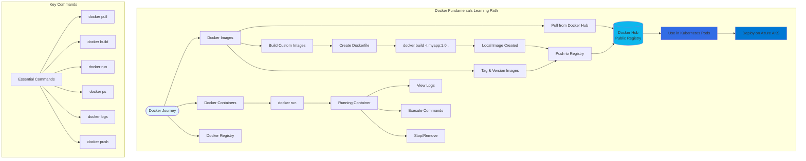

# Docker Fundamentals

## 📊 Architecture & Workflow Diagram

### Understanding the Diagram

- **Docker Images**: Immutable **templates** containing application code, runtime, libraries, and dependencies packaged together as **lightweight distributions**
- **Docker Containers**: **Running instances** of images that provide **isolated execution environments** for applications with their own filesystem and process space
- **Docker Hub Registry**: **Public repository** where you can **pull pre-built images** (like nginx, mysql) or **push your custom images** for sharing and deployment
- **Build Process**: Create custom images using a **Dockerfile** that defines **step-by-step instructions** for assembling your application and its dependencies
- **Image Versioning**: Use **tags** (like myapp:1.0, myapp:2.0) to maintain **multiple versions** of images for rollback and deployment strategies
- **Container Lifecycle**: Containers move through states - **run, running, stopped, removed** - providing **ephemeral compute** that can be easily recreated
- **Local Development**: **Build and test** images locally using **docker build** and **docker run** before pushing to **remote registries**
- **Kubernetes Integration**: Docker images become the **foundation for Kubernetes Pods**, with the same image usable across **development, staging, and production**
- **Essential Commands**: Master core Docker CLI commands for **pulling, building, running, inspecting, and managing** containers throughout the development lifecycle
- **AKS Deployment**: Images stored in **Docker Hub** or **Azure Container Registry** are pulled by **AKS worker nodes** to run your containerized applications

---

For Docker Fundamentals github repository, please click on below link:
- https://github.com/stacksimplify/docker-fundamentals