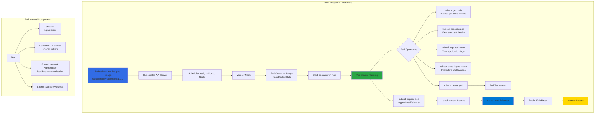

# Kubernetes  - PODs

## 📊 Architecture & Workflow Diagram



### Understanding the Diagram

- **Pod Creation**: Use **kubectl run** command to imperatively create a **single Pod** with a specified **container image** from Docker Hub
- **Kubernetes Scheduler**: The **scheduler** automatically assigns the Pod to an available **worker node** based on resource availability and constraints
- **Image Pull Process**: Worker node's **container runtime** pulls the specified **Docker image** from the registry before starting the container
- **Pod Running State**: Once container starts successfully, Pod enters **Running** state and application becomes available on the node
- **Inspection Commands**: Use **kubectl get pods** for status overview, **kubectl describe** for detailed events, and **kubectl logs** for application output
- **Interactive Access**: **kubectl exec -it** provides **shell access** inside running containers for debugging and troubleshooting
- **Service Exposure**: **kubectl expose** creates a **LoadBalancer Service** that provisions an **Azure Load Balancer** with external access
- **Public IP Assignment**: Azure automatically assigns a **public IP address** to the load balancer, enabling **internet traffic** to reach your Pod
- **Multi-Container Pods**: Pods can contain **multiple containers** sharing the same **network namespace** and **storage volumes** (sidecar pattern)
- **Pod Lifecycle Management**: Pods can be **deleted** using **kubectl delete**, which terminates all containers and releases resources

---

## Step-01: PODs Introduction
- What is a POD ?
- What is a Multi-Container POD?

## Step-02: PODs Demo
### Get Worker Nodes Status
- Verify if kubernetes worker nodes are ready. 
```
# Configure Cluster Creds (kube config) for Azure AKS Clusters
az aks get-credentials --resource-group aks-rg1 --name aksdemo1

# Get Worker Node Status
kubectl get nodes

# Get Worker Node Status with wide option
kubectl get nodes -o wide
```

### Create a Pod
- Create a Pod
```
# Template
kubectl run <desired-pod-name> --image <Container-Image> 

# Replace Pod Name, Container Image
kubectl run my-first-pod --image stacksimplify/kubenginx:1.0.0
```  

### List Pods
- Get the list of pods
```
# List Pods
kubectl get pods

# Alias name for pods is po
kubectl get po
```

### List Pods with wide option
- List pods with wide option which also provide Node information on which Pod is running
```
kubectl get pods -o wide
```

### What happened in the backgroup when above command is run?
1. Kubernetes created a pod
2. Pulled the docker image from docker hub
3. Created the container in the pod
4. Started the container present in the pod


### Describe Pod
- Describe the POD, primarily required during troubleshooting. 
- Events shown will be of a great help during troubleshooting. 
```
# To get list of pod names
kubectl get pods

# Describe the Pod
kubectl describe pod <Pod-Name>
kubectl describe pod my-first-pod 
```

### Access Application
- Currently we can access this application only inside worker nodes. 
- To access it externally, we need to create a **NodePort or Load Balancer Service**. 
- **Services** is one very very important concept in Kubernetes. 

### Delete Pod
```
# To get list of pod names
kubectl get pods

# Delete Pod
kubectl delete pod <Pod-Name>
kubectl delete pod my-first-pod
```

## Step-03: Load Balancer Service Introduction
- What are Services in k8s?
- What is a Load Balancer Service?
- How it works?

## Step-04: Demo - Expose Pod with a Service
- Expose pod with a service (Load Balancer Service) to access the application externally (from internet)
- **Ports**
  - **port:** Port on which node port service listens in Kubernetes cluster internally
  - **targetPort:** We define container port here on which our application is running.
- Verify the following before LB Service creation
  - Azure Standard Load Balancer created for Azure AKS Cluster
    - Frontend IP Configuration
    - Load Balancing Rules
  - Azure Public IP 
```
# Create  a Pod
kubectl run <desired-pod-name> --image <Container-Image> 
kubectl run my-first-pod --image stacksimplify/kubenginx:1.0.0 

# Expose Pod as a Service
kubectl expose pod <Pod-Name>  --type=LoadBalancer --port=80 --name=<Service-Name>
kubectl expose pod my-first-pod  --type=LoadBalancer --port=80 --name=my-first-service

# Get Service Info
kubectl get service
kubectl get svc

# Describe Service
kubectl describe service my-first-service

# Access Application
http://<External-IP-from-get-service-output>
```
- Verify the following after LB Service creation
  - Azure Standard Load Balancer created for Azure AKS Cluster
    - Frontend IP Configuration
    - Load Balancing Rules
  - Azure Public IP
- View the resources in Azure AKS Cluster - Resources section from Azure Portal Management Console  


## Step-05: Interact with a Pod

### Verify Pod Logs
```
# Get Pod Name
kubectl get po

# Dump Pod logs
kubectl logs <pod-name>
kubectl logs my-first-pod

# Stream pod logs with -f option and access application to see logs
kubectl logs <pod-name>
kubectl logs -f my-first-pod
```
- **Important Notes**
  - Refer below link and search for **Interacting with running Pods** for additional log options
  - Troubleshooting skills are very important. So please go through all logging options available and master them.
  - **Reference:** https://kubernetes.io/docs/reference/kubectl/cheatsheet/

### Connect to Container in a POD
- **Connect to a Container in POD and execute commands**
```
# Connect to Nginx Container in a POD
kubectl exec -it <pod-name> -- /bin/bash
kubectl exec -it my-first-pod -- /bin/bash

# Execute some commands in Nginx container
ls
cd /usr/share/nginx/html
cat index.html
exit
```

- **Running individual commands in a Container**
```
kubectl exec -it <pod-name> -- env

# Sample Commands
kubectl exec -it my-first-pod -- env
kubectl exec -it my-first-pod -- ls
kubectl exec -it my-first-pod -- cat /usr/share/nginx/html/index.html
```
## Step-06: Get YAML Output of Pod & Service
### Get YAML Output
```
# Get pod definition YAML output
kubectl get pod my-first-pod -o yaml   

# Get service definition YAML output
kubectl get service my-first-service -o yaml   
```

## Step-07: Clean-Up
```
# Get all Objects in default namespace
kubectl get all

# Delete Services
kubectl delete svc my-first-service

# Delete Pod
kubectl delete pod my-first-pod

# Get all Objects in default namespace
kubectl get all
```