# Kubernetes - ReplicaSets

## 📊 Architecture & Workflow Diagram

```mermaid
graph TB
    subgraph "ReplicaSet Creation & Management"
        Create[kubectl create -f replicaset-demo.yml]
        Create --> RSManifest[ReplicaSet Manifest<br/>replicas: 3<br/>selector: matchLabels]
        
        RSManifest --> RSController[ReplicaSet Controller]
        RSController --> DesiredState[Desired State: 3 Pods]
        
        DesiredState --> Pod1[Pod 1<br/>my-helloworld-rs-abc12]
        DesiredState --> Pod2[Pod 2<br/>my-helloworld-rs-def34]
        DesiredState --> Pod3[Pod 3<br/>my-helloworld-rs-ghi56]
        
        Pod1 --> Node1[Worker Node 1]
        Pod2 --> Node2[Worker Node 2]
        Pod3 --> Node3[Worker Node 1]
    end
    
    subgraph "High Availability Testing"
        Monitor[ReplicaSet Monitoring] --> Watch[Watch Current State]
        Watch --> PodDeleted[kubectl delete pod<br/>Pod 2 Deleted]
        PodDeleted --> Detect[ReplicaSet Detects<br/>Current: 2, Desired: 3]
        Detect --> AutoCreate[Auto-Create New Pod]
        AutoCreate --> Pod2New[Pod 2 New<br/>my-helloworld-rs-xyz99]
        Pod2New --> Restored[State Restored: 3 Pods]
    end
    
    subgraph "Scaling Operations"
        Scale[Scaling ReplicaSet] --> EditManifest[Update replicas: 3 → 6]
        EditManifest --> ReplaceCmd[kubectl replace -f<br/>replicaset-demo.yml]
        ReplaceCmd --> NewPods[Create 3 Additional Pods]
        NewPods --> ScaledOut[Total: 6 Pods Running]
    end
    
    subgraph "Service Exposure"
        ExposeRS[kubectl expose rs<br/>--type=LoadBalancer] --> LBService[LoadBalancer Service]
        LBService --> AzureLB[Azure Load Balancer]
        AzureLB --> TrafficDist[Traffic Distribution<br/>Across All Pods]
        Pod1 --> TrafficDist
        Pod2 --> TrafficDist
        Pod3 --> TrafficDist
    end
    
    style RSController fill:#326ce5
    style Restored fill:#28a745
    style ScaledOut fill:#28a745
    style AzureLB fill:#0078d4
```



### Understanding the Diagram

- **ReplicaSet Manifest**: Define **desired state** with **replica count** and **label selectors** to identify which Pods the ReplicaSet manages
- **ReplicaSet Controller**: Continuously monitors the **current state** vs **desired state** and takes corrective actions to maintain the specified number of replicas
- **Pod Distribution**: ReplicaSet creates multiple **Pod replicas** distributed across available **worker nodes** for high availability
- **Automatic Recovery**: If a Pod is **deleted or fails**, the ReplicaSet **automatically creates a replacement** to maintain the desired replica count
- **Label-Based Ownership**: ReplicaSet uses **label selectors** and **ownerReferences** to track which Pods it manages and controls
- **Horizontal Scaling**: Easily scale applications by **updating the replicas field** in the manifest and applying changes with **kubectl replace**
- **Seamless Scale-Out**: Scaling from **3 to 6 replicas** creates **3 additional Pods** instantly without downtime or disruption
- **Load Balancer Integration**: **kubectl expose** creates a Service that distributes incoming traffic **evenly across all Pod replicas**
- **Azure Load Balancer**: Service type **LoadBalancer** provisions an **Azure Load Balancer** with automatic **traffic distribution** and health checks
- **High Availability Architecture**: Multiple replicas across different nodes ensures application remains available even if individual Pods or nodes fail

---

## Step-01: Introduction to ReplicaSets
- What are ReplicaSets?
- What is the advantage of using ReplicaSets?

## Step-02: Create ReplicaSet

### Create ReplicaSet
- Create ReplicaSet
```
kubectl create -f replicaset-demo.yml
```
- **replicaset-demo.yml**
```yml
apiVersion: apps/v1
kind: ReplicaSet
metadata:
  name: my-helloworld-rs
  labels:
    app: my-helloworld
spec:
  replicas: 3
  selector:
    matchLabels:
      app: my-helloworld
  template:
    metadata:
      labels:
        app: my-helloworld
    spec:
      containers:
      - name: my-helloworld-app
        image: stacksimplify/kube-helloworld:1.0.0
```

### List ReplicaSets
- Get list of ReplicaSets
```
kubectl get replicaset
kubectl get rs
```

### Describe ReplicaSet
- Describe the newly created ReplicaSet
```
kubectl describe rs/<replicaset-name>

kubectl describe rs/my-helloworld-rs
[or]
kubectl describe rs my-helloworld-rs
```

### List of Pods
- Get list of Pods
```
#Get list of Pods
kubectl get pods
kubectl describe pod <pod-name>

# Get list of Pods with Pod IP and Node in which it is running
kubectl get pods -o wide
```

### Verify the Owner of the Pod
- Verify the owner reference of the pod.
- Verify under **"name"** tag under **"ownerReferences"**. We will find the replicaset name to which this pod belongs to. 
```
kubectl get pods <pod-name> -o yaml
kubectl get pods my-helloworld-rs-c8rrj -o yaml 
```

## Step-03: Expose ReplicaSet as a Service
- Expose ReplicaSet with a service (Load Balancer Service) to access the application externally (from internet)
```
# Expose ReplicaSet as a Service
kubectl expose rs <ReplicaSet-Name>  --type=LoadBalancer --port=80 --target-port=8080 --name=<Service-Name-To-Be-Created>
kubectl expose rs my-helloworld-rs  --type=LoadBalancer --port=80 --target-port=8080 --name=my-helloworld-rs-service

# Get Service Info
kubectl get service
kubectl get svc

```
- **Access the Application using External or Public IP**
```
http://<External-IP-from-get-service-output>/hello
```

## Step-04: Test Replicaset Reliability or High Availability 
- Test how the high availability or reliability concept is achieved automatically in Kubernetes
- Whenever a POD is accidentally terminated due to some application issue, ReplicaSet should auto-create that Pod to maintain desired number of Replicas configured to achive High Availability.
```
# To get Pod Name
kubectl get pods

# Delete the Pod
kubectl delete pod <Pod-Name>

# Verify the new pod got created automatically
kubectl get pods   (Verify Age and name of new pod)
``` 

## Step-05: Test ReplicaSet Scalability feature 
- Test how scalability is going to seamless & quick
- Update the **replicas** field in **replicaset-demo.yml** from 3 to 6.
```
# Before change
spec:
  replicas: 3

# After change
spec:
  replicas: 6
```
- Update the ReplicaSet
```
# Apply latest changes to ReplicaSet
kubectl replace -f replicaset-demo.yml

# Verify if new pods got created
kubectl get pods -o wide
```

## Step-06: Delete ReplicaSet & Service
### Delete ReplicaSet
```
# Delete ReplicaSet
kubectl delete rs <ReplicaSet-Name>

# Sample Commands
kubectl delete rs/my-helloworld-rs
[or]
kubectl delete rs my-helloworld-rs

# Verify if ReplicaSet got deleted
kubectl get rs
```

### Delete Service created for ReplicaSet
```
# Delete Service
kubectl delete svc <service-name>

# Sample Commands
kubectl delete svc my-helloworld-rs-service
[or]
kubectl delete svc/my-helloworld-rs-service

# Verify if Service got deleted
kubectl get svc
```
