# Kubernetes - Deployment

## 📊 Architecture & Workflow Diagram

```mermaid
graph TB
    subgraph "Deployment Creation Process"
        Create[kubectl create deployment<br/>my-first-deployment<br/>--image=kubenginx:1.0.0]
        Create --> DeployObj[Deployment Object Created]
        DeployObj --> AutoRS[Automatically creates ReplicaSet]
        AutoRS --> CreatePods[Creates Pods based on replicas]
        CreatePods --> InitialPods[1 Pod Running Initially]
    end
    
    subgraph "Scaling Operations"
        ScaleUp[kubectl scale --replicas=10<br/>deployment/my-first-deployment]
        ScaleUp --> RSScales[ReplicaSet scales to 10]
        RSScales --> TenPods[10 Pods Running]
        
        ScaleDown[kubectl scale --replicas=2]
        ScaleDown --> RSScalesDown[ReplicaSet scales to 2]
        RSScalesDown --> TwoPods[2 Pods Running]
    end
    
    subgraph "Service Exposure Architecture"
        ExposeCmd[kubectl expose deployment<br/>--type=LoadBalancer<br/>--port=80 --target-port=80]
        
        ExposeCmd --> LBService[LoadBalancer Service<br/>my-first-deployment-service]
        
        LBService --> Selector[Service uses label selector<br/>to find target Pods]
        
        Selector --> TargetPods[All Deployment Pods<br/>matched by labels]
        
        LBService --> ProvisionLB[Azure provisions<br/>Standard Load Balancer]
        ProvisionLB --> PublicIP[Public IP Address assigned]
        
        PublicIP --> FrontendIP[Frontend IP Config]
        FrontendIP --> LBRules[Load Balancing Rules<br/>Port 80]
        LBRules --> BackendPool[Backend Pool<br/>All Pod IPs]
        
        BackendPool --> Pod1[Pod 1: 10.244.1.5]
        BackendPool --> Pod2[Pod 2: 10.244.2.8]
        BackendPool --> PodN[Pod N: 10.244.1.9]
    end
    
    subgraph "Traffic Flow"
        Internet[Internet User] --> PublicIPAccess[http://Public-IP]
        PublicIPAccess --> AzureLB[Azure Load Balancer]
        AzureLB --> HealthCheck{Health Check<br/>Pods Healthy?}
        HealthCheck -->|Yes| DistributeTraffic[Distribute traffic<br/>Round-robin]
        DistributeTraffic --> AllHealthyPods[Route to healthy Pods]
    end
    
    style DeployObj fill:#326ce5
    style TenPods fill:#28a745
    style ProvisionLB fill:#0078d4
    style AllHealthyPods fill:#ffd700
```



### Understanding the Diagram

- **Deployment Creation**: **kubectl create deployment** command creates a **Deployment object** that automatically manages a **ReplicaSet** to run your Pods
- **Automatic ReplicaSet**: Deployment automatically creates and manages a **ReplicaSet** which handles the actual **Pod creation and management**
- **Initial State**: Deployment starts with **1 replica by default** unless otherwise specified, creating a single Pod with your application
- **Scale Up Operations**: Use **kubectl scale --replicas=10** to instantly scale from **1 to 10 Pods**, distributing load across multiple instances
- **Scale Down Operations**: Scale back to **2 replicas** to reduce resource usage during low-traffic periods, gracefully terminating excess Pods
- **Service Exposure**: **kubectl expose** creates a **LoadBalancer Service** that acts as a stable endpoint to access your dynamic set of Pods
- **Label Selection**: Service finds target Pods using **label selectors**, automatically routing traffic to all Pods matching the Deployment's labels
- **Azure Load Balancer Provisioning**: LoadBalancer Service type triggers Azure to create a **Standard Load Balancer** with **public IP** and **frontend IP configuration**
- **Backend Pool Management**: Load Balancer maintains a **backend pool** with IP addresses of all **healthy Pods**, automatically updating as Pods are added or removed
- **Health-Based Routing**: Azure Load Balancer performs **health checks** and only routes traffic to **healthy Pods**, ensuring high availability and reliability

---

## Step-01: Introduction to Deployments
- What is a Deployment?
- What all we can do using Deployment?
- Create a Deployment
- Scale the Deployment
- Expose the Deployment as a Service

## Step-02: Create Deployment
- Create Deployment to rollout a ReplicaSet
- Verify Deployment, ReplicaSet & Pods
- **Docker Image Location:** https://hub.docker.com/repository/docker/stacksimplify/kubenginx
```
# Create Deployment
kubectl create deployment <Deplyment-Name> --image=<Container-Image>
kubectl create deployment my-first-deployment --image=stacksimplify/kubenginx:1.0.0 

# Verify Deployment
kubectl get deployments
kubectl get deploy 

# Describe Deployment
kubectl describe deployment <deployment-name>
kubectl describe deployment my-first-deployment

# Verify ReplicaSet
kubectl get rs

# Verify Pod
kubectl get po
```
## Step-03: Scaling a Deployment
- Scale the deployment to increase the number of replicas (pods)
```
# Scale Up the Deployment
kubectl scale --replicas=10 deployment/<Deployment-Name>
kubectl scale --replicas=10 deployment/my-first-deployment 

# Verify Deployment
kubectl get deploy

# Verify ReplicaSet
kubectl get rs

# Verify Pods
kubectl get po

# Scale Down the Deployment
kubectl scale --replicas=2 deployment/my-first-deployment 
kubectl get deploy
```

## Step-04: Expose Deployment as a Service
- Expose **Deployment** with a service (LoadBalancer Service) to access the application externally (from internet)
```
# Expose Deployment as a Service
kubectl expose deployment <Deployment-Name>  --type=LoadBalancer --port=80 --target-port=80 --name=<Service-Name-To-Be-Created>
kubectl expose deployment my-first-deployment --type=LoadBalancer --port=80 --target-port=80 --name=my-first-deployment-service

# Get Service Info
kubectl get svc

```
- **Access the Application using Public IP**
```
http://<External-IP-from-get-service-output>
```