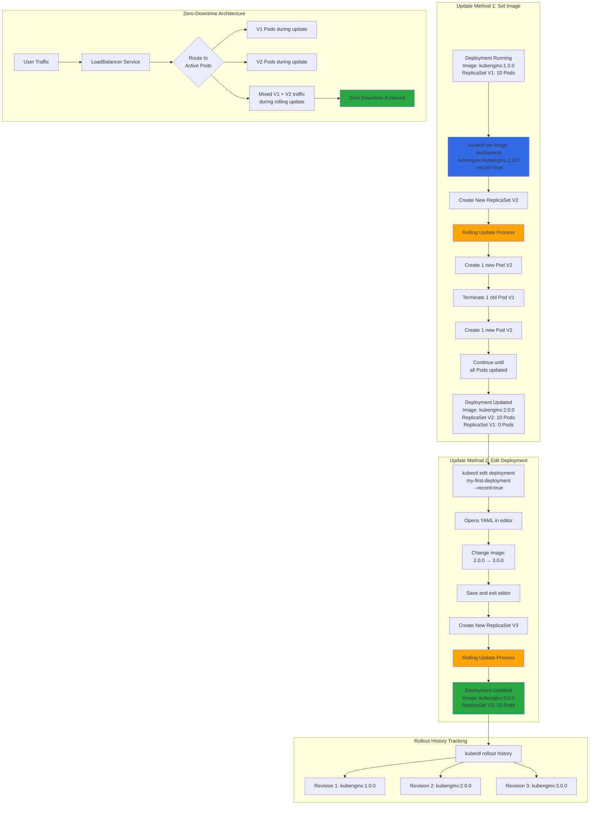

# Kubernetes - Update Deployments

## 📊 Architecture & Workflow Diagram



### Understanding the Diagram

- **Set Image Method**: Use **kubectl set image** to quickly update the **container image** to a new version while keeping all other configurations unchanged
- **Edit Deployment Method**: Use **kubectl edit** to open the full **Deployment YAML** in your editor, allowing changes to **image, environment variables, resources**, and more
- **New ReplicaSet Creation**: Each deployment update creates a **new ReplicaSet** with the updated configuration while keeping old ReplicaSets for rollback
- **Rolling Update Strategy**: Kubernetes gradually replaces old Pods with new ones, creating **new Pods** before terminating **old Pods** to maintain availability
- **Incremental Pod Replacement**: Update happens **one Pod at a time** (or small batches), ensuring some Pods are always running to serve traffic
- **ReplicaSet Retention**: Old ReplicaSets are **scaled to 0** but **kept in history**, allowing instant rollback to previous versions if needed
- **Rollout History**: Use **kubectl rollout history** to view all **deployment revisions** with details about each version's configuration and changes
- **Record Flag**: The **--record=true** flag stores the **kubectl command** in revision annotations, making it easy to see what changed in each revision
- **Zero Downtime Updates**: Service continues routing traffic to **available Pods** (mix of old and new) during the rolling update, ensuring **no service interruption**
- **Three Versions Example**: Diagram shows progression through **3 versions** (1.0.0 → 2.0.0 → 3.0.0), demonstrating continuous delivery capability

---

## Step-00: Introduction
- We can update deployments using two options
  - Set Image
  - Edit Deployment

## Step-01: Updating Application version V1 to V2 using "Set Image" Option
### Update Deployment
- **Observation:** Please Check the container name in `spec.container.name` yaml output and make a note of it and 
replace in `kubectl set image` command <Container-Name>
```
# Get Container Name from current deployment
kubectl get deployment my-first-deployment -o yaml

# Update Deployment - SHOULD WORK NOW
kubectl set image deployment/<Deployment-Name> <Container-Name>=<Container-Image> --record=true
kubectl set image deployment/my-first-deployment kubenginx=stacksimplify/kubenginx:2.0.0 --record=true
```
### Verify Rollout Status (Deployment Status)
- **Observation:** By default, rollout happens in a rolling update model, so no downtime.
```
# Verify Rollout Status 
kubectl rollout status deployment/my-first-deployment

# Verify Deployment
kubectl get deploy
```
### Describe Deployment
- **Observation:**
  - Verify the Events and understand that Kubernetes by default do  "Rolling Update"  for new application releases. 
  - With that said, we will not have downtime for our application.
```
# Descibe Deployment
kubectl describe deployment my-first-deployment
```
### Verify ReplicaSet
- **Observation:** New ReplicaSet will be created for new version
```
# Verify ReplicaSet
kubectl get rs
```

### Verify Pods
- **Observation:** Pod template hash label of new replicaset should be present for PODs letting us 
know these pods belong to new ReplicaSet.
```
# List Pods
kubectl get po
```

### Verify Rollout History of a Deployment
- **Observation:** We have the rollout history, so we can switch back to older revisions using 
revision history available to us.  

```
# Check the Rollout History of a Deployment
kubectl rollout history deployment/<Deployment-Name>
kubectl rollout history deployment/my-first-deployment  
```

### Access the Application using Public IP
- We should see `Application Version:V2` whenever we access the application in browser
```
# Get Load Balancer IP
kubectl get svc

# Application URL
http://<External-IP-from-get-service-output>
```


## Step-02: Update the Application from V2 to V3 using "Edit Deployment" Option
### Edit Deployment
```
# Edit Deployment
kubectl edit deployment/<Deployment-Name> --record=true
kubectl edit deployment/my-first-deployment --record=true
```

```yml
# Change From 2.0.0
    spec:
      containers:
      - image: stacksimplify/kubenginx:2.0.0

# Change To 3.0.0
    spec:
      containers:
      - image: stacksimplify/kubenginx:3.0.0
```

### Verify Rollout Status
- **Observation:** Rollout happens in a rolling update model, so no downtime.
```
# Verify Rollout Status 
kubectl rollout status deployment/my-first-deployment
```
### Verify Replicasets
- **Observation:**  We should see 3 ReplicaSets now, as we have updated our application to 3rd version 3.0.0
```
# Verify ReplicaSet and Pods
kubectl get rs
kubectl get po
```
### Verify Rollout History
```
# Check the Rollout History of a Deployment
kubectl rollout history deployment/<Deployment-Name>
kubectl rollout history deployment/my-first-deployment   
```

### Access the Application using Public IP
- We should see `Application Version:V3` whenever we access the application in browser
```
# Get Load Balancer IP
kubectl get svc

# Application URL
http://<External-IP-from-get-service-output>
```
