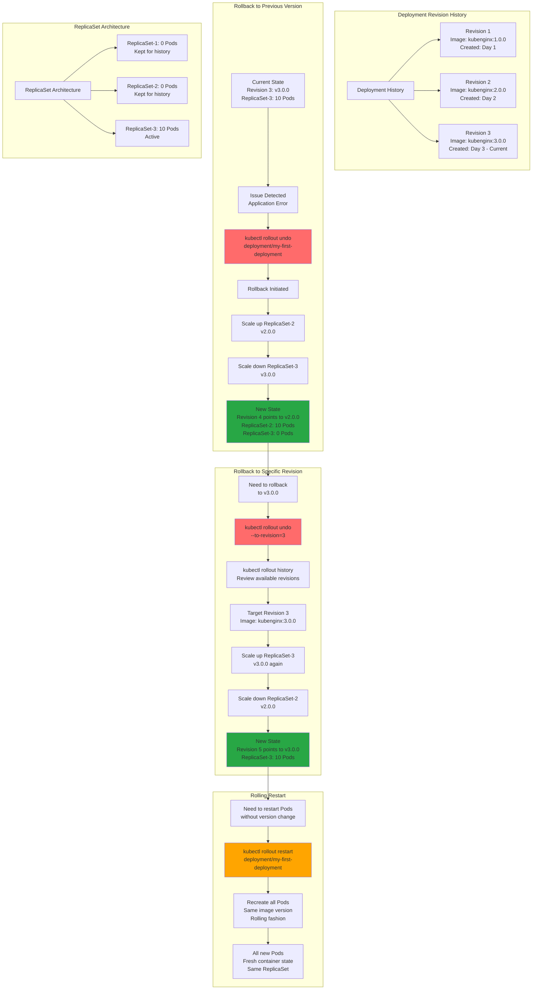

# Rollback Deployment

## 📊 Architecture & Workflow Diagram



### Understanding the Diagram

- **Revision History**: Kubernetes maintains a **complete history** of all deployment revisions with details about **images, configurations, and timestamps**
- **Previous Version Rollback**: Use **kubectl rollout undo** without arguments to instantly rollback to the **immediately previous version** (revision N-1)
- **ReplicaSet Scaling**: Rollback works by **scaling up the old ReplicaSet** and **scaling down the current ReplicaSet** in a rolling fashion
- **New Revision Number**: Each rollback creates a **new revision number** that points to the old configuration (e.g., rollback from rev-3 creates rev-4 pointing to rev-2 config)
- **Specific Revision Rollback**: Use **--to-revision=N** to rollback to any **specific previous revision**, not just the immediate previous one
- **Inspect Before Rollback**: Use **kubectl rollout history --revision=N** to inspect the **exact configuration** of each revision before rolling back
- **Zero Downtime Rollback**: Rollback follows the same **rolling update strategy**, ensuring no downtime during the rollback process
- **ReplicaSet Retention**: All old ReplicaSets are **preserved with 0 Pods**, providing instant rollback capability without recreating resources
- **Rolling Restart**: Use **kubectl rollout restart** to recreate all Pods with the **same image version**, useful for picking up config changes or clearing memory leaks
- **Quick Recovery**: Rollback is **faster than forward deployment** since the old ReplicaSet already exists, only requiring scaling operations

---

## Step-00: Introduction
- We can rollback a deployment in two ways.
  - Previous Version
  - Specific Version

## Step-01: Rollback a Deployment to previous version

### Check the Rollout History of a Deployment
```
# List Deployment Rollout History
kubectl rollout history deployment/<Deployment-Name>
kubectl rollout history deployment/my-first-deployment  
```

### Verify changes in each revision
- **Observation:** Review the "Annotations" and "Image" tags for clear understanding about changes.
```
# List Deployment History with revision information
kubectl rollout history deployment/my-first-deployment --revision=1
kubectl rollout history deployment/my-first-deployment --revision=2
kubectl rollout history deployment/my-first-deployment --revision=3
```


### Rollback to previous version
- **Observation:** If we rollback, it will go back to revision-2 and its number increases to revision-4
```
# Undo Deployment
kubectl rollout undo deployment/my-first-deployment

# List Deployment Rollout History
kubectl rollout history deployment/my-first-deployment  
```

### Verify Deployment, Pods, ReplicaSets
```
kubectl get deploy
kubectl get rs
kubectl get po
kubectl describe deploy my-first-deployment
```

### Access the Application using Public IP
- We should see `Application Version:V2` whenever we access the application in browser
```
# Get Load Balancer IP
kubectl get svc

# Application URL
http://<External-IP-from-get-service-output>
```


## Step-02: Rollback to specific revision
### Check the Rollout History of a Deployment
```
# List Deployment Rollout History
kubectl rollout history deployment/<Deployment-Name>
kubectl rollout history deployment/my-first-deployment 
```
### Rollback to specific revision
```
# Rollback Deployment to Specific Revision
kubectl rollout undo deployment/my-first-deployment --to-revision=3
```

### List Deployment History
- **Observation:** If we rollback to revision 3, it will go back to revision-3 and its number increases to revision-5 in rollout history
```
# List Deployment Rollout History
kubectl rollout history deployment/my-first-deployment  
```


### Access the Application using Public IP
- We should see `Application Version:V3` whenever we access the application in browser
```
# Get Load Balancer IP
kubectl get svc

# Application URL
http://<Load-Balancer-IP>
```

## Step-03: Rolling Restarts of Application
- Rolling restarts will kill the existing pods and recreate new pods in a rolling fashion. 
```
# Rolling Restarts
kubectl rollout restart deployment/<Deployment-Name>
kubectl rollout restart deployment/my-first-deployment

# Get list of Pods
kubectl get po
```