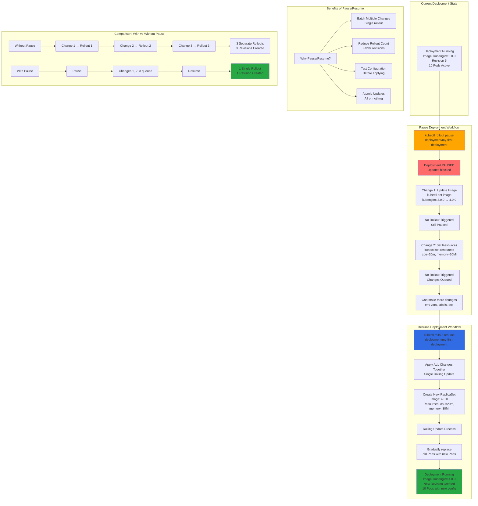

# Pause & Resume Deployments

## 📊 Architecture & Workflow Diagram



### Understanding the Diagram

- **Pause Command**: Use **kubectl rollout pause** to temporarily **freeze deployment updates**, allowing you to make multiple configuration changes
- **Changes While Paused**: All **kubectl** commands (set image, set resources, etc.) are **accepted** but no **rolling update** is triggered while paused
- **Queued Changes**: Multiple changes are **queued** in the deployment specification, waiting for the **resume** command to apply them all
- **Resume Command**: **kubectl rollout resume** applies **all queued changes together** in a **single rolling update**, creating only one new revision
- **Atomic Updates**: All changes are applied **atomically** - either all succeed together or all fail together, ensuring consistency
- **Reduced Rollout Count**: Pausing prevents **multiple consecutive rollouts**, reducing cluster churn and creating cleaner revision history
- **Single Revision**: Instead of creating **3 separate revisions** for 3 changes, pause/resume creates **1 revision** with all changes combined
- **Resource Efficiency**: Fewer rollouts mean less **Pod churn**, reducing resource consumption and minimizing potential disruption
- **Testing Configuration**: Review all **queued changes** in the deployment spec before resuming to catch configuration errors early
- **Version 3 to 4 Example**: Diagram shows updating from **v3.0.0 to v4.0.0** along with resource limits, all in a single coordinated update

---

## Step-00: Introduction
- Why do we need Pausing & Resuming Deployments?
  - If we want to make multiple changes to our Deployment, we can pause the deployment make all changes and resume it. 
- We are going to update our Application Version from **V3 to V4** as part of learning "Pause and Resume Deployments"  

## Step-01: Pausing & Resuming Deployments
### Check current State of Deployment & Application
 ```
# Check the Rollout History of a Deployment
kubectl rollout history deployment/my-first-deployment  
Observation: Make a note of last version number

# Get list of ReplicaSets
kubectl get rs
Observation: Make a note of number of replicaSets present.

# Access the Application 
http://<External-IP-from-get-service-output>
Observation: Make a note of application version
```

### Pause Deployment and Two Changes
```
# Pause the Deployment
kubectl rollout pause deployment/<Deployment-Name>
kubectl rollout pause deployment/my-first-deployment

# Update Deployment - Application Version from V3 to V4
kubectl set image deployment/my-first-deployment kubenginx=stacksimplify/kubenginx:4.0.0 --record=true

# Check the Rollout History of a Deployment
kubectl rollout history deployment/my-first-deployment  
Observation: No new rollout should start, we should see same number of versions as we check earlier with last version number matches which we have noted earlier.

# Get list of ReplicaSets
kubectl get rs
Observation: No new replicaSet created. We should have same number of replicaSets as earlier when we took note. 

# Make one more change: set limits to our container
kubectl set resources deployment/my-first-deployment -c=kubenginx --limits=cpu=20m,memory=30Mi
```
### Resume Deployment 
```
# Resume the Deployment
kubectl rollout resume deployment/my-first-deployment

# Check the Rollout History of a Deployment
kubectl rollout history deployment/my-first-deployment  
Observation: You should see a new version got created

# Get list of ReplicaSets
kubectl get rs
Observation: You should see new ReplicaSet.

# Get Load Balancer IP
kubectl get svc
```
### Access Application
```
# Access the Application 
http://<External-IP-from-get-service-output>
Observation: You should see Application V4 version
```


## Step-02: Clean-Up
```
# Delete Deployment
kubectl delete deployment my-first-deployment

# Delete Service
kubectl delete svc my-first-deployment-service

# Get all Objects from Kubernetes default namespace
kubectl get all
```