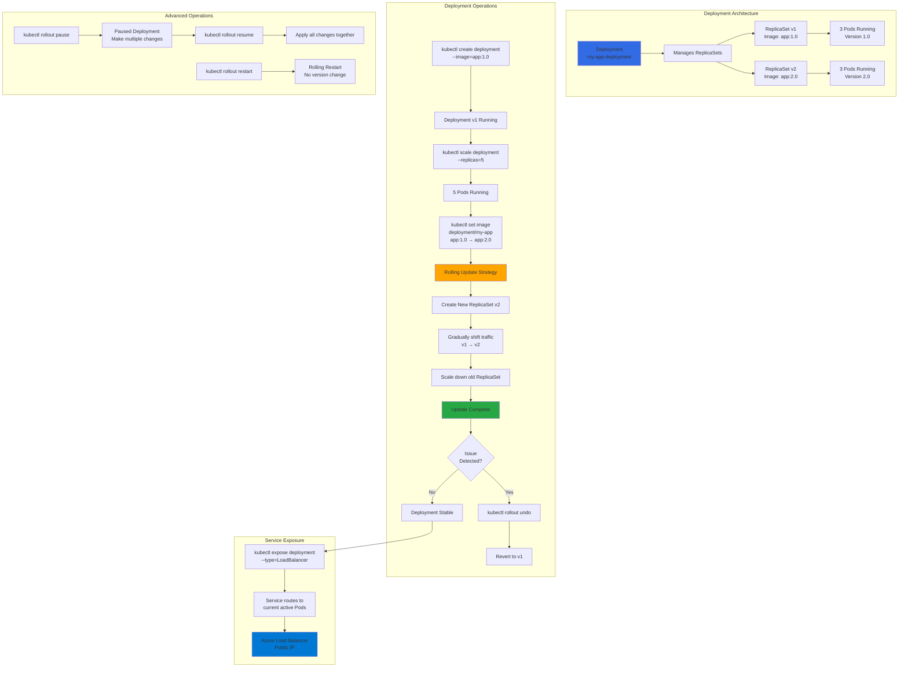

# Kubernetes - Deployment

## 📊 Architecture & Workflow Diagram

### Understanding the Diagram

- **Deployment Hierarchy**: Deployments are the **highest-level abstraction** that manages **ReplicaSets**, which in turn manage **Pods**
- **Version Management**: Each deployment update creates a **new ReplicaSet** while keeping previous ReplicaSets for **easy rollback**
- **Creation Command**: Use **kubectl create deployment** to imperatively create a Deployment with specified **image** and **replica count**
- **Scaling Operations**: **kubectl scale** adjusts the number of **Pod replicas** without changing application version or configuration
- **Rolling Update Strategy**: Updates happen **gradually** by creating new Pods while terminating old ones, ensuring **zero downtime**
- **Automatic Rollback**: If issues are detected, use **kubectl rollout undo** to instantly revert to the **previous working version**
- **Pause and Resume**: **Pause deployments** to make **multiple changes** (image, env vars, resources) then **resume** to apply all changes together
- **Rolling Restart**: Perform **kubectl rollout restart** to restart all Pods with a **rolling strategy** without changing the application version
- **Service Integration**: Expose Deployments via **LoadBalancer Service** which automatically routes traffic to the **current active Pods**
- **Azure Load Balancer**: Service creates an **Azure Load Balancer** with **public IP** that distributes traffic across healthy Pod replicas

---

## Topics
1. Create Deployment
2. Scale the Deployment
3. Expose Deployment as a Service
4. Update Deployment
5. Rollback Deployment
6. Rolling Restarts
7. Pause & Resume Deployments
8. Canary Deployments (Will be covered at Declarative section of Deployments)

