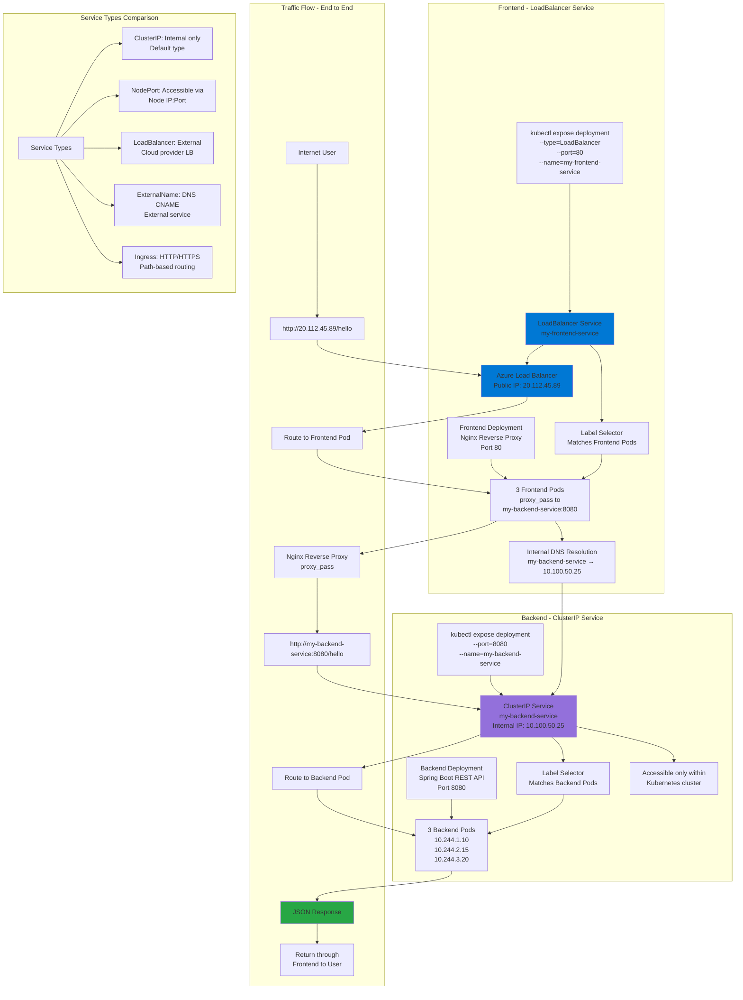

# Kubernetes - Services

## 📊 Architecture & Workflow Diagram



### Understanding the Diagram

- **ClusterIP Service**: Default service type providing **internal-only access** with a **stable virtual IP** that load balances across backend Pods
- **Backend Architecture**: Spring Boot **REST API** deployed as a **Deployment** exposed via **ClusterIP Service** for internal cluster communication
- **Label Selectors**: Services use **label selectors** to dynamically discover and route traffic to **matching Pods**, updating automatically as Pods scale
- **Internal DNS**: Kubernetes provides **built-in DNS** so services can be accessed by **name** (my-backend-service) instead of IP addresses
- **Frontend Reverse Proxy**: Nginx acts as a **reverse proxy** that forwards requests from external users to the **internal backend service**
- **LoadBalancer Service**: Exposes frontend to **internet** by provisioning an **Azure Load Balancer** with a **public IP address**
- **Traffic Flow**: User requests flow **Internet → Azure LB → Frontend Pod → Internal Service → Backend Pod**, with responses following the reverse path
- **Service Discovery**: Frontend Pods use **service name** (my-backend-service:8080) which Kubernetes DNS resolves to the **ClusterIP** automatically
- **Scaling Backend**: Use **kubectl scale** to increase backend replicas to **10 Pods**, and ClusterIP Service automatically load balances across all instances
- **Service Types**: Kubernetes offers **5 service types** - ClusterIP (internal), NodePort (node-level), LoadBalancer (external), ExternalName (DNS), and Ingress (HTTP routing)

---

## Step-01: Introduction to Services
- **Service Types**
  1. ClusterIp
  2. NodePort
  3. LoadBalancer
  4. ExternalName
  5. Ingress
- We are going to look in to ClusterIP and LoadBalancer Service in this section with a detailed example. 
- LoadBalancer Type is primarily for cloud providers and it will differ cloud to cloud, so we will do it accordingly (per cloud basis)
- ExternalName doesn't have Imperative commands and we need to write YAML definition for the same, so we will look in to it as and when it is required in our course. 

## Step-02: ClusterIP Service - Backend Application Setup
- Create a deployment for Backend Application (Spring Boot REST Application)
- Create a ClusterIP service for load balancing backend application. 
```
# Create Deployment for Backend Rest App
kubectl create deployment my-backend-rest-app --image=stacksimplify/kube-helloworld:1.0.0 
kubectl get deploy

# Create ClusterIp Service for Backend Rest App
kubectl expose deployment my-backend-rest-app --port=8080 --target-port=8080 --name=my-backend-service
kubectl get svc
Observation: We don't need to specify "--type=ClusterIp" because default setting is to create ClusterIp Service. 
```
- **Important Note:** If backend application port (Container Port: 8080) and Service Port (8080) are same we don't need to use **--target-port=8080** but for avoiding the confusion i have added it. Same case applies to frontend application and service. 

- **Backend HelloWorld Application Source** [kube-helloworld](https://github.com/stacksimplify/kubernetes-fundamentals/tree/master/00-Docker-Images/02-kube-backend-helloworld-springboot/kube-helloworld)


## Step-03: LoadBalancer Service - Frontend Application Setup
- We have implemented **LoadBalancer Service** multiple times so far (in pods, replicasets and deployments), even then we are going to implement one more time to get a full architectural view in relation with ClusterIp service. 
- Create a deployment for Frontend Application (Nginx acting as Reverse Proxy)
- Create a LoadBalancer service for load balancing frontend application. 
- **Important Note:** In Nginx reverse proxy, ensure backend service name `my-backend-service` is updated when you are building the frontend container. We already built it and put ready for this demo (stacksimplify/kube-frontend-nginx:1.0.0)
- **Nginx Conf File**
```conf
server {
    listen       80;
    server_name  localhost;
    location / {
    # Update your backend application Kubernetes Cluster-IP Service name  and port below      
    # proxy_pass http://<Backend-ClusterIp-Service-Name>:<Port>;      
    proxy_pass http://my-backend-service:8080;
    }
    error_page   500 502 503 504  /50x.html;
    location = /50x.html {
        root   /usr/share/nginx/html;
    }
}
```
- **Docker Image Location:** https://hub.docker.com/repository/docker/stacksimplify/kube-frontend-nginx
- **Frontend Nginx Reverse Proxy Application Source** [kube-frontend-nginx](https://github.com/stacksimplify/kubernetes-fundamentals/tree/master/00-Docker-Images/03-kube-frontend-nginx)
```
# Create Deployment for Frontend Nginx Proxy
kubectl create deployment my-frontend-nginx-app --image=stacksimplify/kube-frontend-nginx:1.0.0 
kubectl get deploy

# Create LoadBalancer Service for Frontend Nginx Proxy
kubectl expose deployment my-frontend-nginx-app  --type=LoadBalancer --port=80 --target-port=80 --name=my-frontend-service
kubectl get svc

# Get Load Balancer IP
kubectl get svc
http://<External-IP-from-get-service-output>/hello

# Scale backend with 10 replicas
kubectl scale --replicas=10 deployment/my-backend-rest-app

# Test again to view the backend service Load Balancing
http://<External-IP-from-get-service-output>/hello
```
