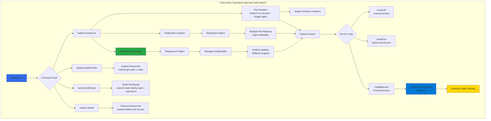

# Kubernetes Fundaments using Imperative Approach using kubectl

## 📊 Architecture & Workflow Diagram

### Understanding the Diagram

- **Imperative Approach**: Execute **direct commands** using **kubectl CLI** to create, modify, and delete Kubernetes resources **without YAML files**
- **kubectl CLI**: The **command-line interface** that communicates with the **Kubernetes API server** to manage cluster resources imperatively
- **Pod Management**: Create standalone **Pods** using **kubectl run**, the most basic deployable unit containing **one or more containers**
- **ReplicaSets**: Ensure **high availability** by maintaining a specified number of **identical Pod replicas** running at all times
- **Deployments**: Highest-level abstraction that manages **ReplicaSets** and provides **declarative updates**, **rolling deployments**, and **rollback capabilities**
- **CRUD Operations**: Perform **Create, Read, Update, Delete** operations using kubectl subcommands like **get, describe, edit, scale, delete**
- **Service Types**: Expose applications using **ClusterIP** (internal), **NodePort** (node-level), or **LoadBalancer** (external with cloud integration)
- **Azure Integration**: **LoadBalancer Services** automatically provision **Azure Load Balancers** with **public IP addresses** for external access
- **Scaling Operations**: Dynamically adjust **replica counts** using **kubectl scale** to handle varying traffic loads
- **Inspection Commands**: Use **kubectl get** with flags like **-o wide** or **-o yaml** to inspect resource details, status, and configuration

---

| S.No  | Topic Name |
| ------| ------------- |
| 01.   | Pods   |
| 02.   | ReplicaSets  |
| 03.   | Deployments  |
| 04.   | Services  |