# YAML Basics

## 📊 Architecture & Workflow Diagram

```mermaid
graph TB
    subgraph "YAML Structure Fundamentals"
        YAML[YAML File Structure]
        
        YAML --> KeyValue[Key-Value Pairs<br/>name: kalyan<br/>age: 23]
        YAML --> Dictionary[Dictionary/Map<br/>person:<br/>  name: kalyan<br/>  age: 23]
        YAML --> List[Lists/Arrays<br/>hobbies:<br/>  - cycling<br/>  - cooking]
        YAML --> NestedList[Nested Lists<br/>friends:<br/>  - name: friend1<br/>    age: 22]
    end
    
    subgraph "Kubernetes YAML Structure"
        K8sYAML[Kubernetes YAML Template]
        
        K8sYAML --> ApiVersion[apiVersion: v1<br/>API version to use]
        K8sYAML --> Kind[kind: Pod<br/>Resource type]
        K8sYAML --> Metadata[metadata:<br/>name, labels, annotations]
        K8sYAML --> Spec[spec:<br/>Desired state definition]
        
        Metadata --> Labels[labels:<br/>  app: myapp<br/>  tier: frontend]
        
        Spec --> Containers[containers: # List<br/>- name: myapp<br/>  image: nginx:1.0.0]
        Containers --> Ports[ports:<br/>- containerPort: 80<br/>  protocol: TCP]
    end
    
    subgraph "YAML to Kubernetes Flow"
        WriteYAML[Write YAML File<br/>pod-definition.yml]
        WriteYAML --> ValidateSyntax{Valid<br/>YAML Syntax?}
        
        ValidateSyntax -->|No| SyntaxError[Indentation Error<br/>Missing colon<br/>Invalid structure]
        ValidateSyntax -->|Yes| ApplyCmd[kubectl apply -f<br/>pod-definition.yml]
        
        ApplyCmd --> K8sAPI[Kubernetes API Server<br/>Validates against schema]
        K8sAPI --> ValidateK8s{Valid K8s<br/>Manifest?}
        
        ValidateK8s -->|No| K8sError[Invalid apiVersion<br/>Missing required fields<br/>Wrong resource type]
        ValidateK8s -->|Yes| CreateResource[Create/Update Resource<br/>Pod, Service, Deployment]
        
        CreateResource --> DesiredState[Achieve Desired State]
    end
    
    subgraph "Common YAML Rules"
        Rules[YAML Syntax Rules]
        Rules --> R1[Space after colon MANDATORY<br/>name: value ✓<br/>name:value ✗]
        Rules --> R2[Consistent Indentation<br/>Use 2 spaces]
        Rules --> R3[Lists start with dash<br/>- item1<br/>- item2]
        Rules --> R4[Strings can be unquoted<br/>name: kalyan]
        Rules --> R5[Comments use #<br/># This is a comment]
    end
    
    style K8sYAML fill:#326ce5
    style CreateResource fill:#28a745
    style SyntaxError fill:#ff6b6b
    style K8sError fill:#ff6b6b
```



### Understanding the Diagram

- **Key-Value Pairs**: Basic YAML building blocks with **keys and values separated by colon and space**, forming simple configuration entries
- **Dictionary/Map**: Group related **key-value pairs** under a parent key using **consistent indentation** to represent hierarchical data structures
- **Lists/Arrays**: Represent **multiple values** for a single key using **dash prefix**, enabling collections like container ports or environment variables
- **Nested Structures**: Combine **dictionaries and lists** to create complex data structures like multiple containers with multiple ports
- **Four Top-Level Objects**: Every Kubernetes YAML has **apiVersion, kind, metadata, and spec** as mandatory top-level fields
- **apiVersion**: Specifies which **Kubernetes API version** to use (v1 for core resources, apps/v1 for deployments)
- **kind**: Defines the **resource type** (Pod, Service, Deployment, ReplicaSet, etc.) being created or modified
- **metadata**: Contains **identifying information** like name, labels, and annotations used for organization and selection
- **spec**: Describes the **desired state** of the resource, including containers, images, ports, replicas, and other configuration
- **YAML Validation**: YAML must pass **syntax validation** (proper indentation, colons) and **Kubernetes schema validation** (required fields, valid values) before creation

---

## Step-01: Comments & Key Value Pairs
- Space after colon is mandatory to differentiate key and value
```yml
# Defining simple key value pairs
name: kalyan
age: 23
city: Hyderabad
```

## Step-02: Dictionary / Map
- Set of properties grouped together after an item
- Equal amount of blank space required for all the items under a dictionary
```yml
person:
  name: kalyan
  age: 23
  city: Hyderabad
```

## Step-03: Array / Lists
- Dash indicates an element of an array
```yml
person: # Dictionary
  name: kalyan
  age: 23
  city: Hyderabad
  hobbies: # List  
    - cycling
    - cookines
  hobbies: [cycling, cooking]   # List with a differnt notation  
```  

## Step-04: Multiple Lists
- Dash indicates an element of an array
```yml
person: # Dictionary
  name: kalyan
  age: 23
  city: Hyderabad
  hobbies: # List  
    - cycling
    - cooking
  hobbies: [cycling, cooking]   # List with a differnt notation  
  friends: # 
    - name: friend1
      age: 22
    - name: friend2
      age: 25            
```  


## Step-05: Sample Pod Tempalte for Reference
```yml
apiVersion: v1 # String
kind: Pod  # String
metadata: # Dictionary
  name: myapp-pod
  labels: # Dictionary 
    app: myapp         
spec:
  containers: # List
    - name: myapp
      image: stacksimplify/kubenginx:1.0.0
      ports:
        - containerPort: 80
          protocol: "TCP"
        - containerPort: 81
          protocol: "TCP"
```


