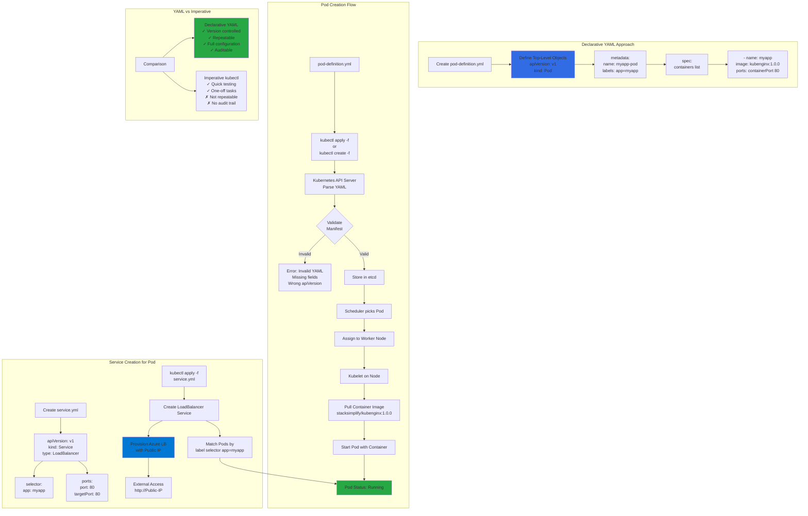

# PODs with YAML

## 📊 Architecture & Workflow Diagram



### Understanding the Diagram

- **Declarative Approach**: Define **desired state** in YAML files that can be **version controlled**, **reviewed**, and **repeatedly applied** for consistent deployments
- **Top-Level Objects**: Every Kubernetes YAML manifest requires **apiVersion, kind, metadata, and spec** to define what resource to create
- **Pod metadata**: Includes **name** for identification and **labels** as key-value pairs used by Services and other resources for **selection**
- **Pod spec**: Defines the **desired state** including **containers list** with image, ports, environment variables, and resource requirements
- **kubectl apply vs create**: Use **kubectl apply** for declarative management (idempotent, can update) or **kubectl create** for one-time creation
- **Validation Process**: Kubernetes API Server **validates YAML syntax** and **schema compliance** before storing configuration in **etcd**
- **Scheduler Assignment**: Kubernetes **Scheduler** automatically assigns Pod to an appropriate **worker node** based on resource availability
- **Service Label Selector**: LoadBalancer Service uses **selector** (app: myapp) to **dynamically discover** and route traffic to matching Pods
- **Azure Load Balancer**: Service type LoadBalancer automatically provisions **Azure Load Balancer** with **public IP** for external access
- **Version Control Benefits**: YAML files can be stored in **Git**, enabling **code review**, **rollback**, **collaboration**, and **audit trails**

---

## Step-01: Kubernetes YAML Top level Objects
- Discuss about the k8s YAML top level objects
- **01-kube-base-definition.yml**
```yml
apiVersion:
kind:
metadata:
  
spec:
```
-  [Pod API Objects Reference](https://kubernetes.io/docs/reference/generated/kubernetes-api/v1.19/#pod-v1-core)

## Step-02: Create Simple Pod Definition using YAML 
- We are going to create a very basic pod definition
- **02-pod-definition.yml**
```yml
apiVersion: v1 # String
kind: Pod  # String
metadata: # Dictionary
  name: myapp-pod
  labels: # Dictionary 
    app: myapp         
spec:
  containers: # List
    - name: myapp
      image: stacksimplify/kubenginx:1.0.0
      ports:
        - containerPort: 80
```
- **Create Pod**
```
# Create Pod
kubectl create -f 02-pod-definition.yml
[or]
kubectl apply -f 02-pod-definition.yml

# List Pods
kubectl get pods
```

## Step-03: Create a LoadBalancer Service
- **03-pod-LoadBalancer-service.yml**
```yml
apiVersion: v1
kind: Service
metadata:
  name: myapp-pod-loadbalancer-service  # Name of the Service
spec:
  type: LoadBalancer
  selector:
  # Loadbalance traffic across Pods matching this label selector
    app: myapp
  # Accept traffic sent to port 80    
  ports: 
    - name: http
      port: 80    # Service Port
      targetPort: 80 # Container Port
```
- **Create LoadBalancer Service for Pod**
```
# Create Service
kubectl apply -f 03-pod-LoadBalancer-service.yml

# List Service
kubectl get svc

# Access Application
http://<Load-Balancer-Service-IP>

```

## API Object References
- [Kubernetes API Spec](https://kubernetes.io/docs/reference/generated/kubernetes-api/v1.19/)
- [Pod Spec](https://kubernetes.io/docs/reference/generated/kubernetes-api/v1.19/#pod-v1-core)
- [Service Spec](https://kubernetes.io/docs/reference/generated/kubernetes-api/v1.19/#service-v1-core)


