# ReplicaSets with YAML

## 📊 Architecture & Workflow Diagram

```mermaid
graph TB
    subgraph "ReplicaSet YAML Structure"
        RSYaml[replicaset-definition.yml]
        RSYaml --> RSApi[apiVersion: apps/v1<br/>kind: ReplicaSet]
        RSYaml --> RSMeta[metadata:<br/>  name: myapp2-rs]
        RSYaml --> RSSpec[spec:]
        
        RSSpec --> Replicas[replicas: 3<br/>Desired Pod count]
        RSSpec --> Selector[selector:<br/>  matchLabels:<br/>    app: myapp2]
        RSSpec --> Template[template: # Pod template]
        
        Template --> PodMeta[metadata:<br/>  labels: app=myapp2]
        Template --> PodSpec[spec:<br/>  containers:<br/>  - image: kubenginx:2.0.0]
    end
    
    subgraph "ReplicaSet Creation & Management"
        ApplyRS[kubectl apply -f<br/>replicaset-definition.yml]
        ApplyRS --> CreateRS[Create ReplicaSet Object]
        CreateRS --> RSController[ReplicaSet Controller]
        
        RSController --> Create3Pods[Create 3 Pods<br/>based on template]
        Create3Pods --> Pod1[myapp2-rs-abc12]
        Create3Pods --> Pod2[myapp2-rs-def34]
        Create3Pods --> Pod3[myapp2-rs-ghi56]
        
        Pod1 --> Node1[Worker Node 1]
        Pod2 --> Node2[Worker Node 2]
        Pod3 --> Node1
    end
    
    subgraph "Label Selector Matching"
        LabelMatch[Label Matching Mechanism]
        LabelMatch --> SelectorLabels[Selector matchLabels:<br/>app: myapp2]
        LabelMatch --> PodLabels[Pod template labels:<br/>app: myapp2]
        SelectorLabels --> Match{Labels Match?}
        PodLabels --> Match
        Match -->|Yes| RSManages[ReplicaSet manages Pods]
        Match -->|No| ErrorNoMatch[Error: Selector mismatch<br/>ReplicaSet cannot create Pods]
    end
    
    subgraph "Self-Healing Demonstration"
        Monitor[ReplicaSet Monitoring]
        Monitor --> DeletePod[kubectl delete pod<br/>myapp2-rs-def34]
        DeletePod --> Detect[RS detects: 2/3 Pods]
        Detect --> AutoRecreate[Automatically create<br/>new Pod]
        AutoRecreate --> NewPod[myapp2-rs-xyz99<br/>Pod recreated]
        NewPod --> Restored[Back to 3/3 Pods]
    end
    
    subgraph "LoadBalancer Service for ReplicaSet"
        ServiceYAML[service.yml<br/>type: LoadBalancer]
        ServiceYAML --> ServiceSelector[selector:<br/>  app: myapp2]
        ServiceSelector --> MatchAllPods[Matches all 3 Pods<br/>with app=myapp2]
        MatchAllPods --> Pod1
        MatchAllPods --> Pod2
        MatchAllPods --> Pod3
        ServiceYAML --> AzureLBRS[Azure Load Balancer<br/>Distributes traffic]
    end
    
    style CreateRS fill:#326ce5
    style Restored fill:#28a745
    style AzureLBRS fill:#0078d4
    style RSManages fill:#28a745
```



### Understanding the Diagram

- **apiVersion apps/v1**: ReplicaSets use **apps/v1** API version (different from Pods which use v1) for app-level resources
- **replicas Field**: Defines **desired number of Pods** (3 in example) that ReplicaSet controller maintains at all times
- **selector.matchLabels**: Critical field that defines **which Pods** the ReplicaSet manages based on **label matching**
- **template Section**: Contains complete **Pod specification** (metadata + spec) used as a blueprint for creating new Pods
- **Label Consistency**: Pod template labels **must match** ReplicaSet selector labels, or creation will fail with validation error
- **ReplicaSet Controller**: Continuously **monitors** current state and takes **corrective actions** to match desired state (3 replicas)
- **Self-Healing**: If a Pod is **deleted or crashes**, ReplicaSet **automatically creates a replacement** within seconds to maintain replica count
- **Pod Naming**: ReplicaSet-created Pods use **ReplicaSet name + random suffix** (myapp2-rs-abc12) for unique identification
- **Service Integration**: LoadBalancer Service uses **same label selector** (app: myapp2) to discover and route traffic to all ReplicaSet Pods
- **Distributed Deployment**: Pods are spread across **multiple worker nodes** for high availability and fault tolerance

---

## Step-01: Create ReplicaSet Definition
- **replicaset-definition.yml**
```yml
apiVersion: apps/v1
kind: ReplicaSet
metadata:
  name: myapp2-rs
spec:
  replicas: 3 # 3 Pods should exist at all times.
  selector:  # Pods label should be defined in ReplicaSet label selector
    matchLabels:
      app: myapp2
  template:
    metadata:
      name: myapp2-pod
      labels:
        app: myapp2 # Atleast 1 Pod label should match with ReplicaSet Label Selector
    spec:
      containers:
      - name: myapp2
        image: stacksimplify/kubenginx:2.0.0
        ports:
          - containerPort: 80
```
## Step-02: Create ReplicaSet
- Create ReplicaSet with 3 Replicas
```
# Create ReplicaSet
kubectl apply -f 02-replicaset-definition.yml

# List Replicasets
kubectl get rs
```
- Delete a pod
- ReplicaSet immediately creates the pod. 
```
# List Pods
kubectl get pods

# Delete Pod
kubectl delete pod <Pod-Name>
```

## Step-03: Create LoadBalancer Service for ReplicaSet
```yml
apiVersion: v1
kind: Service
metadata:
  name: replicaset-loadbalancer-service
spec:
  type: LoadBalancer 
  selector: 
    app: myapp2 
  ports: 
    - name: http
      port: 80
      targetPort: 80
     
```
- **Create LoadBalancer Service for ReplicaSet & Test**
```
# Create LoadBalancer Service
kubectl apply -f 03-replicaset-LoadBalancer-servie.yml

# List LoadBalancer Service
kubectl get svc

# Access Application
http://<Load-Balancer-Service-IP>

```

## API References
- [ReplicaSet](https://kubernetes.io/docs/reference/generated/kubernetes-api/v1.19/#replicaset-v1-apps)