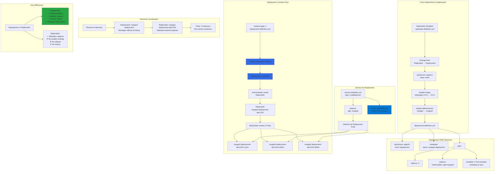

# Deployments with YAML

## 📊 Architecture & Workflow Diagram



### Understanding the Diagram

- **Easy Migration**: Converting **ReplicaSet to Deployment** requires changing only the **kind** field and optionally updating image versions and names
- **apiVersion Consistency**: Both ReplicaSets and Deployments use **apps/v1** API version, making conversion straightforward
- **Deployment Controller**: Manages the entire **application lifecycle** including creating ReplicaSets, handling updates, and maintaining revision history
- **Automatic ReplicaSet**: Deployment automatically creates a **ReplicaSet** with a generated name (deployment-name + hash) to manage Pods
- **Resource Hierarchy**: **Deployment → ReplicaSet → Pods** - each level manages the layer below it with specific responsibilities
- **Pod Naming Convention**: Pods created by Deployments have names like **deployment-name-replicaset-hash-pod-hash** for clear traceability
- **Service Label Matching**: LoadBalancer Service uses **app: myapp3** selector to route traffic to all Pods, regardless of the managing ReplicaSet
- **Rolling Update Capability**: Deployments support **zero-downtime updates** by creating new ReplicaSets and gradually shifting traffic
- **Rollback Support**: Deployments maintain **revision history** allowing instant rollback to previous versions using old ReplicaSets
- **Production Recommendation**: Always use **Deployments** over ReplicaSets in production for better update management and rollback capabilities

---

## Step-01: Copy templates from ReplicaSet
- Copy templates from ReplicaSet and change the `kind: Deployment` 
- Update Container Image version to `3.0.0`
- Change all names to Deployment
- Change all labels and selectors to `myapp3`

```
# Create Deployment
kubectl apply -f 02-deployment-definition.yml
kubectl get deploy
kubectl get rs
kubectl get po

# Create LoadBalancer Service
kubectl apply -f 03-deployment-LoadBalancer-service.yml

# List Service
kubectl get svc

# Get Public IP
kubectl get nodes -o wide

# Access Application
http://<Load-Balancer-Service-IP>
```
## API References
- [Deployment](https://kubernetes.io/docs/reference/generated/kubernetes-api/v1.19/#deployment-v1-apps)
