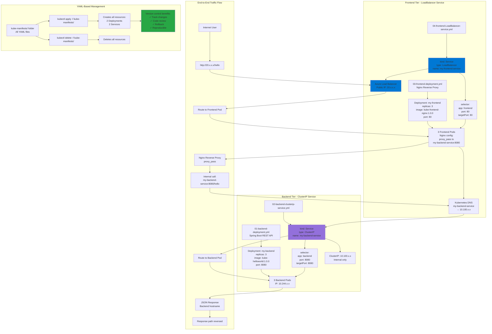

# Services with YAML

## 📊 Architecture & Workflow Diagram



### Understanding the Diagram

- **Two-Tier Architecture**: **Frontend tier** (Nginx reverse proxy) exposed externally via **LoadBalancer**, **backend tier** (REST API) internal via **ClusterIP**
- **ClusterIP Service**: Default service type providing **internal-only** access with stable **virtual IP** for backend-to-backend communication
- **Service Name Importance**: Nginx configuration must use **exact service name** (my-backend-service) as configured in the ClusterIP Service
- **Kubernetes DNS**: Automatically resolves **service names to ClusterIPs**, enabling service discovery without hardcoding IP addresses
- **LoadBalancer Service**: Exposes frontend to **internet** by provisioning **Azure Load Balancer** with **public IP address**
- **Label Selectors**: Backend service selects Pods with **app: backend**, frontend service selects Pods with **app: frontend** for traffic routing
- **Reverse Proxy Pattern**: Frontend Nginx **forwards requests** to backend service, hiding backend complexity and providing single entry point
- **Traffic Flow**: Request flows **Internet → Azure LB → Frontend Pod → ClusterIP Service → Backend Pod**, response follows reverse path
- **Folder-Based Deployment**: Use **kubectl apply -f kube-manifests/** to deploy all YAML files in a folder with single command
- **Version Control**: Store all YAML manifests in **Git repository** for **change tracking**, **collaboration**, **code review**, and **reproducible deployments**

---

## Step-01: Introduction to Services
- We are going to look in to below two services in detail with a frotnend and backend example
  - LoadBalancer Service
  - ClusterIP Service

## Step-02: Create Backend Deployment & Cluster IP Service
- Write the Deployment template for backend REST application.
- Write the Cluster IP service template for backend REST application.
- **Important Notes:** 
  - Name of Cluster IP service should be `name: my-backend-service` because  same is configured in frontend nginx reverse proxy `default.conf`. 
  - Test with different name and understand the issue we face
  - We have also discussed about in our section [03-04-Services-with-kubectl](https://github.com/stacksimplify/azure-aks-kubernetes-masterclass/tree/master/03-Kubernetes-Fundamentals-with-kubectl/03-04-Services-with-kubectl)
```
cd 04-05-Services-with-YAML/kube-manifests
kubectl get all
kubectl apply -f 01-backend-deployment.yml -f 02-backend-clusterip-service.yml
kubectl get all
```


## Step-03: Create Frontend Deployment & LoadBalancer Service
- Write the Deployment template for frontend Nginx Application
- Write the LoadBalancer service template for frontend Nginx Application
```
cd 04-05-Services-with-YAML/kube-manifests
kubectl get all
kubectl apply -f 03-frontend-deployment.yml -f 04-frontend-LoadBalancer-service.yml
kubectl get all
```
- **Access REST Application**
```
# Get Service IP
kubectl get svc

# Access REST Application 
http://<Load-Balancer-Service-IP>/hello
```

## Step-04: Delete & Recreate Objects using kubectl apply
### Delete Objects (file by file)
```
kubectl delete -f 01-backend-deployment.yml -f 02-backend-clusterip-service.yml -f 03-frontend-deployment.yml -f 04-frontend-LoadBalancer-service.yml
kubectl get all
```
### Recreate Objects using YAML files in a folder
```
cd 04-05-Services-with-YAML/
kubectl apply -f kube-manifests/
kubectl get all
```
### Delete Objects using YAML files in folder
```
cd 04-05-Services-with-YAML/
kubectl delete -f kube-manifests/
kubectl get all
```


## Additional References - Use Label Selectors for get and delete
- [Labels](https://kubernetes.io/docs/concepts/cluster-administration/manage-deployment/#using-labels-effectively)
- [Labels-Selectors](https://kubernetes.io/docs/concepts/overview/working-with-objects/labels/#label-selectors)