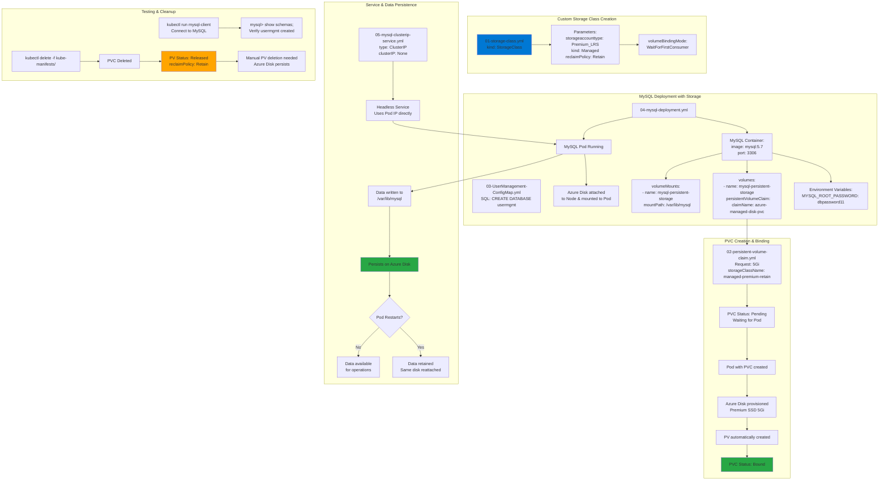

# AKS Storage -  Storage Classes, Persistent Volume Claims

## 📊 Architecture & Workflow Diagram



### Understanding the Diagram

- **Custom Storage Class**: Creates a **reusable template** defining Azure Disk type (Premium_LRS), reclaim policy (Retain), and binding mode (WaitForFirstConsumer)
- **volumeBindingMode WaitForFirstConsumer**: Delays disk provisioning until a **Pod using the PVC is created**, ensuring disk is created in the same **availability zone** as the Pod
- **Pending PVC State**: PVC remains **Pending** until first Pod consumption, preventing unnecessary disk provisioning costs
- **Dynamic Provisioning**: Kubernetes automatically creates both the **Azure Managed Disk** and **PV** when Pod starts, no manual PV creation needed
- **ConfigMap for Initialization**: Stores **SQL initialization scripts** executed during MySQL startup to create the `usermgmt` database schema
- **Environment Variables**: Pass **MySQL root password** and other configuration to the container securely (better practice: use Secrets)
- **Volume Definition**: Links the **PVC name** in the Pod spec's volumes section to make the storage available to the Pod
- **Volume Mount**: Specifies the **mount path** (`/var/lib/mysql`) where the Azure Disk appears inside the MySQL container filesystem
- **Headless Service**: ClusterIP with **clusterIP: None** means no cluster IP is allocated; Service uses Pod IP directly for 1:1 Pod-to-Service mapping
- **Retain Reclaim Policy**: When PVC is deleted, PV and Azure Disk are **retained** (not automatically deleted), requiring **manual cleanup** to avoid orphaned resources

---

## Step-01: Introduction
- We are going to create a MySQL Database with persistence storage using **Azure Disks** 

| Kubernetes Object  | YAML File |
| ------------- | ------------- |
| Storage Class  | 01-storage-class.yml |
| Persistent Volume Claim | 02-persistent-volume-claim.yml   |
| Config Map  | 03-UserManagement-ConfigMap.yml  |
| Deployment, Environment Variables, Volumes, VolumeMounts  | 04-mysql-deployment.yml  |
| ClusterIP Service  | 05-mysql-clusterip-service.yml  |

## Step-02: Create following Kubernetes manifests
### Create Storage Class manifest
- https://kubernetes.io/docs/concepts/storage/storage-classes/#volume-binding-mode
- https://kubernetes.io/docs/concepts/storage/storage-classes/#azure-disk


### Create Persistent Volume Claims manifest
```
# Create Storage Class & PVC
kubectl apply -f kube-manifests/01-storage-class.yml
kubectl apply -f kube-manifests/02-persistent-volume-claim.yml

# List Storage Classes
kubectl get sc

# List PVC
kubectl get pvc 

# List PV
kubectl get pv
```
### Create ConfigMap manifest
- We are going to create a `usermgmt` database schema during the mysql pod creation time which we will leverage when we deploy User Management Microservice. 

### Create MySQL Deployment manifest
- Environment Variables
- Volumes
- Volume Mounts

### Create MySQL ClusterIP Service manifest
- At any point of time we are going to have only one mysql pod in this design so `ClusterIP: None` will use the `Pod IP Address` instead of creating or allocating a separate IP for `MySQL Cluster IP service`.   

## Step-03: Create MySQL Database with all above manifests
```
# Create MySQL Database
kubectl apply -f kube-manifests/

# List Storage Classes
kubectl get sc

# List PVC
kubectl get pvc 

# List PV
kubectl get pv

# List pods
kubectl get pods 

# List pods based on  label name
kubectl get pods -l app=mysql
```

## Step-04: Connect to MySQL Database
```
# Connect to MYSQL Database
kubectl run -it --rm --image=mysql:5.6 --restart=Never mysql-client -- mysql -h mysql -pdbpassword11

# Verify usermgmt schema got created which we provided in ConfigMap
mysql> show schemas;
```

## Step-05: Clean-Up 
```
# Delete All
kubectl delete -f kube-manifests/
```

## Step-06: Delete PV exclusively - It exists due to retain policy
```
# List PV
kubect get pv

# Delete PV exclusively
kubectl get pv
kubectl delete pv <PV-NAME>

# Delete Azure Disks 
Go to All Services -> Disks -> Select and Delete the Disk
```

## Step-07: References & Storage Best Practices
- We need to discuss references exclusively here. 
- https://docs.microsoft.com/en-us/azure/aks/concepts-storage
- https://docs.microsoft.com/en-us/azure/aks/operator-best-practices-storage
- https://docs.microsoft.com/en-us/azure/aks/azure-disks-dynamic-pv
- https://kubernetes.io/docs/concepts/storage/persistent-volumes/
- https://kubernetes.io/docs/concepts/storage/storage-classes/#azure-disk
- https://kubernetes.io/docs/reference/generated/kubernetes-api/v1.18/#storageclass-v1-storage-k8s-io

