# AKS Storage - Azure Disks

## 📊 Architecture & Workflow Diagram

```mermaid
graph TB
    subgraph "AKS Pre-Provisioned Storage Classes"
        AKSProvision[AKS Cluster Provisioned<br/>Storage Classes]
        AKSProvision --> ManagedPremium[managed-premium<br/>Premium_LRS SSD<br/>reclaimPolicy: Delete]
        AKSProvision --> Default[default<br/>StandardSSD_LRS<br/>reclaimPolicy: Delete]
    end
    
    subgraph "Simplified Storage Setup"
        NeedStorage[Need Storage for MySQL]
        NeedStorage --> SkipSC[Skip Storage Class creation<br/>Use AKS-provided]
        SkipSC --> DirectPVC[Create PVC directly<br/>storageClassName: managed-premium]
        DirectPVC --> AutoProvision[Kubernetes auto-provisions<br/>Premium Azure Disk]
    end
    
    subgraph "PVC Manifest Changes"
        PVCManifest[01-persistent-volume-claim.yml]
        PVCManifest --> PVCSpec[apiVersion: v1<br/>kind: PersistentVolumeClaim]
        PVCSpec --> StorageRef[storageClassName: managed-premium<br/>References AKS storage class]
        PVCSpec --> Size[storage: 5Gi]
        PVCSpec --> AccessMode[accessModes:<br/>- ReadWriteOnce]
    end
    
    subgraph "MySQL Deployment - Same as Before"
        ConfigMap[ConfigMap with SQL]
        MySQLDeploy[MySQL Deployment]
        MySQLDeploy --> PVCRef[Uses PVC:<br/>azure-managed-disk-pvc]
        PVCRef --> Mount[Mounts to: /var/lib/mysql]
        MySQLDeploy --> ClusterIP[ClusterIP Service]
    end
    
    subgraph "Key Differences"
        Compare[Custom SC vs AKS SC]
        Compare --> CustomSC[Custom Storage Class:<br/>✓ Full control<br/>✓ Custom parameters<br/>✓ Retain policy option<br/>✗ Extra manifest]
        Compare --> AKSSC[AKS Storage Class:<br/>✓ Pre-configured<br/>✓ No extra manifest<br/>✓ Production-ready<br/>✗ Delete reclaim policy]
    end
    
    subgraph "Reclaim Policy Impact"
        ReclaimPolicy[Reclaim Policy Difference]
        ReclaimPolicy --> CustomRetain[Custom SC: Retain<br/>PVC deleted → PV & Disk remain<br/>Manual cleanup needed]
        ReclaimPolicy --> AKSDelete[AKS SC: Delete<br/>PVC deleted → PV & Disk auto-deleted<br/>Data loss warning!]
    end
    
    subgraph "Deployment & Testing"
        Deploy[kubectl apply -f kube-manifests/]
        Deploy --> ListResources[kubectl get sc, pvc, pv, pods]
        ListResources --> ConnectMySQL[kubectl run mysql-client<br/>Test connection]
        ConnectMySQL --> VerifyData[Verify usermgmt schema]
        VerifyData --> Cleanup[kubectl delete -f kube-manifests/]
        Cleanup --> AutoDeleted[PV & Azure Disk<br/>automatically deleted!]
    end
    
    style ManagedPremium fill:#0078d4
    style AKSSC fill:#28a745
    style AutoDeleted fill:#ff6b6b
```



### Understanding the Diagram

- **AKS Pre-Provisioned Storage Classes**: AKS automatically creates **managed-premium** (Premium SSD) and **default** (Standard SSD) Storage Classes during cluster creation
- **No Storage Class Manifest Needed**: Can directly reference **managed-premium** in PVC without creating custom Storage Class manifest, simplifying deployment
- **Why Learn Custom Storage Class**: Understanding **kind: StorageClass** is important for scenarios requiring custom parameters or **Retain** reclaim policy
- **storageClassName Field**: PVC references the **AKS-provided Storage Class** name, triggering automatic provisioning of appropriate Azure Disk type
- **accessModes ReadWriteOnce**: Azure Disks support only **ReadWriteOnce**, meaning disk can be mounted by **one node** at a time (suitable for databases)
- **Delete Reclaim Policy**: AKS-provided Storage Classes use **reclaimPolicy: Delete**, automatically cleaning up PV and Azure Disk when PVC is deleted
- **Data Loss Warning**: With **Delete** reclaim policy, deleting PVC **permanently removes** the Azure Disk and all data - use with caution in production
- **Production Consideration**: For critical data, use **custom Storage Class** with **Retain** policy or implement **backup strategies** before deleting PVCs
- **Simplified Workflow**: Reduces manifests from **6 to 5 files** by eliminating Storage Class creation, making deployments cleaner
- **Same Functionality**: MySQL deployment, ConfigMap, Services work **identically** regardless of whether using custom or AKS-provided Storage Classes

---

## Step-01: Introduction
- We are going to use Azure AKS provisioned storage class as part of this section

## Step-02: Use AKS Provisioned Azure Disks
- Copy all templates from previous section
- Remove Storage Class Manifest
- **Question-1:** Why do we need to remove storage class Manifests?
- Azure AKS provisions two types of storage classes well in advance during the cluster creation process
  - managed-premium
  - default-
- We can leverage Azure AKS provisioned disk storage classes instead of what we created manually.
- **Question-2:** If that is the case why did we use custom storate class in previous section?
- That is for us to learn the `kind: StorageClass` concept.  

## Step-03: Review PVC Manifest 01-persistent-volume-claim.yml
- Primarily we are going to focus on `storageClassName: managed-premium` which tells us that we are going to use Azure AKS provisioned Azure Disks storage class.
```yml
apiVersion: v1
kind: PersistentVolumeClaim
metadata:
  name: azure-managed-disk-pvc
spec:
  accessModes:
  - ReadWriteOnce
  storageClassName: managed-premium 
  resources:
    requests:
      storage: 5Gi  
```

## Step-04: Deploy and Test
```
# Create MySQL Database
kubectl apply -f kube-manifests/

# List Storage Classes
kubectl get sc

# List PVC
kubectl get pvc 

# List PV
kubectl get pv

# List pods
kubectl get pods 
```

## Step-05: Connect to MySQL Database
```
# Connect to MYSQL Database
kubectl run -it --rm --image=mysql:5.6 --restart=Never mysql-client -- mysql -h mysql -pdbpassword11

# Verify usermgmt schema got created which we provided in ConfigMap
mysql> show schemas;
```

## Step-06: Clean-Up
```
# Delete all manifests
kubectl delete -f kube-manifests/
```