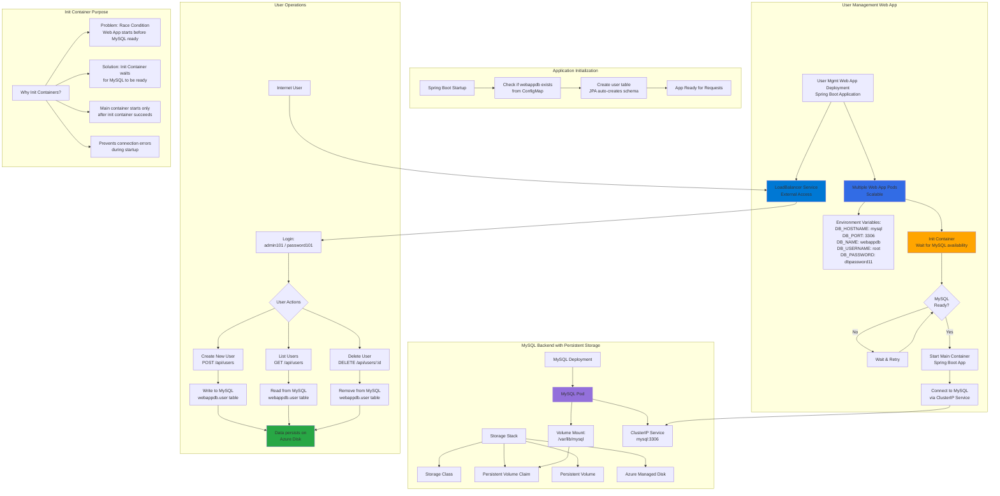

# Deploy UserManagement Web Application with MySQL Database

## 📊 Architecture & Workflow Diagram



### Understanding the Diagram

- **Full Stack Application**: Complete web application with **MySQL database backend** and **Spring Boot web frontend**, demonstrating real-world architecture
- **Environment Variables**: Pass **database connection details** to Spring Boot app, enabling connection to MySQL via Kubernetes **ClusterIP Service** name resolution
- **Init Container Pattern**: **Waits for MySQL availability** before starting main application container, preventing startup failures due to database unavailability
- **Race Condition Solution**: Without init container, web app might start **before MySQL is ready**, causing connection errors and Pod crash loops
- **Init Container Flow**: Runs **before main container**, checks MySQL readiness, **retries on failure**, and main container starts only after success
- **ClusterIP Service Discovery**: Web app connects to database using service name **"mysql"**, which Kubernetes DNS resolves to ClusterIP automatically
- **Spring Boot JPA**: Application uses **JPA/Hibernate** to automatically create **user table schema** in webappdb during first startup
- **RESTful API Operations**: Supports **Create, Read, Delete** operations via REST endpoints (/api/users) for user management
- **Data Persistence**: All user data written to MySQL is stored on **Azure Managed Disk**, surviving Pod restarts and redeployments
- **Horizontal Scalability**: Web app can scale to **multiple Pods** (all connecting to same MySQL instance) to handle increased load, while MySQL remains single instance with persistent storage

---

## Step-01: Introduction
- We are going to deploy a **User Management Web Application** which will connect to MySQL Database schema **webappdb** during startup.
- Then we can test the following APIs
  - Create Users
  - List Users
  - Delete User


| Kubernetes Concepts  | YAML File |
| ------------- | ------------- |
| Deployment  | 05-UserMgmtWebApp-Deployment.yml  |
| Environment Variables  | 05-UserMgmtWebApp-Deployment.yml  |
| Init Containers  | 05-UserMgmtWebApp-Deployment.yml  |
| Load Balancer Service  | 06-UserMgmtWebApp-Service.yml  |

## Step-02: Create following Kubernetes manifests

### Create User Management Web Application k8s Deployment manifest
- **Environment Variables**

| Key Name  | Value |
| ------------- | ------------- |
| DB_HOSTNAME  | mysql |
| DB_PORT  | 3306  |
| DB_NAME  | webappdb  |
| DB_USERNAME  | root  |
| DB_PASSWORD | dbpassword11  |  

- **Problem Observation:** 
  - If we deploy all manifests at a time, by the time mysql is ready our `User Management Web Application` pod will be throwing error due to unavailability of Database. 
  - To avoid such situations, we can apply `initContainers` concept to our User management Web Application `Deployment manifest`.
  - We will see that in our next section but for now lets continue to test the application

### Create User Management Web Application Load Balancer Service manifest
- LoadBalancer Service

## Step-03: Create UserManagement Web Application Deployment & Service 
```
# Create Deployment & LoadBalancer Service
kubectl apply -f kube-manifests/

# List Pods
kubectl get pods

# Verify logs of Usermgmt Web Application Pod
kubectl logs -f <pod-name> 
# If we have only 1 pod, below commnad works well for getting the logs
kubectl logs -f $(kubectl get po  | egrep -o 'usermgmt-webapp-[A-Za-z0-9-]+')

# Verify sc, pvc, pv
kubectl get sc,pvc,pv
```

- **Access Application**
```
# List Services
kubectl get svc

# Access Application
http://<External-IP-from-get-service-output>
Username: admin101
Password: password101
```

## Step-04: Test User Management Web Application using Browser
- Usecase-1: Login, List Users and Logout
  - Username: admin101
  - Password: password101
- Usecase-2: Login, Create New User and Logout and login with new user
  - Username: admin101
  - Password: password101
  - Create New User 
    - User Details: admin102, password102, fname102, lname102, admin102@gmail.com, ssn102
  - Login with newly user and list users
      - Username: admin102
      - Password: password102    

## Step-05: Verify Users in MySQL Database
```
# Connect to MYSQL Database
kubectl run -it --rm --image=mysql:5.6 --restart=Never mysql-client -- mysql -h mysql -pdbpassword11

# Verify webappdb schema got created which we provided in ConfigMap
mysql> show schemas;
mysql> use webappdb;
mysql> show tables;
mysql> select * from user;
```

## Step-06: Clean-Up
- Delete all k8s objects created as part of this section
```
# Delete All
kubectl delete -f kube-manifests/

# List Pods
kubectl get pods

# Verify sc, pvc, pv
kubectl get sc,pvc,pv

# Delete PV Exclusively
kubectl get pv
kubectl delete pv <PV-NAME>

# Delete Azure Disks 
Go to All Services -> Disks -> Select and Delete the Disk
```
