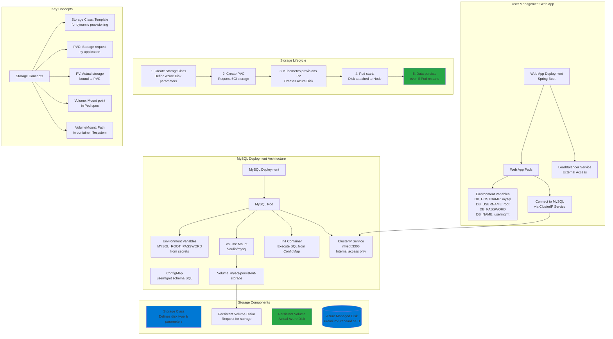

# Azure AKS Storage - Azure Disks

## 📊 Architecture & Workflow Diagram

### Understanding the Diagram

- **Storage Class**: Defines the **type of Azure Disk** (Premium SSD, Standard SSD) and provisioning parameters like **reclaim policy** and **volume binding mode**
- **Persistent Volume Claim (PVC)**: Application's **request for storage** specifying size (5Gi) and access mode (ReadWriteOnce for Azure Disks)
- **Persistent Volume (PV)**: Actual **Azure Managed Disk** automatically provisioned by Kubernetes based on PVC and Storage Class specifications
- **ConfigMap**: Stores **initialization SQL scripts** to create the `usermgmt` database schema when MySQL Pod starts
- **Init Containers**: Execute **one-time setup tasks** like running SQL scripts from ConfigMap before the main MySQL container starts
- **Volume Mount**: Mounts the **Azure Disk** at `/var/lib/mysql` inside the MySQL container to persist database files
- **ClusterIP Service**: Provides **stable internal endpoint** (mysql:3306) for the Web App to connect to MySQL without knowing Pod IPs
- **Environment Variables**: Pass **database connection details** to the Web App, enabling it to connect to MySQL using the ClusterIP Service name
- **Data Persistence**: Azure Disk ensures **data survives Pod restarts**, node failures, and redeployments - critical for stateful applications
- **Storage Lifecycle**: Shows the complete flow from **Storage Class definition** to **data persistence**, demonstrating Kubernetes dynamic provisioning

---

## Topics
1. Understand about Azure Disks
2. How we are going to use Azure Disks for Applications deployed on AKS for persistent Storage?
3. Understand best possible options available that we can configure in Storage Classess to persist our data, save cost and performance etc.

## Concepts
| Kubernetes Object  | YAML File |
| ------------- | ------------- |
| Storage Class  | 01-storage-class.yml |
| Persistent Volume Claim | 02-persistent-volume-claim.yml   |
| Config Map  | 03-UserManagement-ConfigMap.yml  |
| Deployment | 04-mysql-deployment.yml  |
| Environment Variables | 04-mysql-deployment.yml  |
| Volumes  | 04-mysql-deployment.yml  |
| VolumeMounts  | 04-mysql-deployment.yml  |
| ClusterIP Service  | 05-mysql-clusterip-service.yml  |
| Deployment  | 06-UserMgmtWebApp-Deployment.yml  |
| Environment Variables| 06-UserMgmtWebApp-Deployment.yml |
| Init Containers  | 06-UserMgmtWebApp-Deployment.yml  |
| Load Balancer Service  | 07-UserMgmtWebApp-Service.yml  |

