# Azure Files for AKS Storage

## 📊 Architecture & Workflow Diagram

```mermaid
graph TB
    subgraph "Azure Disks vs Azure Files"
        Comparison[Storage Type Comparison]
        Comparison --> AzureDisk[Azure Disks:<br/>✓ Block storage<br/>✓ Single Pod access ReadWriteOnce<br/>✓ Best for databases<br/>✗ Cannot share across Pods]
        Comparison --> AzureFiles[Azure Files:<br/>✓ File share storage SMB<br/>✓ Multi-Pod access ReadWriteMany<br/>✓ Share static content<br/>✓ Multiple Pods read/write]
    end
    
    subgraph "Azure Files Architecture"
        StorageAccount[Azure Storage Account<br/>Auto-created by AKS]
        StorageAccount --> FileShare[Azure File Share<br/>SMB 3.0 Protocol]
        FileShare --> SharedContent[Shared Files:<br/>file1.html<br/>file2.html]
    end
    
    subgraph "V1: Custom Storage Class"
        CustomSC[01-Storage-Class.yml<br/>Custom parameters]
        CustomSC --> SCParams[skuName: Standard_GRS<br/>Geo-redundant storage<br/>location: eastus]
        
        PVC1[02-Persistent-Volume-Claim.yml<br/>accessModes:<br/>- ReadWriteMany]
        PVC1 --> FileSharePV[PV: Azure File Share<br/>Can be mounted by multiple Pods]
    end
    
    subgraph "V2: AKS Default Storage Class"
        AKS_SC[Use AKS azurefile<br/>storage class]
        AKS_SC --> DefaultOptions[Only Standard_LRS or<br/>Premium_LRS available]
        
        PVC2[01-Persistent-Volume-Claim.yml<br/>storageClassName: azurefile<br/>accessModes:<br/>- ReadWriteMany]
    end
    
    subgraph "Nginx Deployment with Azure Files"
        NginxDeploy[03-Nginx-Deployment.yml<br/>replicas: 2]
        NginxDeploy --> NginxPod1[Nginx Pod 1]
        NginxDeploy --> NginxPod2[Nginx Pod 2]
        
        NginxPod1 --> VolumeMount1[volumeMount:<br/>/usr/share/nginx/html/app1]
        NginxPod2 --> VolumeMount2[volumeMount:<br/>/usr/share/nginx/html/app1]
        
        VolumeMount1 --> SharedVolume[volume: my-azurefile-volume<br/>PVC: my-azurefile-pvc]
        VolumeMount2 --> SharedVolume
        
        SharedVolume --> FileShare
        
        NginxDeploy --> LBSvc[04-Nginx-Service.yml<br/>LoadBalancer]
    end
    
    subgraph "Workflow"
        Deploy[kubectl apply -f<br/>kube-manifests-v1/ or v2/]
        Deploy --> CreateResources[Creates: SC, PVC, PV<br/>Deployment, Service]
        CreateResources --> AzureProvision[Azure provisions<br/>Storage Account & File Share]
        
        AzureProvision --> Upload[Upload files via Portal:<br/>Storage Account → File Shares<br/>→ kubernetes-dynamic-pv-xxx]
        Upload --> Access[Access via LB:<br/>http://Public-IP/app1/file1.html]
        
        Access --> BothPods[Both Nginx Pods serve<br/>same files from shared storage]
    end
    
    subgraph "Use Cases"
        UseCases[When to use Azure Files?]
        UseCases --> UC1[Static Content<br/>Images, CSS, JS, HTML]
        UseCases --> UC2[Shared Configuration<br/>Config files across Pods]
        UseCases --> UC3[Logging<br/>Centralized log storage]
        UseCases --> UC4[Content Management<br/>Upload once, serve from all Pods]
    end
    
    style AzureFiles fill:#28a745
    style FileShare fill:#0078d4
    style BothPods fill:#28a745
```



### Understanding the Diagram

- **Azure Disks vs Files**: **Azure Disks** provide block storage with **ReadWriteOnce** (single Pod), while **Azure Files** offer **SMB file shares** with **ReadWriteMany** (multiple Pods)
- **ReadWriteMany Access Mode**: Critical difference - **multiple Pods across different nodes** can mount and read/write the same Azure File Share simultaneously
- **Azure Storage Account**: AKS automatically creates a **Storage Account** in the node resource group when provisioning Azure Files PV
- **SMB 3.0 Protocol**: Azure Files uses **SMB** (Server Message Block) protocol for file sharing, compatible with Windows and Linux
- **Custom vs Default Storage Class**: **V1** uses custom Storage Class with **Standard_GRS** (geo-redundant), **V2** uses AKS default with limited options
- **Volume Mount Path**: Mounts Azure File Share at **`/usr/share/nginx/html/app1`**, making shared files accessible to Nginx for serving web content
- **Multiple Pod Access**: Both **Nginx Pod 1** and **Pod 2** mount the **same Azure File Share**, serving identical content to users
- **Azure Portal Upload**: Upload files directly to File Share via **Azure Portal** → **Storage Account** → **File Shares** → specific share
- **Dynamic Content Updates**: Files uploaded to Azure File Share are **immediately available** to all mounted Pods without Pod restart
- **Use Cases**: Perfect for **static content** (images, CSS, HTML), **shared configurations**, **centralized logging**, and **content management systems**

---

## Step-01: Introduction
- Understand Azure Files
- We are going to write a Deployment Manifest for NGINX Application which will have its static content served from **Azure File Shares** in **app1** folder
- We are going to mount the file share to a specific path `mountPath: "/usr/share/nginx/html/app1"` in the Nginx container

### kube-manifests-v1: Custom Storage Class
- We will define our own custom storage class with desired permissions 
  - Standard_LRS - standard locally redundant storage (LRS)
  - Standard_GRS - standard geo-redundant storage (GRS)
  - Standard_ZRS - standard zone redundant storage (ZRS)
  - Standard_RAGRS - standard read-access geo-redundant storage (RA-GRS)
  - Premium_LRS - premium locally redundant storage (LRS)

### kube-manifests-v2: AKS defined default storage class
- With default AKS created storage classes only below two options are available for us.
  - Standard_LRS - standard locally redundant storage (LRS)
  - Premium_LRS - premium locally redundant storage (LRS)  

- **Important Note:** Azure Files support premium storage in AKS clusters that run Kubernetes 1.13 or higher, minimum premium file share is 100GB


## Step-02: Create or Review kube-manifests-v1 and Nginx Files
- Kube Manifests
  - 01-Storage-Class.yml
  - 02-Persistent-Volume-Claim.yml
  - 03-Nginx-Deployment.yml
  - 04-Nginx-Service.yml
- nginx-files  
  - file1.html
  - file2.html

- k8s Deployment maniest - core item for review
```yml
          volumeMounts:
            - name: my-azurefile-volume
              mountPath: "/usr/share/nginx/html/app1"
      volumes:
        - name: my-azurefile-volume
          persistentVolumeClaim:
            claimName: my-azurefile-pvc    
```  

## Step-03: Deploy Kube Manifests V1
```
# Deploy
kubectl apply -f kube-manifests-v1/

# Verify SC, PVC, PV
kubectl get sc, pvc, pv

# Verify Pod
kubectl get pods
kubectl describe pod <pod-name>

# Get Load Balancer Public IP
kubectl get svc

# Access Application
http://<External-IP-from-get-service-output>
http://<External-IP-from-get-service-output>/app1/index.html
```

## Step-04: Upload Nginx Files to Azure File Share
- Go to Storage Accounts
- Select and Open storage account under resoure group **mc_aks-rg1_aksdemo1_eastus**
- In **Overview**, go to **File Shares**
- Open File share with name which starts as **kubernetes-dynamic-pv-xxxxxx**
- Click on **Upload** and upload 
  - file1.html 
  - file2.html

## Step-05: Access Application & Test
```
# URLs
http://<External-IP-from-get-service-output>/app1/file1.html
http://<External-IP-from-get-service-output>/app1/file2.html
```  

## Step-06: Clean-Up
```
# Delete
kubectl delete -f kube-manifests-v1/
```

## Step-07: Create or Review kube-manifests-v2 and Nginx Files
- Kube Manifests
  - 01-Persistent-Volume-Claim.yml
  - 02-Nginx-Deployment.yml
  - 03-Nginx-Service.yml
- nginx-files  
  - file1.html
  - file2.html


## Step-08: Deploy Kube Manifests V2
```
# Deploy
kubectl apply -f kube-manifests-v2/

# Verify SC, PVC, PV
kubectl get sc, pvc, pv

# Verify Pod
kubectl get pods
kubectl describe pod <pod-name>

# Get Load Balancer Public IP
kubectl get svc

# Access Application
http://<External-IP-from-get-service-output>
```

## Step-09: Upload Nginx Files to Azure File Share
- Go to Storage Accounts
- Select and Open storage account under resoure group **mc_aks-rg1_aksdemo1_eastus**
- In **Overview**, go to **File Shares**
- Open File share with name which starts as **kubernetes-dynamic-pv-xxxxxx**
- Click on **Upload** and upload 
  - file1.html 
  - file2.html

## Step-10: Access Application & Test
```
# URLs
http://<External-IP-from-get-service-output>/app1/file1.html
http://<External-IP-from-get-service-output>/app1/file2.html
```  

## Step-11: Clean-Up
```
# Delete
kubectl delete -f kube-manifests-v2/
```

## References
- https://docs.microsoft.com/en-us/azure/aks/azure-files-dynamic-pv