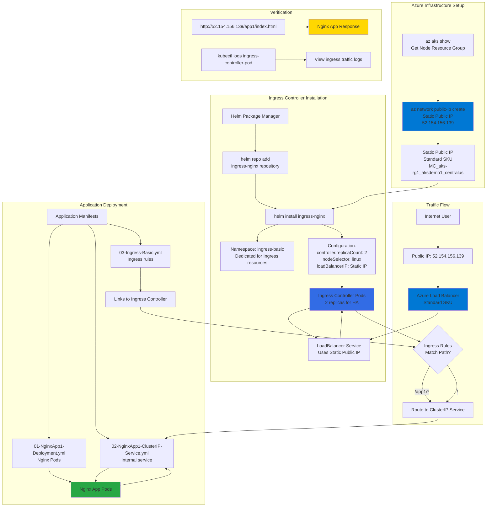

# Ingress - Basics

## 📊 Architecture & Workflow Diagram



### Understanding the Diagram

- **Static Public IP Creation**: First step is creating a **dedicated static public IP** in the **AKS node resource group** (MC_*) using **Azure CLI**, ensuring the IP persists across ingress controller recreations
- **Helm Installation**: Use **Helm package manager** to deploy the **NGINX Ingress Controller** with custom configurations including **2 replicas** for high availability and binding to the **static public IP**
- **Dedicated Namespace**: All ingress controller resources are deployed in the **ingress-basic namespace** to isolate them from application workloads, making management and future **cert-manager** integration easier
- **LoadBalancer Service**: The ingress controller creates a **Kubernetes LoadBalancer service** that provisions an **Azure Standard Load Balancer** automatically associated with the static public IP
- **Ingress Resource**: Applications define **Ingress resources** (separate from the controller) that specify **routing rules** based on URL paths to direct traffic to the appropriate **ClusterIP services**
- **Internal Routing**: Application pods are exposed via **ClusterIP services** (internal only), while the **Ingress Controller** handles external traffic and routes it internally based on **path-based rules**
- **Traffic Flow**: External users hit the **public IP** → **Azure Load Balancer** → **Ingress Controller pods** → Controller evaluates **ingress rules** → Routes to **ClusterIP service** → **Application pods**
- **High Availability**: With **2 ingress controller replicas**, traffic is distributed across both pods, providing **redundancy** and **load balancing** for ingress traffic processing
- **Namespace Flexibility**: While the **ingress controller** lives in **ingress-basic namespace**, the **ingress resources** and **applications** can be in any namespace (must be same namespace per app)
- **Verification Workflow**: Test by accessing the **public IP** with URL paths, check **ingress controller logs** to verify routing decisions, and confirm the **Azure Load Balancer** frontend IP configuration in Azure Portal

---

## Step-01: Introduction
### Ingress Basic Architecture
[](https://www.udemy.com/course/aws-eks-kubernetes-masterclass-devops-microservices/?referralCode=257C9AD5B5AF8D12D1E1)

### What are we going to learn?
- We are going to create a **Static Public IP** for Ingress in Azure AKS
- Associate that Public IP to **Ingress Controller** during installation.
- We are going to create a namespace `ingress-basic` for Ingress Controller where all ingress controller related things will be placed. 
- In future, we install **cert-manager** for SSL certificates also in same namespace. 
- **Caution Note:** This namespace is for Ingress controller stuff, ingress resource we can create in any other namespaces and not an issue.  Only condition is create ingress resource and ingress pointed application in same namespace (Example: App1 and Ingress resource of App1 should be in same namespace)
- Create / Review Ingress Manifest
- Deploy a simple Nginx App1 with Ingress manifest and test it
- Clean-Up or delete application after testing

## Step-02: Create Static Public IP
```t
# Get the resource group name of the AKS cluster 
az aks show --resource-group aks-rg1 --name aksdemo1 --query nodeResourceGroup -o tsv

# TEMPLATE - Create a public IP address with the static allocation
az network public-ip create --resource-group <REPLACE-OUTPUT-RG-FROM-PREVIOUS-COMMAND> --name myAKSPublicIPForIngress --sku Standard --allocation-method static --query publicIp.ipAddress -o tsv

# REPLACE - Create Public IP: Replace Resource Group value
az network public-ip create --resource-group MC_aks-rg1_aksdemo1_centralus --name myAKSPublicIPForIngress --sku Standard --allocation-method static --query publicIp.ipAddress -o tsv
```
- Make a note of Static IP which we will use in next step when installing Ingress Controller
```t
# Make a note of Public IP created for Ingress
52.154.156.139
```

## Step-03: Install Ingress Controller
```t
# Install Helm3 (if not installed)
brew install helm

# Create a namespace for your ingress resources
kubectl create namespace ingress-basic

# Add the official stable repository
helm repo add ingress-nginx https://kubernetes.github.io/ingress-nginx
helm repo update

#  Customizing the Chart Before Installing. 
helm show values ingress-nginx/ingress-nginx

# Use Helm to deploy an NGINX ingress controller
helm install ingress-nginx ingress-nginx/ingress-nginx \
    --namespace ingress-basic \
    --set controller.replicaCount=2 \
    --set controller.nodeSelector."kubernetes\.io/os"=linux \
    --set defaultBackend.nodeSelector."kubernetes\.io/os"=linux \
    --set controller.service.externalTrafficPolicy=Local \
    --set controller.service.loadBalancerIP="REPLACE_STATIC_IP" 

# Replace Static IP captured in Step-02 (without beta for NodeSelectors)
helm install ingress-nginx ingress-nginx/ingress-nginx \
    --namespace ingress-basic \
    --set controller.replicaCount=2 \
    --set controller.nodeSelector."kubernetes\.io/os"=linux \
    --set defaultBackend.nodeSelector."kubernetes\.io/os"=linux \
    --set controller.service.externalTrafficPolicy=Local \
    --set controller.service.loadBalancerIP="52.154.156.139"     


# List Services with labels
kubectl get service -l app.kubernetes.io/name=ingress-nginx --namespace ingress-basic

# List Pods
kubectl get pods -n ingress-basic
kubectl get all -n ingress-basic


# Access Public IP
http://<Public-IP-created-for-Ingress>

# Output should be
404 Not Found from Nginx

# Verify Load Balancer on Azure Mgmt Console
Primarily refer Settings -> Frontend IP Configuration
```

## Step-04: Review Application k8s manifests
- 01-NginxApp1-Deployment.yml
- 02-NginxApp1-ClusterIP-Service.yml
- 03-Ingress-Basic.yml

## Step-05: Deploy Application k8s manifests and verify
```t
# Deploy
kubectl apply -f kube-manifests/

# List Pods
kubectl get pods

# List Services
kubectl get svc

# List Ingress
kubectl get ingress

# Access Application
http://<Public-IP-created-for-Ingress>/app1/index.html
http://<Public-IP-created-for-Ingress>

# Verify Ingress Controller Logs
kubectl get pods -n ingress-basic
kubectl logs -f <pod-name> -n ingress-basic
```

## Step-06: Clean-Up Apps
```t
# Delete Apps
kubectl delete -f kube-manifests/
```

## Ingress Annotation Reference
- https://kubernetes.github.io/ingress-nginx/user-guide/nginx-configuration/annotations/

## Other References
- https://github.com/kubernetes/ingress-nginx
- https://github.com/kubernetes/ingress-nginx/blob/master/charts/ingress-nginx/values.yaml
- https://raw.githubusercontent.com/kubernetes/ingress-nginx/controller-v0.34.1/deploy/static/provider/cloud/deploy.yaml
- https://kubernetes.github.io/ingress-nginx/deploy/#azure
- https://helm.sh/docs/intro/install/
- https://kubernetes.io/docs/reference/generated/kubernetes-api/v1.19/#ingress-v1-networking-k8s-io
- [Kubernetes Ingress API Reference](https://kubernetes.io/docs/reference/generated/kubernetes-api/v1.24/#ingress-v1-networking-k8s-io)
- [Ingress Path Types](https://kubernetes.io/docs/concepts/services-networking/ingress/#path-types)

## Important Note
```
Ingress Admission Webhooks
With nginx-ingress-controller version 0.25+, the nginx ingress controller pod exposes an endpoint that will integrate with the validatingwebhookconfiguration Kubernetes feature to prevent bad ingress from being added to the cluster. This feature is enabled by default since 0.31.0.
```
