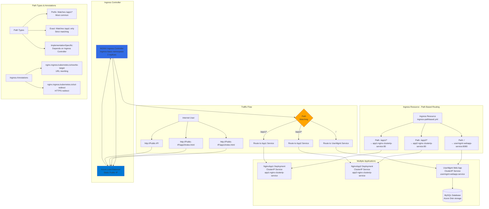

# Ingress - Context Path Based Routing

## 📊 Architecture & Workflow Diagram



### Understanding the Diagram

- **Path-Based Routing**: Single **Ingress resource** routes traffic to **multiple backend services** based on **URL path** (e.g., /app1, /app2, /)
- **Ingress Rules**: Each **path** in the Ingress spec defines a **routing rule** mapping URL paths to specific **ClusterIP Services** and ports
- **NGINX Ingress Controller**: Watches Ingress resources and **dynamically configures NGINX** to route traffic according to defined rules
- **Single Load Balancer**: All applications share **one Azure Load Balancer** with **one public IP**, reducing costs and simplifying DNS management
- **Path Matching**: Ingress Controller examines the **request path** and routes to the matching service (/app1/* → App1, /app2/* → App2, / → UserMgmt)
- **ClusterIP Services**: Backend applications use **ClusterIP Services** (internal only) since external access is handled by **Ingress**
- **URL Rewrite**: Use **rewrite-target annotation** to modify URL before forwarding to backend (e.g., /app1/index.html → /index.html)
- **Prefix Path Type**: Most common type - matches **all paths with the specified prefix** (/app1/anything matches /app1/*)
- **Cost Optimization**: Multiple apps behind **single Load Balancer** vs separate LoadBalancer Service per app saves **Azure Load Balancer costs**
- **Namespace Default**: Ingress resource must be in the **same namespace** as the backend Services it references (typically `default`)

---

## Step-01: Introduction
- We are going to implement context path based routing using Ingress

[](https://www.udemy.com/course/aws-eks-kubernetes-masterclass-devops-microservices/?referralCode=257C9AD5B5AF8D12D1E1)

## Step-02: Review k8s Application Manifests
- 01-NginxApp1-Manifests
- 02-NginxApp2-Manifests
- 03-UserMgmtmWebApp-Manifests

## Step-03: Review Ingress Service Manifests
- 04-IngressService-Manifests

## Step-04: Deploy and Verify
```t
# Deploy Apps
kubectl apply -R -f kube-manifests/

# List Pods
kubectl get pods

# List Services
kubectl get svc

# List Ingress
kubectl get ingress

# Verify Ingress Controller Logs
kubectl get pods -n ingress-basic
kubectl logs -f <pod-name> -n ingress-basic
```

## Step-05: Access Applications
```t
# Access App1
http://<Public-IP-created-for-Ingress>/app1/index.html

# Access App2
http://<Public-IP-created-for-Ingress>/app2/index.html

# Access Usermgmt Web App
http://<Public-IP-created-for-Ingress>
Username: admin101
Password: password101
```

## Step-06: Clean-Up Applications
```t
# Delete Apps
kubectl delete -f kube-manifests/

# Delete Azure Disk created for Usermgmt Web App
Go to All Services -> Azure Disks -> Delete disk
```

## Ingress Annotation Reference
- https://kubernetes.github.io/ingress-nginx/user-guide/nginx-configuration/annotations/
- [Ingress Path Types](https://kubernetes.io/docs/concepts/services-networking/ingress/#path-types)

