# Delegate Domain to Azure DNS

## 📊 Architecture & Workflow Diagram

```mermaid
graph TB
    subgraph "Domain Registration"
        DomainRegistrar[Domain Registrar<br/>AWS Route53, GoDaddy, Namecheap]
        DomainRegistrar --> OwnDomain[Your Domain:<br/>kubeoncloud.com]
    end
    
    subgraph "Before Delegation - AWS Route53"
        BeforeSetup[Initial Setup]
        BeforeSetup --> AWSHostedZone[AWS Route53 Hosted Zone<br/>kubeoncloud.com]
        AWSHostedZone --> AWSNameservers[AWS Nameservers:<br/>ns-123.awsdns-12.com<br/>ns-456.awsdns-45.net<br/>ns-789.awsdns-78.org<br/>ns-012.awsdns-01.co.uk]
        
        OwnDomain --> PointsToAWS[Points to AWS<br/>Nameservers]
    end
    
    subgraph "Create Azure DNS Zone"
        AzureDNS[Azure DNS Zones Service]
        AzureDNS --> CreateZone[Create DNS Zone:<br/>kubeoncloud.com]
        CreateZone --> AzureZone[Azure DNS Zone Created]
        AzureZone --> AzureNameservers[Azure Nameservers:<br/>ns1-04.azure-dns.com<br/>ns2-04.azure-dns.net<br/>ns3-04.azure-dns.org<br/>ns4-04.azure-dns.info]
    end
    
    subgraph "Delegation Process"
        Step1[Step 1: Note Azure Nameservers]
        Step1 --> Step2[Step 2: Update Domain Registrar]
        Step2 --> UpdateNS[Update Nameservers at Registrar<br/>Replace AWS NS with Azure NS]
        UpdateNS --> Step3[Step 3: Delete AWS Hosted Zone]
        Step3 --> DeleteAWS[Delete kubeoncloud.com<br/>from AWS Route53]
    end
    
    subgraph "After Delegation - Azure DNS"
        AfterSetup[New Setup]
        OwnDomain --> PointsToAzure[Now Points to Azure<br/>Nameservers]
        PointsToAzure --> AzureZone
        AzureZone --> DNSRecords[DNS Records in Azure:<br/>A Records<br/>CNAME Records<br/>TXT Records<br/>etc.]
    end
    
    subgraph "DNS Resolution Flow"
        UserBrowser[User Browser:<br/>kubeoncloud.com] --> DNSQuery[DNS Query]
        DNSQuery --> RootServers[Root DNS Servers]
        RootServers --> TLDServers[.com TLD Servers]
        TLDServers --> CheckRegistrar{Check Domain<br/>Registrar}
        CheckRegistrar --> AzureNS[Return Azure Nameservers]
        AzureNS --> AzureZoneQuery[Query Azure DNS Zone]
        AzureZoneQuery --> ReturnIP[Return IP Address<br/>of resource]
        ReturnIP --> UserBrowser
    end
    
    subgraph "Verification Commands"
        Verify[DNS Verification]
        Verify --> NSLookup1[nslookup -type=SOA<br/>kubeoncloud.com 8.8.8.8]
        Verify --> NSLookup2[nslookup -type=NS<br/>kubeoncloud.com 8.8.8.8]
        NSLookup1 --> VerifySOA[Check Start of Authority]
        NSLookup2 --> VerifyNS[Verify Nameservers]
    end
    
    style DomainRegistrar fill:#ffa500
    style AWSHostedZone fill:#ff9900
    style AzureZone fill:#0078d4
    style PointsToAzure fill:#28a745
```



### Understanding the Diagram

- **Domain Registrar**: Company where you **purchased the domain** (AWS Route53, GoDaddy, Namecheap) - controls which **nameservers** the domain uses
- **DNS Zone**: A **container for DNS records** hosted on a DNS service (AWS Route53, Azure DNS, etc.) that answers queries for a domain
- **Nameservers**: Authoritative servers that **store DNS records** and respond to DNS queries for your domain (NS records)
- **Delegation Purpose**: Move DNS management from **AWS Route53** to **Azure DNS** to consolidate services in Azure and simplify infrastructure
- **Azure DNS Zone Creation**: Create a DNS Zone in **Azure** for your domain, which automatically provisions **4 Azure nameservers**
- **Nameserver Update**: At your domain registrar, update the **NS records** to point to **Azure nameservers** instead of AWS nameservers
- **Propagation Time**: DNS changes take **24-48 hours** to propagate globally as DNS caches expire and update with new nameservers
- **Delete Old Zone**: After delegation, **delete the AWS Route53 Hosted Zone** to avoid confusion and stop AWS charges for the zone
- **DNS Resolution Flow**: When users access your domain, DNS resolves by querying **root servers** → **TLD servers** → **your nameservers** (Azure) → **IP address**
- **Verification**: Use **nslookup** with Google DNS (8.8.8.8) to verify **SOA and NS records** point to Azure nameservers after propagation

---

## Step-01: Introduction
- Understand about
  - Domain Registrar
  - DNS Zones
- Learn to delegate a domain from AWS Route53 to Azure DNS by creating DNS Zones in Azure Cloud 

[](https://www.udemy.com/course/aws-eks-kubernetes-masterclass-devops-microservices/?referralCode=257C9AD5B5AF8D12D1E1)


## Step-02: DNS Zones - Create DNS Zone
- Go to Service -> **DNS Zones**
- **Subscription:** StackSimplify-Paid-Subscription (You need to have a paid subscription for this)
- **Resource Group:** dns-zones
- **Name:** kubeoncloud.com
- **Resource Group Location:** East US
- Click on **Review + Create**

## Step-03: Make a note of Azure Nameservers
- Go to Services -> **DNS Zones** -> **kubeoncloud.com**
- Make a note of Nameservers
```
ns1-04.azure-dns.com.
ns2-04.azure-dns.net.
ns3-04.azure-dns.org.
ns4-04.azure-dns.info.
```

## Step-04: Update Nameservers at your Domain provider (Mine is AWS)
- **Verify before updation**
```
nslookup -type=SOA kubeoncloud.com
nslookup -type=NS kubeoncloud.com
```
- Go to AWS Route53 (This is my Domain Provider)
- Go to Services -> Route53 -> Registered Domains -> kubeoncloud.com
- Click on **Add or edit name servers**
- Update Azure Name servers here and click on **Update**
- Click on **Hosted Zones**
- Delete the hosted zone with name **kubeoncloud.com**
- **Verify after updation**
```
nslookup -type=SOA kubeoncloud.com 8.8.8.8
nslookup -type=NS kubeoncloud.com 8.8.8.8
```
