# Ingress - Domain Name Based Routing

## 📊 Architecture & Workflow Diagram

```mermaid
graph TB
    subgraph "Three Applications with Unique Domains"
        App1[App1 Nginx Deployment<br/>ClusterIP Service]
        App2[App2 Nginx Deployment<br/>ClusterIP Service]
        App3[App3 UserMgmt Web App<br/>ClusterIP Service]
    end
    
    subgraph "Ingress Resource - Domain-Based Routing"
        IngressResource[Ingress Resource<br/>Domain-based rules]
        IngressResource --> Rule1[host: eapp1.kubeoncloud.com<br/>→ app1-nginx-clusterip-service]
        IngressResource --> Rule2[host: eapp2.kubeoncloud.com<br/>→ app2-nginx-clusterip-service]
        IngressResource --> Rule3[host: eapp3.kubeoncloud.com<br/>→ usermgmt-webapp-service]
        
        Rule1 --> App1
        Rule2 --> App2
        Rule3 --> App3
    end
    
    subgraph "ExternalDNS Automation"
        IngressResource --> ExternalDNSAnnotation[Annotation on Ingress:<br/>external-dns.alpha.kubernetes.io/hostname<br/>eapp1, eapp2, eapp3.kubeoncloud.com]
        
        ExternalDNS[ExternalDNS Pod] --> WatchIngress[Watch Ingress Resources]
        WatchIngress --> DetectHostnames[Detect hostname annotations]
        DetectHostnames --> GetIngressIP[Get Ingress LoadBalancer IP:<br/>20.112.45.89]
        GetIngressIP --> CreateDNSRecords[Create/Update DNS A Records]
    end
    
    subgraph "Azure DNS Zone"
        CreateDNSRecords --> AzureDNS[Azure DNS Zone:<br/>kubeoncloud.com]
        AzureDNS --> Record1[A Record:<br/>eapp1.kubeoncloud.com → 20.112.45.89]
        AzureDNS --> Record2[A Record:<br/>eapp2.kubeoncloud.com → 20.112.45.89]
        AzureDNS --> Record3[A Record:<br/>eapp3.kubeoncloud.com → 20.112.45.89]
    end
    
    subgraph "Traffic Flow"
        User1[User requests<br/>eapp1.kubeoncloud.com] --> DNS1[DNS Resolution]
        User2[User requests<br/>eapp2.kubeoncloud.com] --> DNS2[DNS Resolution]
        User3[User requests<br/>eapp3.kubeoncloud.com] --> DNS3[DNS Resolution]
        
        DNS1 --> ResolveIP1[Resolves to: 20.112.45.89]
        DNS2 --> ResolveIP2[Resolves to: 20.112.45.89]
        DNS3 --> ResolveIP3[Resolves to: 20.112.45.89]
        
        ResolveIP1 --> LB[Azure Load Balancer<br/>Public IP: 20.112.45.89]
        ResolveIP2 --> LB
        ResolveIP3 --> LB
        
        LB --> IngressController[NGINX Ingress Controller]
        IngressController --> HostHeader{Check HTTP<br/>Host Header}
        
        HostHeader -->|eapp1.kubeoncloud.com| RouteApp1[Route to App1 Service]
        HostHeader -->|eapp2.kubeoncloud.com| RouteApp2[Route to App2 Service]
        HostHeader -->|eapp3.kubeoncloud.com| RouteApp3[Route to App3 Service]
        
        RouteApp1 --> App1
        RouteApp2 --> App2
        RouteApp3 --> App3
    end
    
    subgraph "Domain vs Path Routing"
        Comparison[Routing Comparison]
        Comparison --> DomainBased[Domain-Based:<br/>✓ Different domains per app<br/>✓ Professional appearance<br/>✓ SSL per domain<br/>✓ Better for microservices]
        Comparison --> PathBased[Path-Based:<br/>✓ Single domain<br/>✓ Different paths /app1, /app2<br/>✓ Simpler DNS management<br/>✓ Single SSL cert]
    end
    
    style IngressController fill:#326ce5
    style AzureDNS fill:#0078d4
    style ExternalDNS fill:#9370db
    style DomainBased fill:#28a745
```



### Understanding the Diagram

- **Domain-Based Routing**: Route traffic to different applications based on **domain name** in the HTTP Host header (eapp1, eapp2, eapp3.kubeoncloud.com)
- **Single Load Balancer**: All three domains point to the **same Load Balancer IP** (20.112.45.89), but Ingress routes to different backends based on domain
- **Host-Based Rules**: Ingress spec defines **host** field for each rule, matching incoming request's Host header to appropriate backend Service
- **ExternalDNS Integration**: Automatically creates **multiple A records** in Azure DNS, all pointing to the Ingress LoadBalancer IP
- **HTTP Host Header**: When users access eapp1.kubeoncloud.com, browser sends Host header, which Ingress Controller uses for **routing decision**
- **Professional URLs**: Domain-based routing provides **clean, professional URLs** (eapp1.kubeoncloud.com vs kubeoncloud.com/app1) for each application
- **Independent Scaling**: Each application can be **independently scaled, updated, and managed** while sharing the same Ingress Controller
- **SSL Certificates**: Each domain can have its own **SSL certificate**, enabling fine-grained security control per application
- **Microservices Architecture**: Domain-based routing is ideal for **microservices** where each service has its own subdomain (api, admin, portal)
- **Cost Efficiency**: Multiple applications share **one Load Balancer** and **one public IP**, reducing Azure infrastructure costs significantly

---

## Step-01: Introduction
- We are going to implement Domain Name based routing using Ingress
- We are going to use 3 applications for this.

[](https://www.udemy.com/course/aws-eks-kubernetes-masterclass-devops-microservices/?referralCode=257C9AD5B5AF8D12D1E1)

## Step-02: Review k8s Application Manifests
- App1 Manifests
- App2 Manifests
- App3 Manifests

## Step-03: Review Ingress Service Manifests
- 01-Ingress-DomainName-Based-Routing-app1-2-3.yml


## Step-04: Deploy and Verify
```t
# Deploy Apps
kubectl apply -R -f kube-manifests/

# List Pods
kubectl get pods

# List Services
kubectl get svc

# List Ingress
kubectl get ingress

# Verify Ingress Controller Logs
kubectl get pods -n ingress-basic
kubectl logs -f <pod-name> -n ingress-basic

# Verify External DNS pod to ensure record set got deleted
kubectl logs -f $(kubectl get po | egrep -o 'external-dns[A-Za-z0-9-]+')


# Verify Record set got automatically deleted in DNS Zones
# Template Command
az network dns record-set a list -g <Resource-Group-dnz-zones> -z <yourdomain.com>

# Replace DNS Zones Resource Group and yourdomain
az network dns record-set a list -g dns-zones -z kubeoncloud.com
```

## Step-05: Access Applications
```t
# Access App1
http://eapp1.kubeoncloud.com/app1/index.html

# Access App2
http://eapp2.kubeoncloud.com/app2/index.html

# Access Usermgmt Web App
http://eapp3.kubeoncloud.com
Username: admin101
Password: password101

```

## Step-06: Clean-Up Applications
```t
# Delete Apps
kubectl delete -R -f kube-manifests/

# Verify Record set got automatically deleted in DNS Zones
# Template Command
az network dns record-set a list -g <Resource-Group-dnz-zones> -z <yourdomain.com>

# Replace DNS Zones Resource Group and yourdomain
az network dns record-set a list -g dns-zones -z kubeoncloud.com
```

## Ingress Annotation Reference
- https://kubernetes.github.io/ingress-nginx/user-guide/nginx-configuration/annotations/

## Other References
- https://docs.nginx.com/nginx-ingress-controller/

