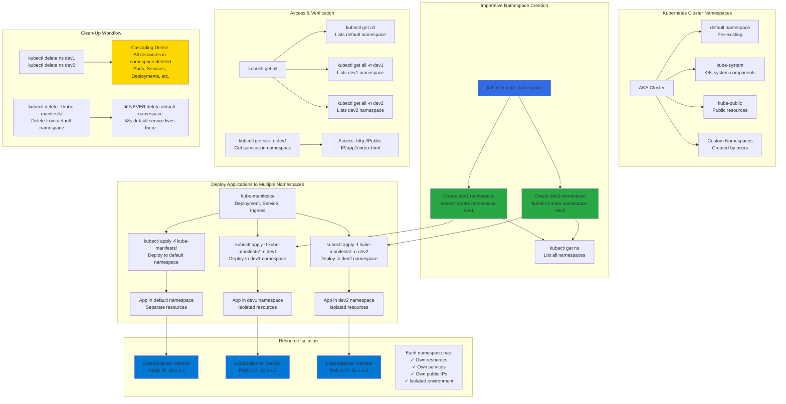

# Kubernetes Namespaces - Imperative using kubectl

## 📊 Architecture & Workflow Diagram



### Understanding the Diagram

- **Imperative Approach**: Use **kubectl create namespace** commands to create namespaces **on-the-fly** without YAML files, perfect for quick testing and learning Kubernetes namespace fundamentals
- **Pre-existing Namespaces**: Every cluster starts with **default** (user workloads), **kube-system** (control plane components), **kube-public** (publicly accessible resources), and **kube-node-lease** namespaces
- **Multiple Environment Isolation**: Create separate namespaces like **dev1** and **dev2** to simulate different **environments** (dev, staging, prod) within the same AKS cluster for resource segregation
- **Namespace-Specific Deployment**: Deploy identical manifests to multiple namespaces using the **-n flag** (kubectl apply -f kube-manifests/ -n dev1), creating **isolated copies** of applications
- **Resource Independence**: Each namespace gets its own **LoadBalancer services** with **separate public IPs**, ensuring applications in different namespaces are completely **isolated** and independently accessible
- **Default Namespace Behavior**: When no namespace is specified with **-n flag**, kubectl commands operate on the **default namespace** automatically, making it the implicit target for operations
- **List Resources by Namespace**: Use **kubectl get all -n namespace-name** to view resources in specific namespaces, or **kubectl get all --all-namespaces** to view resources across **all namespaces**
- **Cascading Deletion**: Deleting a namespace with **kubectl delete ns** automatically deletes **all resources** within it (pods, services, deployments, etc.), providing an easy cleanup mechanism
- **Default Namespace Protection**: **Never delete** the **default namespace** as it contains the **kubernetes default service** (cluster internal DNS) required for cluster operations
- **Use Case**: Namespaces enable **multi-tenancy**, **team separation**, **environment isolation** (dev/test/prod), and **resource quotas** to prevent one team from consuming all cluster resources

---

## Step-01: Introduction
- Namespaces allow to split-up resources into different groups.
- Resource names should be unique in a namespace
- We can use namespaces to create multiple environments like dev, staging and production etc
- Kubernetes will always list the resources from `default namespace` unless we provide exclusively from which namespace we need information from.

[](https://stacksimplify.com/course-images/azure-kubernetes-service-namespaces-1.png){:target="_blank"}  

[](https://stacksimplify.com/course-images/azure-kubernetes-service-namespaces-2.png){:target="_blank"}  

[](https://stacksimplify.com/course-images/azure-kubernetes-service-namespaces-3.png){:target="_blank"}  

## Pre-requisite Check (Optional)
- We should already have our AKS Cluster UP and Running. 
- We should have configured our AKS Cluster credentials in command line to execute `kubectl` commands
```
# Configure AKS Cluster Credentials from command line
az aks get-credentials --name aksdemo1 --resource-group aks-rg1

# List Worker Nodes
kubectl get nodes
kubectl get nodes -o wide
```


## Step-02: Namespaces Generic - Deploy in Dev1 and Dev2
### Create Namespace
```
# List Namespaces
kubectl get ns 

# Craete Namespace
kubectl create namespace <namespace-name>
kubectl create namespace dev1
kubectl create namespace dev2

# List Namespaces
kubectl get ns 
```
### Deploy All k8s Objects to default, dev1 and dev2 namespaces
```
# Deploy All k8s Objects
kubectl apply -f kube-manifests/  
kubectl apply -f kube-manifests/ -n dev1
kubectl apply -f kube-manifests/ -n dev2

# List all objects from default, dev1 & dev2 Namespaces
kubectl get all -n default
kubectl get all -n dev1
kubectl get all -n dev2
```

## Step-04: Access Application

### Default Namesapace
```
# List Services
kubectl get svc

# Access Application
http://<Public-IP-from-List-Services-Output>/app1/index.html
```

### Dev1 Namespace
```
# List Services
kubectl get svc -n dev1

# Access Application
http://<Public-IP-from-List-Services-Output>/app1/index.html
```
### Dev2 Namespace
```
# List Services
kubectl get svc -n dev2

# Access Application
http://<Public-IP-from-List-Services-Output>/app1/index.html
```
## Step-05: Clean-Up
```
# Delete namespaces dev1 & dev2
kubectl delete ns dev1
kubectl delete ns dev2

# List all objects from dev1 & dev2 Namespaces
kubectl get all -n dev1
kubectl get all -n dev2

# List Namespaces
kubectl get ns

# Delete App from default Namespace (Dont Delete default Namespace - k8s default service exists in it)
kubectl delete -f kube-manifests/

# Get all from All Namespaces
kubectl get all -all-namespaces
```

## References:
- https://kubernetes.io/docs/tasks/administer-cluster/namespaces-walkthrough/