# Kubernetes Namespaces - ResourceQuota - Declarative using YAML

## 📊 Architecture & Workflow Diagram

```mermaid
graph TB
    subgraph "Namespace without ResourceQuota"
        NSNoQuota[Namespace: dev-unlimited]
        NSNoQuota --> UnlimitedPods[Can create unlimited Pods<br/>❌ May exhaust node resources<br/>❌ May consume all cluster capacity<br/>❌ No cost control]
    end
    
    subgraph "Namespace with ResourceQuota"
        NSQuota[Namespace: dev-with-quota]
        NSQuota --> RQ[ResourceQuota Resource]
        
        RQ --> ComputeQuota[Compute Quotas:<br/>requests.cpu: 2 cores<br/>requests.memory: 4Gi<br/>limits.cpu: 4 cores<br/>limits.memory: 8Gi]
        
        RQ --> ObjectQuota[Object Count Quotas:<br/>pods: 10<br/>services: 5<br/>persistentvolumeclaims: 5<br/>configmaps: 10<br/>secrets: 10]
        
        RQ --> StorageQuota[Storage Quotas:<br/>requests.storage: 50Gi<br/>persistentvolumeclaims: 5]
    end
    
    subgraph "Resource Tracking"
        CurrentUsage[Current Namespace Usage]
        CurrentUsage --> UsedCPU[Used CPU requests: 1.5 cores]
        CurrentUsage --> UsedMemory[Used Memory requests: 3Gi]
        CurrentUsage --> UsedPods[Active Pods: 8]
        
        QuotaLimit[ResourceQuota Limits]
        QuotaLimit --> MaxCPU[Max CPU requests: 2 cores]
        QuotaLimit --> MaxMemory[Max Memory requests: 4Gi]
        QuotaLimit --> MaxPods[Max Pods: 10]
        
        Remaining[Remaining Capacity]
        Remaining --> AvailCPU[Available CPU: 0.5 cores]
        Remaining --> AvailMemory[Available Memory: 1Gi]
        Remaining --> AvailPods[Available Pods: 2]
    end
    
    subgraph "Pod Creation with ResourceQuota"
        NewPod[Create New Pod<br/>requests: 200m CPU, 256Mi Memory]
        NewPod --> CheckQuota{Check against<br/>ResourceQuota}
        
        CheckQuota --> SumResources[Sum all existing Pod requests<br/>+ new Pod requests]
        SumResources --> Compare{Total within<br/>quota limits?}
        
        Compare -->|Yes| AllowPod[Pod Created<br/>Update quota usage]
        Compare -->|No| DenyPod[Pod Rejected<br/>Error: exceeded quota]
        
        AllowPod --> UpdateTracking[Update tracking:<br/>Used CPU: 1.7 cores<br/>Used Memory: 3.25Gi<br/>Used Pods: 9]
    end
    
    subgraph "ResourceQuota vs LimitRange"
        Comparison[Key Differences]
        Comparison --> RQChar[ResourceQuota:<br/>✓ Total namespace limits<br/>✓ Aggregated consumption<br/>✓ Prevents namespace overuse<br/>✓ Affects all resources combined]
        Comparison --> LRChar[LimitRange:<br/>✓ Per-Pod/Container limits<br/>✓ Individual resource bounds<br/>✓ Sets defaults<br/>✓ Affects each resource individually]
    end
    
    subgraph "Use Cases"
        UseCases[ResourceQuota Use Cases]
        UseCases --> UC1[Multi-Tenancy:<br/>Fair resource distribution<br/>between teams]
        UseCases --> UC2[Cost Control:<br/>Limit spending per namespace<br/>environment budgets]
        UseCases --> UC3[Cluster Protection:<br/>Prevent resource exhaustion<br/>maintain cluster stability]
        UseCases --> UC4[Environment Limits:<br/>dev: small quota<br/>staging: medium<br/>prod: large]
    end
    
    style RQ fill:#326ce5
    style AllowPod fill:#28a745
    style DenyPod fill:#ff6b6b
    style RQChar fill:#9370db
```



### Understanding the Diagram

- **ResourceQuota**: Namespace-scoped resource that limits the **total aggregate consumption** of resources across all Pods in a namespace
- **Compute Quotas**: Set limits on **total CPU and memory** that can be requested/used by all Pods combined in the namespace
- **Object Count Quotas**: Limit the **number of Kubernetes objects** (Pods, Services, PVCs, ConfigMaps) that can exist in the namespace
- **Aggregate Tracking**: Kubernetes tracks the **sum of all resource requests** across all Pods and compares to quota limits
- **Admission Control**: When creating a new Pod, admission controller checks if **adding it would exceed quota** - rejects if yes
- **Prevents Oversubscription**: ResourceQuota ensures a namespace cannot **consume more than its fair share** of cluster resources
- **Real-Time Enforcement**: Quota is enforced at **creation time** - if quota exceeded, Pod creation fails with clear error message
- **ResourceQuota vs LimitRange**: ResourceQuota limits **total namespace consumption**, while LimitRange limits **individual Pod/Container** resources
- **Multi-Tenancy**: Essential for **multi-tenant clusters** where different teams share a cluster but need isolated resource allocations
- **Cost Control**: Helps **control cloud costs** by capping the maximum resources (and therefore cost) per namespace/environment

---

[](https://stacksimplify.com/course-images/azure-kubernetes-service-namespaces-resource-quota.png){:target="_blank"}  

## Step-01: Create Namespace manifest
- **Important Note:** File name starts with `00-`  so that when creating k8s objects namespace will get created first so it don't throw an error.
```yml
apiVersion: v1
kind: Namespace
metadata:
  name: dev3
```

## Step-02: Create ResourceQuota manifest
```yml
apiVersion: v1
kind: ResourceQuota
metadata:
  name: ns-resource-quota
  namespace: dev3
spec:
  hard:
    requests.cpu: "1"
    requests.memory: 1Gi
    limits.cpu: "2"
    limits.memory: 2Gi  
    pods: "5"    
    configmaps: "5" 
    persistentvolumeclaims: "5" 
    secrets: "5" 
    services: "5"                      
```


## Step-03: Create k8s objects & Test
```
# Create All Objects
kubectl apply -f kube-manifests/

# List Pods
kubectl get pods -n dev3

# View Pod Specification (CPU & Memory)
kubectl get pod <pod-name> -o yaml -n dev3

# Get & Describe Limits
kubectl get limits -n dev3
kubectl describe limits default-cpu-mem-limit-range -n dev3

# Get Resource Quota 
kubectl get quota -n dev3
kubectl describe quota ns-resource-quota -n dev3

# List Service
kubectl get svc -n dev3

# Access Application
http://<Public-IP-from-List-Services-Output>/app1/index.html

```
## Step-04: Clean-Up
- Delete all k8s objects created as part of this section
```
# Delete All
kubectl delete -f kube-manifests/
```

## References:
- https://kubernetes.io/docs/tasks/administer-cluster/namespaces-walkthrough/
- https://kubernetes.io/docs/tasks/administer-cluster/manage-resources/quota-memory-cpu-namespace/


## Additional References:
- https://kubernetes.io/docs/tasks/administer-cluster/manage-resources/cpu-constraint-namespace/ 
- https://kubernetes.io/docs/tasks/administer-cluster/manage-resources/memory-constraint-namespace/