# Namespaces

## 📊 Architecture & Workflow Diagram

```mermaid
graph TB
    subgraph "Kubernetes Cluster"
        Cluster[AKS Cluster] --> DefaultNS[default namespace<br/>User workloads]
        Cluster --> SystemNS[kube-system namespace<br/>K8s control plane components]
        Cluster --> PublicNS[kube-public namespace<br/>Publicly readable resources]
        Cluster --> NodeLeaseNS[kube-node-lease namespace<br/>Node heartbeats]
        Cluster --> CustomNS[Custom Namespaces<br/>dev, staging, prod]
    end
    
    subgraph "Namespace Benefits"
        Benefits[Why Use Namespaces?]
        Benefits --> Isolation[Resource Isolation<br/>Separate environments]
        Benefits --> RBAC[RBAC per Namespace<br/>Access control]
        Benefits --> Quotas[Resource Quotas<br/>Prevent over-consumption]
        Benefits --> Limits[Limit Ranges<br/>Default resources]
        Benefits --> Organization[Logical Organization<br/>Team/project separation]
    end
    
    subgraph "Three Namespace Types"
        Type1[dev Namespace]
        Type1 --> LimitRange[LimitRange:<br/>Default CPU: 100m-200m<br/>Default Memory: 128Mi-256Mi]
        Type1 --> DevPods[Development Pods<br/>Lower resource limits]
        
        Type2[staging Namespace]
        Type2 --> StagingQuota[ResourceQuota:<br/>Max Pods: 10<br/>Max CPU: 2 cores<br/>Max Memory: 4Gi]
        Type2 --> StagingPods[Staging Pods<br/>Testing environment]
        
        Type3[prod Namespace]
        Type3 --> ProdQuota[ResourceQuota:<br/>Max Pods: 50<br/>Max CPU: 10 cores<br/>Max Memory: 20Gi]
        Type3 --> ProdLimitRange[Strict LimitRanges<br/>Higher limits]
        Type3 --> ProdPods[Production Pods<br/>Mission-critical apps]
    end
    
    subgraph "Cross-Namespace Communication"
        PodDev[Pod in dev namespace] --> ServiceCall[Call Service:<br/>myservice.prod.svc.cluster.local]
        ServiceCall --> PodProd[Pod in prod namespace]
        
        DNSFormat[DNS Format:<br/>service-name.namespace.svc.cluster.local]
        DNSFormat --> SameNS[Same namespace:<br/>just use service-name]
        DNSFormat --> DiffNS[Different namespace:<br/>service-name.namespace-name]
    end
    
    subgraph "Namespace Operations"
        Imperative[Imperative Approach]
        Imperative --> CreateNS[kubectl create namespace dev]
        Imperative --> DeployToNS[kubectl apply -f app.yml -n dev]
        Imperative --> ListNS[kubectl get pods -n dev]
        
        Declarative[Declarative Approach]
        Declarative --> NSManifest[namespace.yml<br/>apiVersion: v1<br/>kind: Namespace<br/>metadata: name: dev]
        NSManifest --> ApplyNS[kubectl apply -f namespace.yml]
    end
    
    subgraph "Namespace-Scoped vs Cluster-Scoped"
        NSScoped[Namespace-Scoped Resources:<br/>Pods, Services, Deployments<br/>ConfigMaps, Secrets<br/>ReplicaSets]
        
        ClusterScoped[Cluster-Scoped Resources:<br/>Nodes, PersistentVolumes<br/>Namespaces, ClusterRoles<br/>StorageClasses]
    end
    
    style CustomNS fill:#326ce5
    style Isolation fill:#28a745
    style ProdPods fill:#ffa500
```

### Understanding the Diagram

- **Namespaces**: Virtual clusters within a physical cluster, providing **logical isolation** for resources without requiring separate clusters
- **Default Namespaces**: Kubernetes creates **default, kube-system, kube-public, kube-node-lease** namespaces automatically for different purposes
- **Resource Isolation**: Namespaces enable **team isolation**, **environment separation** (dev/staging/prod), and **multi-tenancy** within a single cluster
- **LimitRange**: Sets **default and maximum** resource requests/limits for containers in a namespace, preventing resource abuse
- **ResourceQuota**: Limits **total resources** consumed by all Pods in a namespace (total CPU, memory, number of Pods, etc.)
- **RBAC Integration**: Assign **Role-Based Access Control** per namespace, giving teams access only to their namespaces
- **Cross-Namespace DNS**: Access services in other namespaces using **service-name.namespace.svc.cluster.local** DNS format
- **Namespace-Scoped Resources**: Most resources (Pods, Services, Deployments) are **namespace-scoped**, existing only within their namespace
- **Cluster-Scoped Resources**: Some resources like **Nodes, PersistentVolumes, StorageClasses** are **cluster-wide**, not namespaced
- **Best Practices**: Use namespaces for **environment separation**, not just organizational; apply **LimitRanges and ResourceQuotas** to prevent resource exhaustion

---

1. Namespaces - Imperative using kubectl
2. Namespaces -  Declarative using YAML & LimitRange
3. Namespaces -  Declarative using YAML & ResourceQuota
