# Azure Kubernetes Service AKS Virtual Nodes (Serverless)

## 📊 Architecture & Workflow Diagram

```mermaid
graph TB
    subgraph "Create AKS Cluster with Virtual Nodes"
        Portal[Azure Portal]
        Portal --> CreateAKS[Create AKS Cluster<br/>Basics: aksdemo2]
        CreateAKS --> EnableVN[Node Pools:<br/>Enable Virtual Nodes]
        EnableVN --> AdvancedNet[Networking:<br/>Azure CNI Advanced<br/>Azure Network Policy]
        AdvancedNet --> CreateCluster[Review + Create]
    end
    
    subgraph "Cluster Architecture"
        AKSCluster[AKS Cluster: aksdemo2]
        
        AKSCluster --> RegularNode[Regular Node<br/>aks-agentpool-xxx-vmss000000<br/>Azure VM<br/>Status: Ready]
        
        AKSCluster --> VirtualNode[Virtual Node<br/>virtual-node-aci-linux<br/>Status: Ready<br/>Version: v1.14.3-vk-azure-aci]
        
        VirtualNode --> ACIConnector[Pod: aci-connector-linux-xxx<br/>Namespace: kube-system<br/>Manages ACI integration]
    end
    
    subgraph "Deployment Manifest for Virtual Nodes"
        Deployment[Deployment YAML]
        Deployment --> PodSpec[spec.template.spec:]
        
        PodSpec --> NodeSelector[nodeSelector:<br/>  kubernetes.io/role: agent<br/>  beta.kubernetes.io/os: linux<br/>  type: virtual-kubelet]
        
        PodSpec --> Tolerations[tolerations:<br/>  - key: virtual-kubelet.io/provider<br/>    operator: Exists<br/>  - key: azure.com/aci<br/>    effect: NoSchedule]
    end
    
    subgraph "Pod Scheduling"
        SchedulePod[kubectl apply -f deployment.yml]
        SchedulePod --> Scheduler[Kubernetes Scheduler]
        Scheduler --> EvaluateNode{Evaluate<br/>nodeSelector<br/>+ tolerations}
        
        EvaluateNode --> VirtualNodeMatch[Matches Virtual Node]
        VirtualNodeMatch --> ACIConnectorPod[aci-connector-linux<br/>receives Pod request]
        ACIConnectorPod --> ProvisionACI[Provision ACI<br/>Container Instance]
        ProvisionACI --> RunningPod[Pod Running on ACI<br/>Node: virtual-node-aci-linux]
    end
    
    subgraph "Verification Commands"
        Commands[kubectl Commands]
        Commands --> GetNodes[kubectl get nodes<br/>Shows: regular + virtual nodes]
        Commands --> GetPods[kubectl get pods -o wide<br/>Shows: Pod scheduled on virtual-node-aci-linux]
        Commands --> GetKubeSystem[kubectl get pods -n kube-system<br/>Shows: aci-connector-linux-xxx]
        Commands --> LogsACI[kubectl logs aci-connector-linux-xxx -n kube-system<br/>Shows: ACI provisioning logs]
    end
    
    subgraph "Azure Resources Created"
        ResourceGroup[Resource Group: aks-rg2]
        ResourceGroup --> AKSRes[AKS Cluster: aksdemo2]
        ResourceGroup --> VNET[Virtual Network<br/>Azure CNI]
        ResourceGroup --> VMSSRes[VMSS for Node Pool]
        ResourceGroup --> ACIRes[ACI Container Groups<br/>Created dynamically per Pod]
        ResourceGroup --> MSI[Managed Identity<br/>For ACI integration]
    end
    
    subgraph "Load Balancer Service"
        Service[Service Type: LoadBalancer]
        Service --> CheckNode{Pod scheduled<br/>on which node?}
        CheckNode -->|Virtual Node| ACIPubIP[ACI gets Public IP<br/>Azure Load Balancer created]
        CheckNode -->|Regular Node| VMPubIP[VM Load Balancer Public IP]
    end
    
    style VirtualNode fill:#00d1b2
    style ProvisionACI fill:#28a745
    style ACIConnector fill:#326ce5
```



### Understanding the Diagram

- **Azure CNI Required**: Virtual Nodes require **Azure CNI networking** to integrate ACI containers into the same virtual network as cluster nodes
- **Virtual Node Enablement**: Enable Virtual Nodes during **cluster creation** in the "Node Pools" tab or post-creation via Azure Portal/CLI
- **aci-connector-linux Pod**: Runs in **kube-system namespace** and acts as the Virtual Kubelet provider for Azure Container Instances
- **Two Node Types**: Cluster has both **regular VM nodes** (aks-agentpool-xxx) and **virtual-node-aci-linux** (serverless ACI)
- **NodeSelector + Tolerations**: Pods **must specify** the virtual-kubelet nodeSelector and ACI tolerations to be scheduled on Virtual Nodes
- **Dynamic ACI Provisioning**: When a Pod targets Virtual Node, **aci-connector-linux provisions an ACI Container Group** in the resource group
- **Fast Provisioning**: ACI containers start in **seconds**, much faster than provisioning new VMs for regular nodes
- **LoadBalancer Service**: Services of type LoadBalancer work seamlessly - **ACI Pods get their own Public IP** via Azure Load Balancer
- **Verification**: Use `kubectl get nodes` to see both regular and virtual nodes, and `kubectl get pods -o wide` to see which node each Pod runs on
- **Cost Model**: Pay for **ACI runtime per-second** for Virtual Node Pods, vs paying for always-on VMs for regular nodes

---

## Step-01: Introduction
- What is [Virtual Kubelet](https://github.com/virtual-kubelet/virtual-kubelet)?
- What is [Azure Container Instances - ACI](https://docs.microsoft.com/en-us/azure/container-instances/)?
- What are [AKS Virtual Nodes](https://docs.microsoft.com/en-us/azure/aks/virtual-nodes-portal)?
- **Important Note:** Virtual nodes require AKS clusters with [Azure CNI networking](https://docs.microsoft.com/en-us/azure/aks/configure-azure-cni)

[](https://stacksimplify.com/course-images/azure-kubernetes-service-virtual-nodes.png)

 ## Step-02: Create a new cluster using Azure Management Console
- **Basics**
  - **Subscription:** Free Trial or Pay-as-you-go
  - **Resource Group:** Creat New: aks-rg2
  - **Kubernetes Cluster Name:** aksdemo2
  - **Region:** (US) Central US
  - **Kubernetes Version:** Select what ever is latest stable version
  - **Node Size:** Standard DS2 v2 (Default one)
  - **Node Count:** 1
- **Node Pools**
  - **Virtual Nodes:** Enabled
  - leave to defaults
- **Authentication**
  - Authentication method: 	System-assigned managed identity
  - Rest all leave to defaults
- **Networking**
  - **Network Configuration:** Advanced
  - **Network Policy:** Azure
  - Rest all leave to defaults
- **Integrations**
  - Azure Container Registry: None
  - leave to defaults
- **Tags**
  - leave to defaults
- **Review + Create**
  - Click on **Create**


## Step-03: Verify Nodes & ACI
```
# Configure Command Line Credentials
az aks get-credentials --name aksdemo2 --resource-group aks-rg2

# Verify Nodes
kubectl get nodes 
kubectl get nodes -o wide

# Verify aci-connector-linux
kubectl get pods -n kube-system

# Verify logs of ACI Connector Linux
kubectl logs -f $(kubectl get po -n kube-system | egrep -o 'aci-connector-linux-[A-Za-z0-9-]+') -n kube-system
```
- We should see `virtual-node-aci-linux` node also listed for `kubectl get nodes` output
- **Sample Output**
```
Kalyans-MacBook-Pro:azure-aks-kubernetes-masterclass kdaida$ kubectl get nodes
NAME                                STATUS   ROLES   AGE   VERSION
aks-agentpool-87689508-vmss000000   Ready    agent   24m   v1.17.11
virtual-node-aci-linux              Ready    agent   21m   v1.14.3-vk-azure-aci-v1.2.1.1
Kalyans-MacBook-Pro:azure-aks-kubernetes-masterclass kdaida$
```

## Step-04: Update Deployment Manifest to Schedule Pod on Virtual Nodes
- The below section should be added in Deployment for Azure AKS to schedule the pod on Azure Virtual Nodes
- Review the manifests
```yaml
      nodeSelector:
        kubernetes.io/role: agent
        beta.kubernetes.io/os: linux
        type: virtual-kubelet
      tolerations:
      - key: virtual-kubelet.io/provider
        operator: Exists
      - key: azure.com/aci
        effect: NoSchedule
```

## Step-05: Deploy Application Manifests
```
# Deploy
kubectl apply -f kube-manifests/

# Verify pods
kubectl get pods -o wide

# Get Public IP
kubectl get svc

# Access Application
http://<Public-ip-captured-from-get-service>
```

## Step-06: Scale the Deployment 
```
# List Deployments
kubectl get deploy

# Scale the Deployment to 10 Replicas
kubectl scale --replicas=10 deployment app1-nginx-deployment

# List Pods
kubectl get pods
```

## Step-07: Clean-Up
```
# Delete Application
kubectl delete -f kube-manifests/

# Delete this new cluster created for Virtual Nodes (if you want to)
az aks delete --name aksdemo2 --resource-group aks-rg2
```

## References
- [Azure Virtual Nodes - Limitations](https://docs.microsoft.com/en-us/azure/aks/virtual-nodes-cli#known-limitations)
- [Virtual kubelet - Referece - 1](https://github.com/virtual-kubelet/virtual-kubelet)
- [Virtual kubelet - Referece - 2](https://github.com/virtual-kubelet/azure-aci/blob/master/README.md)
- [Virtual Node Autoscale - Optional & legacy](https://github.com/Azure-Samples/virtual-node-autoscale)
