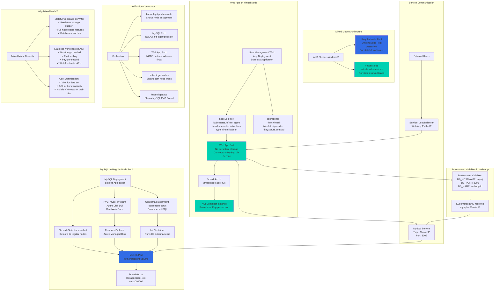

# Azure AKS Virtual Nodes Mixed Mode Deployments

## 📊 Architecture & Workflow Diagram



### Understanding the Diagram

- **Mixed Mode Deployment**: Run **stateful workloads (MySQL) on regular VM nodes** for persistent storage, and **stateless workloads (Web App) on Virtual Nodes (ACI)** for cost efficiency
- **MySQL on Regular Nodes**: MySQL Pod scheduled on **regular node pool** because it needs **Persistent Volume** support (Azure Disk), which Virtual Nodes don't support
- **Web App on Virtual Nodes**: User Management Web App scheduled on **virtual-node-aci-linux** using nodeSelector and tolerations for **serverless ACI execution**
- **NodeSelector for Virtual Nodes**: Web App Deployment specifies `type: virtual-kubelet` nodeSelector to target Virtual Nodes instead of regular VMs
- **Tolerations Required**: Must add tolerations for `virtual-kubelet.io/provider` and `azure.com/aci` to allow scheduling on Virtual Nodes
- **Service Communication**: Web App connects to MySQL via **ClusterIP Service** using Kubernetes DNS (service name: `mysql` resolves to ClusterIP)
- **Persistent Volume**: MySQL uses **PVC with Azure Disk** for data persistence - only works on regular VM nodes, not Virtual Nodes
- **Init Container**: MySQL Pod uses **ConfigMap** to run database initialization script via Init Container before main container starts
- **Cost Efficiency**: Virtual Nodes provide **pay-per-second billing** for web app, while VMs run database tier - no need for extra VMs for web tier burst capacity
- **Verification**: Use `kubectl get pods -o wide` to see which node each Pod is scheduled on - MySQL on `aks-agentpool-xxx`, Web App on `virtual-node-aci-linux`

---

## Step-01: Introduction
- We are going to deploy MySQL on regular AKS nodepools (default system nodepool)
- We are going to deploy **User Management Web Application** on Azure Virtual Nodes
- All this we are going to do using NodeSelectors concept in Kubernetes

[](https://stacksimplify.com/course-images/azure-kubernetes-service-virtual-nodes-mixed-mode-deployments.png)

## Step-02: Review Kubernetes Manifests
### MySQL Deployment 
- **File Name:** 04-mysql-deployment.yml
- No changes in it, MySQL pod will get scheduled on default AKS nodepool

### User Management Web Application Deployment
- **File Name:** 06-UserMgmtWebApp-Deployment.yml
- User Management web app pod will schedule on Azure Virtual Node
```yaml
# To schedule pods on Azure Virtual Nodes            
      nodeSelector:
        kubernetes.io/role: agent
        beta.kubernetes.io/os: linux
        type: virtual-kubelet
      tolerations:
      - key: virtual-kubelet.io/provider
        operator: Exists
      - key: azure.com/aci
        effect: NoSchedule    
```

## Step-03: Deploy App & Test
```
# Deploy
kubectl apply -f kube-manifests/

# Verify Pods
kubectl get pods

# Verify Pods scheduled on which Nodes
kubectl get pods -o wide

# List Kubernetes Nodes
kubectl get nodes 
kubectl get nodes -o wide

# List Node Pools
az aks nodepool list --cluster-name aksdemo2 --resource-group aks-rg2 --output table

# Access Application
kubectl get svc
http://<Public-IP-from-Get-Service-Output>
Username: admin101
Password: password101
```


## Step-04: Clean-Up Apps
```
# Delete App
kubectl delete -f kube-manifests/

# Delete this new cluster created for Virtual Nodes (if you want to)
az aks delete --name aksdemo2 --resource-group aks-rg2
```

