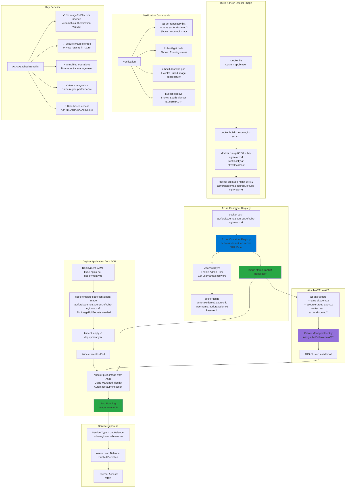

# Integrate Azure Container Registry ACR with AKS

## 📊 Architecture & Workflow Diagram



### Understanding the Diagram

- **Azure Container Registry (ACR)**: Private **Docker registry** in Azure for securely storing and managing container images with SKU options (Basic, Standard, Premium)
- **Build & Push Workflow**: Build Docker image locally, test it, **tag with ACR registry name**, then push to ACR repository
- **Admin User Authentication**: Enable **Admin User** in ACR Access Keys to get username/password for Docker CLI authentication (for push)
- **Attach ACR to AKS**: Use `az aks update --attach-acr` to **automatically create Managed Identity** with AcrPull role on the ACR for AKS cluster
- **No imagePullSecrets Required**: Once ACR is attached, Pods can pull images **without imagePullSecrets** - authentication handled automatically by Managed Identity
- **Managed Identity**: AKS uses **System-assigned or User-assigned Managed Identity** with AcrPull role to authenticate with ACR securely
- **Image Pull**: When Pod is created, Kubelet **automatically pulls image from ACR** using Managed Identity credentials - no manual secrets needed
- **LoadBalancer Service**: Expose application externally using **Service Type: LoadBalancer**, which provisions Azure Load Balancer with Public IP
- **Verification**: Use `az acr repository list` to verify image in ACR, `kubectl describe pod` to see image pull events, and `kubectl get svc` for Public IP
- **Best Practice**: ACR attached method is **simplest and most secure** for AKS integration - use for production workloads

---

## Step-00: Pre-requisites
- We should have Azure AKS Cluster Up and Running.
- We have created a new aksdemo2 cluster as part of Azure Virtual Nodes demo in previous section.
- We are going to leverage the same cluster for all 3 demos planned for Azure Container Registry and AKS.
```
# Configure Command Line Credentials
az aks get-credentials --name aksdemo2 --resource-group aks-rg2

# Verify Nodes
kubectl get nodes 
kubectl get nodes -o wide

# Verify aci-connector-linux
kubectl get pods -n kube-system

# Verify logs of ACI Connector Linux
kubectl logs -f $(kubectl get po -n kube-system | egrep -o 'aci-connector-linux-[A-Za-z0-9-]+') -n kube-system
```

## Step-01: Introduction
- Build a Docker Image from our Local Docker on our Desktop
- Tag the docker image in the required ACR Format
- Push to Azure Container Registry
- Attach ACR with AKS
- Deploy kubernetes workloads and see if the docker image got pulled automatically from ACR we have created. 


[](https://stacksimplify.com/course-images/azure-kubernetes-service-and-acr.png)

[](https://stacksimplify.com/course-images/azure-container-registry-pricing-tiers.png)

## Step-02: Create Azure Container Registry
- Go to Services -> Container Registries
- Click on **Add**
- Subscription: StackSimplify-Paid-Subsciption
- Resource Group: aks-rg2
- Registry Name: acrforaksdemo2   (NAME should be unique across Azure Cloud)
- Location: Central US
- SKU: Basic  (Pricing Note: $0.167 per day)
- Click on **Review + Create**
- Click on **Create**

## Step-02: Build Docker Image Locally
- Review Docker Manigests 
```
# Change Directory
cd docker-manifests
 
# Docker Build
docker build -t kube-nginx-acr:v1 .

# List Docker Images
docker images
docker images kube-nginx-acr:v1
```

## Step-03: Run Docker Container locally and test
```
# Run locally and Test
docker run --name kube-nginx-acr --rm -p 80:80 -d kube-nginx-acr:v1

# Access Application locally
http://localhost

# Stop Docker Image
docker stop kube-nginx-acr
```

## Step-04: Enable Docker Login for ACR Repository 
- Go to Services -> Container Registries -> acrforaksdemo2
- Go to **Access Keys**
- Click on **Enable Admin User**
- Make a note of Username and password

## Step-05: Push Docker Image to ACR

### Build, Test Locally, Tag and Push to ACR
```
# Export Command
export ACR_REGISTRY=acrforaksdemo2.azurecr.io
export ACR_NAMESPACE=app1
export ACR_IMAGE_NAME=kube-nginx-acr
export ACR_IMAGE_TAG=v1
echo $ACR_REGISTRY, $ACR_NAMESPACE, $ACR_IMAGE_NAME, $ACR_IMAGE_TAG

# Login to ACR
docker login $ACR_REGISTRY

# Tag
docker tag kube-nginx-acr:v1  $ACR_REGISTRY/$ACR_NAMESPACE/$ACR_IMAGE_NAME:$ACR_IMAGE_TAG
It replaces as below
docker tag kube-nginx-acr:v1 acrforaksdemo2.azurecr.io/app1/kube-nginx-acr:v1

# List Docker Images to verify
docker images kube-nginx-acr:v1
docker images $ACR_REGISTRY/$ACR_NAMESPACE/$ACR_IMAGE_NAME:$ACR_IMAGE_TAG

# Push Docker Images
docker push $ACR_REGISTRY/$ACR_NAMESPACE/$ACR_IMAGE_NAME:$ACR_IMAGE_TAG
```
### Verify Docker Image in ACR Repository
- Go to Services -> Container Registries -> acrforaksdemo2
- Go to **Repositories** -> **app1/kube-nginx-acr**


## Step-05: Configure ACR integration for existing AKS clusters
```
#Set ACR NAME
export ACR_NAME=acrforaksdemo2
echo $ACR_NAME

# Template
az aks update -n myAKSCluster -g myResourceGroup --attach-acr <acr-name>

# Replace Cluster, Resource Group and ACR Repo Name
az aks update -n aksdemo2 -g aks-rg2 --attach-acr $ACR_NAME
```


## Step-06: Update & Deploy to AKS & Test
### Update Deployment Manifest with Image Name
```yaml
    spec:
      containers:
        - name: acrdemo-localdocker
          image: acrforaksdemo2.azurecr.io/app1/kube-nginx-acr:v1
          imagePullPolicy: Always
          ports:
            - containerPort: 80
```

### Deploy to AKS and Test
```
# Deploy
kubectl apply -f kube-manifests/

# List Pods
kubectl get pods

# Describe Pod
kubectl describe pod <pod-name>

# Get Load Balancer IP
kubectl get svc

# Access Application
http://<External-IP-from-get-service-output>
```

## Step-07: Clean-Up
```
# Delete Applications
kubectl delete -f kube-manifests/
```

## Step-08: Detach ACR from AKS Cluster (Optional)
```
#Set ACR NAME
export ACR_NAME=acrforaksdemo2
echo $ACR_NAME

# Detach ACR with AKS Cluster
az aks update -n aksdemo2 -g aks-rg2 --detach-acr $ACR_NAME

# Delete ACR Repository
Go To Services -> Container Registries -> acrforaksdemo2 -> Delete it
```

