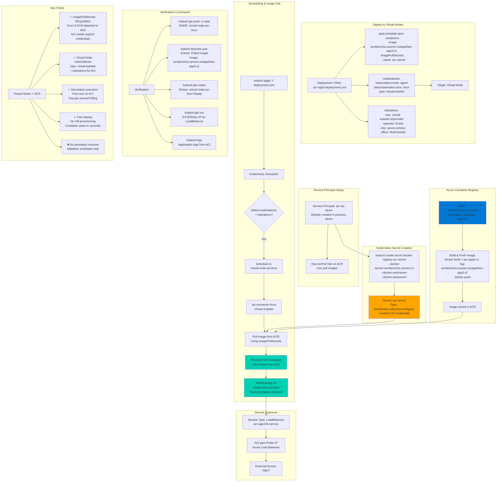

# Pull Docker Images from ACR using Service Principal and Run on Azure Virtual Nodes

## 📊 Architecture & Workflow Diagram



### Understanding the Diagram

- **Virtual Nodes with ACR**: Virtual Nodes (ACI) **always require imagePullSecrets** to pull from ACR, even if ACR is attached to AKS cluster
- **Service Principal Reuse**: Can **reuse same Service Principal** created in previous demo (acr-sp-demo) with AcrPull role on ACR
- **imagePullSecrets Required**: Unlike regular nodes with attached ACR, **Virtual Nodes need explicit credentials** via imagePullSecrets for ACI to authenticate with ACR
- **NodeSelector + Tolerations**: Must specify `type: virtual-kubelet` nodeSelector and ACI tolerations to **schedule Pod on Virtual Node** instead of regular VMs
- **aci-connector-linux**: Virtual Kubelet (aci-connector-linux) receives Pod spec, **extracts imagePullSecrets**, and passes to ACI for image pull
- **ACI Provisioning**: ACI provisions container instance, **pulls image from ACR using SP credentials**, and runs container in serverless environment
- **Fast Startup**: Virtual Nodes provide **near-instant Pod startup** (seconds) as no VM provisioning needed - ideal for burst workloads
- **Pay-per-Second**: ACI charges **per-second billing** for container runtime, more cost-effective than always-on VMs for short-lived or burst workloads
- **LoadBalancer Service**: Virtual Node Pods get **their own Azure Load Balancer Public IP** when exposed via LoadBalancer Service
- **Stateless Only**: Virtual Nodes **don't support persistent volumes** - only use for stateless applications like web frontends, APIs, batch jobs

---

## Step-01: Introduction
- We are going to pull Images from Azure Container Registry which is not attached to AKS Cluster. 
- We are going to do that using Azure Service Principals.
- Build a Docker Image from our Local Docker on our Desktop
- Push to Azure Container Registry
- Create Service Principal and using that create Kubernetes Secret. 
- Using Kubernetes Secret associated to Pod Specificaiton, pull the docker image from Azure Container Registry and Schedule on Azure AKS Virtual Nodes

[](https://stacksimplify.com/course-images/azure-kubernetes-service-and-acr-virtualnodes.png)


## Step-02: Build Docker Image Locally
```
# Change Directory
cd docker-manifests
 
# Docker Build
docker build -t acr-app3:v1 .

# List Docker Images
docker images
docker images acr-app3:v1
```

## Step-03: Run locally and test
```
# Run locally and Test
docker run --name acr-app3 --rm -p 80:80 -d acr-app3:v1

# Access Application locally
http://localhost

# Stop Docker Image
docker stop acr-app3
```

## Step-04: Enable Docker Login for ACR Repository 
- Go to Services -> Container Registries -> acrdemo2ss
- Go to **Access Keys**
- Click on **Enable Admin User**
- Make a note of Username and password

## Step-05: Push Docker Image to Azure Container Registry

### Build, Test Locally, Tag and Push to ACR
```
# Export Command
export ACR_REGISTRY=acrdemo2ss.azurecr.io
export ACR_NAMESPACE=app3
export ACR_IMAGE_NAME=acr-app3
export ACR_IMAGE_TAG=v1
echo $ACR_REGISTRY, $ACR_NAMESPACE, $ACR_IMAGE_NAME, $ACR_IMAGE_TAG

# Login to ACR
docker login $ACR_REGISTRY

# Tag
docker tag acr-app3:v1  $ACR_REGISTRY/$ACR_NAMESPACE/$ACR_IMAGE_NAME:$ACR_IMAGE_TAG
It replaces as below
docker tag acr-app3:v1 acrdemo2ss.azurecr.io/app3/acr-app3:v1

# List Docker Images to verify
docker images acr-app3:v1
docker images $ACR_REGISTRY/$ACR_NAMESPACE/$ACR_IMAGE_NAME:$ACR_IMAGE_TAG

# Push Docker Images
docker push $ACR_REGISTRY/$ACR_NAMESPACE/$ACR_IMAGE_NAME:$ACR_IMAGE_TAG
```
### Verify Docker Image in ACR Repository
- Go to Services -> Container Registries -> acrdemo2ss
- Go to **Repositories** -> **app3/acr-app3**

## Step-06: Review & Update Deployment Manifest with Image Name, ImagePullSecrets
```yaml
    spec:
      containers:
        - name: acrdemo-localdocker
          image: acrdemo2ss.azurecr.io/app3/acr-app3:v1
          imagePullPolicy: Always
          ports:
            - containerPort: 80
      imagePullSecrets:
        - name: acrdemo2ss-secret           
```

## Step-07: Review & Update Deployment Manifest with NodeSelector
```yaml
# To schedule pods on Azure Virtual Nodes            
      nodeSelector:
        kubernetes.io/role: agent
        beta.kubernetes.io/os: linux
        type: virtual-kubelet
      tolerations:
      - key: virtual-kubelet.io/provider
        operator: Exists
      - key: azure.com/aci
        effect: NoSchedule   
```

## Step-08: Deploy to AKS and Test
```
# Deploy
kubectl apply -f kube-manifests/

# List Pods
kubectl get pods -o wide

# Get Load Balancer IP
kubectl get svc

# Access Application
http://<External-IP-from-get-service-output>
```

## Step-07: Clean-Up
```
# Delete Applications
kubectl delete -f kube-manifests/

# Delete Container Registry
Go to Services -> Container Registries -> acrdemo2ss -> Delete

# Delete AKS Cluster
Go to Services -> Resource Groups -> aks-rg2 -> Delete
```
