# Azure Container Registry Integrate wtih AKS

## 📊 Architecture & Workflow Diagram

```mermaid
graph TB
    subgraph "Azure Container Registry - ACR"
        ACR[Azure Container Registry<br/>acrdemo2ss.azurecr.io]
        ACR --> BuildPush[Build & Push Images]
        BuildPush --> Image1[app1-nginx:v1]
        BuildPush --> Image2[app2-nginx:v1]
        BuildPush --> Image3[kube-nginx-acr:v1]
    end
    
    subgraph "Integration Method 1: ACR Attached to AKS"
        AKSAttached[AKS Cluster<br/>ACR Attached]
        ACRAttached[ACR: acrdemo2ss]
        ACRAttached -->|Managed Identity<br/>AcrPull Role| AKSAttached
        
        AKSAttached --> PullImage1[Pull images directly<br/>No authentication needed]
        PullImage1 --> ScheduleNodePool1[Schedule to<br/>AKS Node Pools]
        
        DeploymentAttached[Deployment YAML]
        DeploymentAttached --> ImageSpec1[image: acrdemo2ss.azurecr.io/app1-nginx:v1<br/>No imagePullSecrets needed]
    end
    
    subgraph "Integration Method 2: ACR NOT Attached - Service Principal"
        AKSNotAttached[AKS Cluster<br/>ACR NOT Attached]
        ACRNotAttached[ACR: acrdemo2ss]
        
        CreateSP[Create Service Principal]
        CreateSP --> SPCredentials[SP Credentials:<br/>Client ID<br/>Client Secret]
        
        SPCredentials --> AssignRole[Assign Role:<br/>AcrPull on ACR<br/>to Service Principal]
        
        AssignRole --> CreateSecret[Create K8s Secret:<br/>kubectl create secret docker-registry<br/>--docker-server=acrdemo2ss.azurecr.io<br/>--docker-username=SP_CLIENT_ID<br/>--docker-password=SP_CLIENT_SECRET]
        
        CreateSecret --> K8sSecret[Secret: acr-secret<br/>Type: docker-registry]
        
        DeploymentNotAttached[Deployment YAML]
        DeploymentNotAttached --> ImageSpec2[image: acrdemo2ss.azurecr.io/app2-nginx:v1<br/>imagePullSecrets:<br/>  - name: acr-secret]
        
        K8sSecret --> PullImage2[Kubelet uses secret<br/>to pull from ACR]
        PullImage2 --> ScheduleNodePool2[Schedule to<br/>AKS Node Pools]
    end
    
    subgraph "Integration Method 3: ACR with Virtual Nodes"
        VirtualNode[Virtual Node<br/>virtual-node-aci-linux]
        
        ACIConnector[ACI Connector]
        ACIConnector --> UseSecret[Uses imagePullSecrets<br/>for authentication]
        
        DeploymentVN[Deployment YAML]
        DeploymentVN --> VNNodeSelector[nodeSelector:<br/>  type: virtual-kubelet<br/>tolerations for ACI]
        DeploymentVN --> ImageSpec3[image: acrdemo2ss.azurecr.io/kube-nginx-acr:v1<br/>imagePullSecrets:<br/>  - name: acr-secret]
        
        UseSecret --> PullImageACI[ACI pulls from ACR<br/>using SP credentials]
        PullImageACI --> ScheduleACI[Schedule to<br/>Virtual Node / ACI]
    end
    
    subgraph "Build & Push to ACR Workflow"
        LocalDocker[Local Dockerfile]
        LocalDocker --> DockerBuild[docker build -t app1-nginx:v1 .]
        DockerBuild --> ACRLogin[az acr login --name acrdemo2ss]
        ACRLogin --> DockerTag[docker tag app1-nginx:v1<br/>acrdemo2ss.azurecr.io/app1-nginx:v1]
        DockerTag --> DockerPush[docker push<br/>acrdemo2ss.azurecr.io/app1-nginx:v1]
        DockerPush --> ImageInACR[Image stored in ACR]
    end
    
    subgraph "Comparison"
        Methods[Three Integration Methods]
        Methods --> Method1[Method 1: ACR Attached<br/>✓ Easiest - no secrets<br/>✓ Managed Identity<br/>✓ Best for new clusters]
        Methods --> Method2[Method 2: Service Principal<br/>✓ Works with any K8s cluster<br/>✓ Manual secret management<br/>❌ SP credential rotation needed]
        Methods --> Method3[Method 3: SP + Virtual Nodes<br/>✓ Serverless ACI<br/>✓ Requires imagePullSecrets<br/>❌ Virtual Node limitations]
    end
    
    style ACR fill:#0078d4
    style ImageInACR fill:#28a745
    style ScheduleACI fill:#00d1b2
```

### Understanding the Diagram

- **Azure Container Registry (ACR)**: Private Docker registry hosted in Azure for storing and managing **container images** securely
- **Method 1 - ACR Attached**: Simplest approach where ACR is **attached to AKS during cluster creation**, using Managed Identity with AcrPull role for seamless image pulling
- **No Secrets Needed**: When ACR is attached, Pods can pull images **without imagePullSecrets** - authentication handled automatically by Managed Identity
- **Method 2 - Service Principal**: For clusters where ACR is **not attached**, create a **Service Principal** with AcrPull role and store credentials as Kubernetes Secret
- **imagePullSecrets**: Deployments must reference the **docker-registry Secret** to authenticate with ACR when pulling images
- **Build & Push Workflow**: Use **az acr build** or local Docker to build images, tag with ACR registry name, and push to ACR repository
- **Method 3 - Virtual Nodes**: Virtual Nodes (ACI) **require imagePullSecrets** even if ACR is attached, as ACI Connector needs explicit credentials
- **NodeSelector for Virtual Nodes**: Use `type: virtual-kubelet` nodeSelector and ACI tolerations to **schedule Pods on Virtual Nodes** instead of regular VMs
- **Role Assignment**: Service Principal needs **AcrPull role** on the ACR to read/pull images (not AcrPush unless building in cluster)
- **Best Practice**: For production, use **ACR attached with Managed Identity** (Method 1) for security and simplicity; use Service Principal for cross-cluster scenarios

---

1. Attach Azure Container Registry to AKS
2. Use Service Principal to access ACR and Schedule workload on AKS Nodepools
3. Use Service Principal to access ACR and Schedule workload on AKS Virtual Nodes