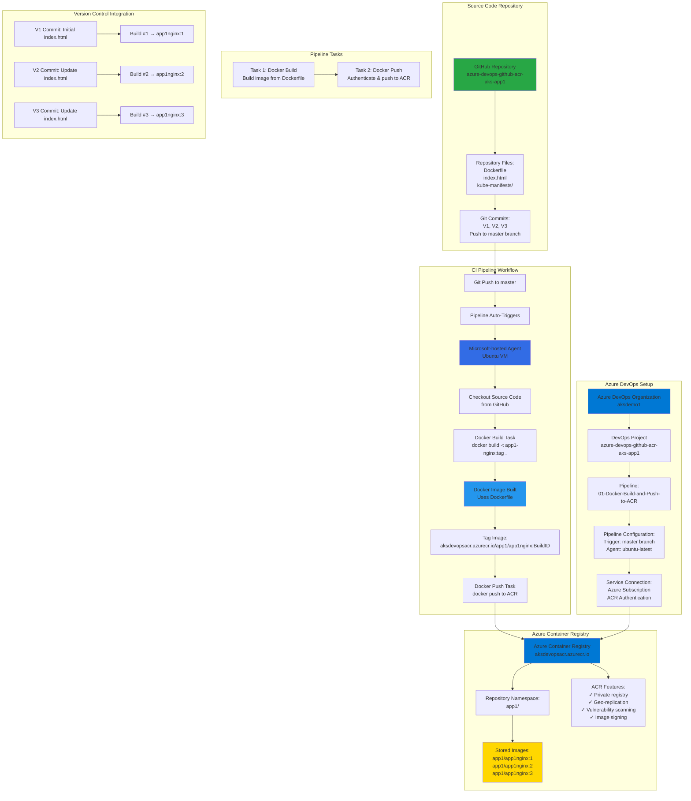

# Azure DevOps - Build and Push Docker Image to Azure Container Registry

## 📊 Architecture & Workflow Diagram



### Understanding the Diagram

- **GitHub Integration**: Source code including **Dockerfile**, **index.html**, and **Kubernetes manifests** are stored in a **GitHub repository** and integrated with Azure DevOps for automatic pipeline triggering
- **Azure DevOps Organization**: Create an **Azure DevOps organization** and **project** to host pipelines, manage builds, and orchestrate the **CI/CD workflow** for containerized applications
- **Service Connection**: Establish a **service connection** between Azure DevOps and **Azure subscription** to authenticate and push Docker images to **Azure Container Registry** (ACR) securely
- **CI Pipeline Trigger**: Pipeline is configured with **automatic triggers** on **master branch commits**, ensuring every code push initiates a new **build and push workflow** automatically
- **Microsoft-Hosted Agent**: Azure DevOps provides **free Microsoft-hosted agents** running on **Ubuntu VMs** with Docker pre-installed, eliminating the need to manage build infrastructure
- **Docker Build Process**: Pipeline executes **docker build** command using the Dockerfile to create a **container image** with the application code, creating reproducible and portable artifacts
- **Image Tagging Strategy**: Images are tagged with **BuildID** (e.g., aksdevopsacr.azurecr.io/app1/app1nginx:123), providing **unique versioning** and **traceability** back to specific pipeline runs
- **Azure Container Registry**: ACR serves as a **private Docker registry** hosted in Azure, storing container images with features like **geo-replication**, **vulnerability scanning**, and **RBAC integration**
- **Repository Namespaces**: Organize images using **namespace prefixes** (app1/app1nginx) in ACR to logically group related container images by application or team
- **Continuous Integration**: Each commit (V1, V2, V3) triggers a **separate build**, creating **versioned images** that can be deployed independently, enabling **rollback** and **progressive deployment** strategies

---

## Step-01: Introduction
- Understand Azure DevOps Basics
- Understand Azure Pipelines
- Implement a pipeline to Build and Push Docker Image to Azure Container Registry

[](https://stacksimplify.com/course-images/azure-devops-pipelines-build-and-push-docker-image-to-acr.png)

## Step-02: Create Github Project and Check-In Code
### Create Github Repo in Github
- Name: azure-devops-github-acr-aks-app1
- Description: Azure DevOps App1 Demo with AKS, Github and Azure Containter Registry
- Repo Type: Public / Private (Your choice)
- Click on **Create Repository**

### Create Local Git Repo and Check-In Code
- Create Local folders
```
# Create a folder for all Repos we are going to create 
mkdir azure-devops-aks-demo-repos
cd azure-devops-aks-demo-repos

# Create a Directory for Repo
mkdir azure-devops-github-acr-aks-app1
cd azure-devops-github-acr-aks-app1
```
- Copy all files from `Giti-Repository-files` folder to our new repo folder `azure-devops-github-acr-aks-app1`
```
# Initialize Git Repo
cd azure-devops-github-acr-aks-app1
git init

# Do local Commit
echo "# Azure DevOps App1 Demo with AKS, Github and ACR" >> README.md
git add .
git commit -am "V1 Base Commit"

# Link Github Remote Repository
git remote add origin https://github.com/stacksimplify/azure-devops-github-acr-aks-app1.git

# Push to Remote Repository
git push --set-upstream origin master

# Go to Github Repo - Refresh and check files appeared in githbu repo
https://github.com/stacksimplify/azure-devops-github-acr-aks-app1
```

## Step-03: Review github checked-in files
- kube-manifests
- Dockerfile
- index.html

## Step-04: Create Azure Container Registry ACR
- Go to Services -> Container Registries
- Click on **Add**
- Subscription: StackSimplify-Paid-Subsciption
- Resource Group: acr-rg1
- Registry Name: aksdevopsacr   (NAME should be unique across Azure Cloud)
- Location: Central US
- SKU: Basic  (Pricing Note: $0.167 per day)
- Click on **Review + Create**
- Click on **Create**

## Step-05: Creat DevOps Organization
- Go to
  - https://dev.azure.com/
  - Sign in to Azure DevOps
- Our Organization will be automatically created and if you want to manually create organization you can create one. 
- Organization Name: aksdemo1


## Step-06 : Create DevOps Project
- Project Name: azure-devops-github-acr-aks-app1
- Project Description: AKS CICD Pipelines with Github and Azure Container Registry ACR
- Visibility: Private
- Advanced: Leave to defaults
  - Version Control: Git
  - Work Item Process: Basic

## Step-07: Create Basic Build Pipeline
- Create Folder -> App1-Pipelines
- Go to Pipelines -> Create New Pipeline
- Where is your Code?: Github  
- Select Repository: azure-devops-github-acr-aks-app1
  - Provide Github Password
  - Click on **Approve and Install** for Repositories selected
- Configure Your Pipeline: Docker (Build and Push Image to Azure Container Registry )
- Select an Azure Subscription: stacksimplify-paid-subscription
- Continue (Login as admin user)
- Container Registry: aksdevopsacr
- Image Name: app1-nginx
- Dockerfile: $(Build.SourcesDirectory)/Dockerfile
- Click on **Validate and Configure**
- Change Pipeline Name: 01-docker-build-and-push-to-acr-pipeline.yml
- Click on **Save and Run**
- Commit Message: Pipeline-1: Docker Build and Push to ACR
- Commit directly to master branch: check
- Click on **Save and Run**

## Step-08: Review Build Logs & Docker Image in ACR
- Review Build logs
- Review Image in ACR

## Step-09: Rename Pipeline Name
- Click on Pipeline -> Rename/Move
- Name: 01-Docker-Build-and-Push-to-ACR

## Step-10: Make changes to index.html and push changes to git repo - V2 Commit
```
# Pull changes related to pipeline to local repo
git pull
ls -lrt

# Make changes to index.html
index.html file - change version v2

# Push changes
git add .
git commit -am "V2 Commit for index.html"
git push
```
- Verify Build logs 
- Verify ACR Image

## Step-12: Add Namespace for Docker Images stored in ACR
- Go to Pipeline -> 01-Docker-Build-and-Push-to-ACR -> Edit
- Update the below and Save
```yaml
# Before
  imageRepository: 'app1nginx'

# After
  imageRepository: 'app1/app1nginx'  
```
- Verify Build logs 
- Verify ACR Image

## Step-13: Make changes to index.html and push changes to git repo - V3 Commit
```
# Pull changes related to pipeline to local repo
git pull
ls -lrt

# Make changes to index.html
index.html file - change version v3

# Push changes
git add .
git commit -am "V3 Commit for index.html"
git push
```
- Verify Build logs 
- Verify ACR Image

## Step-14: Disable Pipeline
- Go to Pipeline -> 01-Docker-Build-and-Push-to-ACR -> Settings -> Disable

## Step-15: Review Pipeline code
- Click on Pipeline -> Edit Pipeline
- Review pipeline code
- Review Service Connections
```yaml
# Docker
# Build and push an image to Azure Container Registry
# https://docs.microsoft.com/azure/devops/pipelines/languages/docker

trigger:
- master

resources:
- repo: self

variables:
  # Container registry service connection established during pipeline creation
  dockerRegistryServiceConnection: '6a8843fd-7313-48e2-9381-3f9ef59ce82d' ## Review Service Connections
  imageRepository: 'app1/app1nginx'
  containerRegistry: 'aksdevopsacr.azurecr.io'
  dockerfilePath: '$(Build.SourcesDirectory)/Dockerfile'
  tag: '$(Build.BuildId)'
  
  # Agent VM image name
  vmImageName: 'ubuntu-latest'

stages:
- stage: Build
  displayName: Build and push stage
  jobs:  
  - job: Build
    displayName: Build
    pool:
      vmImage: $(vmImageName)
    steps:
    - task: Docker@2
      displayName: Build and push an image to container registry
      inputs:
        command: buildAndPush
        repository: $(imageRepository)
        dockerfile: $(dockerfilePath)
        containerRegistry: $(dockerRegistryServiceConnection)
        tags: |
          $(tag)
```

## References
- [Azure DevOps](https://docs.microsoft.com/en-us/azure/devops/pipelines/?view=azure-devops)
 
