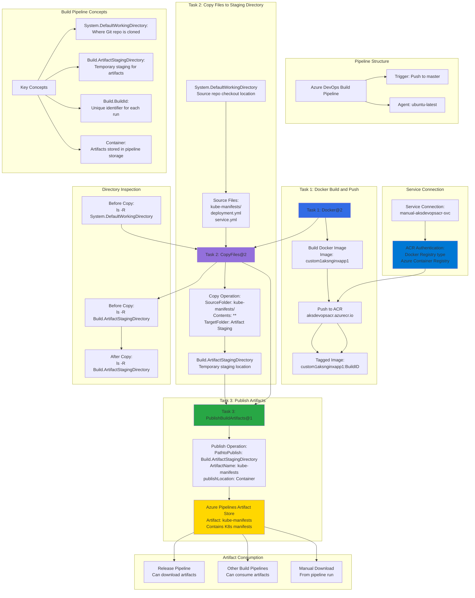

# Azure DevOps Create Starter Pipeline

## 📊 Architecture & Workflow Diagram



### Understanding the Diagram

- **Three-Task Pipeline**: Build pipeline consists of three distinct tasks - **Task 1** (Build & Push Docker image), **Task 2** (Copy files to staging), and **Task 3** (Publish artifacts to Azure Pipelines)
- **System.DefaultWorkingDirectory**: This is the **source directory** where Azure Pipelines clones your **GitHub repository** containing code, Dockerfile, and kube-manifests during pipeline execution
- **CopyFiles@2 Task**: Copies **Kubernetes manifests** from the source repo directory to the **Build.ArtifactStagingDirectory**, which is a temporary location for preparing artifacts before publishing
- **Build.ArtifactStagingDirectory**: A **temporary staging directory** created for each pipeline run where files are copied before being published as artifacts, separate from the source code checkout
- **PublishBuildArtifacts@1 Task**: Takes contents from the **staging directory** and publishes them as a named artifact (**kube-manifests**) to **Azure Pipelines artifact storage**
- **Artifact Storage**: Published artifacts are stored in **Azure Pipelines Container storage**, making them available for **Release Pipelines**, other builds, or manual download for deployment purposes
- **Service Connection Pattern**: Uses a **manually created service connection** to ACR for authentication, demonstrating manual configuration of Docker Registry connections for finer control
- **Directory Inspection**: Pipeline includes **bash commands** to list directory contents before and after copy operations, helping debug and verify the **file copy process**
- **Artifact Consumption**: Published artifacts can be consumed by **Release Pipelines** (for deployment to multiple environments), **other pipelines** (for cross-pipeline dependencies), or downloaded manually
- **Starter Pipeline Approach**: This demonstrates building a pipeline **from scratch** using starter template and manually adding tasks, teaching the fundamentals of **pipeline YAML structure** and task configuration

---

## Step-01: Introduction

### Part-1: Partial manual pipeline
- We are going to have 3 tasks as part of this
- **Task-1:** Leverage existing default available pipeline named "Docker Build and Push an image to ACR" and customize to add two more tasks
- **Task-2:** Copy files from System Default Working Directory to Build Artifact Staging Directory
- **Task-3:** Publish Artifacts to Azure Pipelines

### Part-2: Full custom manual pipeline
- Use starter pipeline and build all 3 taks from scratch
- **Task-1:** Build this task also from scratch
- **Task-2:** Copy files from System Default Working Directory to Build Artifact Staging Directory
- **Task-3:** Publish Artifacts to Azure Pipelines

[](https://stacksimplify.com/course-images/azure-devops-pipelines-key-concepts-1.png)

[](https://stacksimplify.com/course-images/azure-devops-pipelines-key-concepts-1.png)

[](https://stacksimplify.com/course-images/azure-devops-starter-pipeline.png)


## Step-02: Task-1: Create a Build Pipeline and Publish Artifacts to Azure Pipelines
- Go to Pipelines -> Create New Pipeline
- Where is your Code?: Github  
- Select Repository: azure-devops-github-acr-aks-app1
- Configure Your Pipeline: Docker (Build and Push Image to Azure Container Registry )
- Select an Azure Subscription: stacksimplify-paid-subscription
- Continue (Login as admin user)
- Container Registry: aksdevopsacr
- Image Name: custom1aksnginxapp1
- Dockerfile: $(Build.SourcesDirectory)/Dockerfile
- Click on **Validate and Configure**
- Change Pipeline Name: 03-custom1-pipeline-buildandpush-to-acr-and-publish-artifacts.yml

## Step-03: Task-2: Copy kube-manifests to Artifact Staging Directory
- Copy files from source directory to target directory
```yaml
## Publish Artifacts pipeline code in addition to Build and Push          
    - bash: echo Contents in System Default Working Directory; ls -R $(System.DefaultWorkingDirectory)        
    - bash: echo Before copying Contents in Build Artifact Directory; ls -R $(Build.ArtifactStagingDirectory)        
    # Task-2: Copy files (Copy files from a source folder to target folder)
    # Source Directory: $(System.DefaultWorkingDirectory)/kube-manifests
    # Target Directory: $(Build.ArtifactStagingDirectory)
    - task: CopyFiles@2
      inputs:
        SourceFolder: '$(System.DefaultWorkingDirectory)/kube-manifests'
        Contents: '**'
        TargetFolder: '$(Build.ArtifactStagingDirectory)'
        OverWrite: true
    # List files from Build Artifact Staging Directory - After Copy
    - bash: echo After copying to Build Artifact Directory; ls -R $(Build.ArtifactStagingDirectory) 
```

## Step-04: Task-3: Publish Artifacts to Azure Pipelines
```yaml
    # Task-3: Publish build artifacts (Publish build to Azure Pipelines)           
    - task: PublishBuildArtifacts@1
      inputs:
        PathtoPublish: '$(Build.ArtifactStagingDirectory)'
        ArtifactName: 'kube-manifests'
        publishLocation: 'Container'         
```

## Step-05: Save and Run the Build, Verify Build, Copy and Publish Task logs
- Click on **Save and Run**
- Commit Message: Pipeline-3: Docker Build, Push to ACR and Publish Artifacts
- Commit directly to master branch: check
- Click on **Save and Run**
- Build Task should pass. Verify logs
- Copy Task should pass.  Verify logs
- Publish Task should pass. Verify logs

 ## Step-06: Rename Pipeline Name
- Go to pipeline -> Rename / Move
- Name: 03-custom1-BuildPushToACR-Publish-k8s-manifests-to-AzurePipelines
- Folder: App1-Pipelines
- Refresh till changes reflect
- Verify -> Pipelines -> Click on **All** tab

## Step-07: Disable Pipeline
- Go to Pipeline -> 03-custom1-BuildPushToACR-Publish-k8s-manifests-to-AzurePipelines -> Settings -> Disable

## Step-08: Create Service Connection to Azure Container Registry ACR
- Go to Project -> azure-devops-github-acr-aks-app1 -> Project Settings -> Pipelines -> Service Connections
- Click on **New Service Connection**
- Choose a Service or Connection Type: Docker Registry
- Registry Type: Azure Container Registry
- Subscription: Azure Pay as you go subscription
- Signin
  - Username: Your Azure Administrator User
  - Password: Your Azure Administrator Password
- Azure Container Registry: aksdevopsacr
- Service Connection Name: manual-aksdevopsacr-svc
- Service Connection Description: SVC for ACR named aksdevopsacr
- Click on **Save**

## Step-09: Create a Starter Pipeline from scratch 
- Go to Pipelines -> Create New Pipeline
- Where is your Code?: Github  
- Select Repository: azure-devops-github-acr-aks-app1
- Configure Your Pipeline: Starter Pipeline
- Understand Pipeline concepts
  - Stages -> Stage -> Jobs -> Job -> Steps -> Task1, Task2, Task3
- Change Pipeline name to  04-custom2-pipeline-build-from-scratch.yml

### Discuss about tags
- Tag1: $(Build.BuildId)
- Tag2: $(Build.SourceVersion)


```yaml
# Stages
# Stage-1:
  # Task-1: Build Docker Image and push to Azure Container Registry ACR
  # Task-2: Copy kube-manifest files to Build Artifact Directory
  # Task-3: Publish build articats to Azure Pipelines
# Pipeline Hierarchial Flow: Stages -> Stage -> Jobs -> Job -> Steps -> Task1, Task2, Task3  

trigger:
- master

# Variables
variables:
  tag: '$(Build.BuildId)'

stages:
# Build Stage 
- stage: Build
  displayName: Build Stage
  jobs:
  - job: Build
    displayName: Build Job
    pool:
      vmImage: 'ubuntu-latest'
    steps: 

    # Task-1: Build Docker Image and push to Azure Container Registry ACR
    - task: Docker@2
      inputs:
        containerRegistry: 'manual-aksdevopsacr-svc'
        repository: 'custom2aksnginxapp1'
        command: 'buildAndPush'
        Dockerfile: '**/Dockerfile'
        tags: |
          $(tag)
          $(Build.SourceVersion)
## Publish Artifacts pipeline code in addition to Build and Push          
    - bash: echo Contents in System Default Working Directory; ls -R $(System.DefaultWorkingDirectory)        
    - bash: echo Before copying Contents in Build Artifact Directory; ls -R $(Build.ArtifactStagingDirectory)        
    # Task-2: Copy files (Copy files from a source folder to target folder)
    # Source Directory: $(System.DefaultWorkingDirectory)/kube-manifests
    # Target Directory: $(Build.ArtifactStagingDirectory)
    - task: CopyFiles@2
      inputs:
        SourceFolder: '$(System.DefaultWorkingDirectory)/kube-manifests'
        Contents: '**'
        TargetFolder: '$(Build.ArtifactStagingDirectory)'
        OverWrite: true
    # List files from Build Artifact Staging Directory - After Copy
    - bash: echo After copying to Build Artifact Directory; ls -R $(Build.ArtifactStagingDirectory)  
    # Task-3: Publish build artifacts (Publish build to Azure Pipelines)           
    - task: PublishBuildArtifacts@1
      inputs:
        PathtoPublish: '$(Build.ArtifactStagingDirectory)'
        ArtifactName: 'kube-manifests'
        publishLocation: 'Container'
```
## Step-10: Save and Run the Build, Verify Build, Copy and Publish Task logs
- Click on **Save and Run**
- Commit Message: Pipeline-4: Custom2-Docker Build, Push to ACR and Publish Artifacts
- Commit directly to master branch: check
- Click on **Save and Run**
- Build Task should pass. Verify logs
- Copy Task should pass.  Verify logs
- Publish Task should pass. Verify logs
- Verify ACR Image **custom2aksnginxapp1**

 ## Step-11: Rename Pipeline Name
- Go to pipeline -> Rename / Move
- Name: 04-custom2-BuildPushToACR-Publish-k8s-manifests-to-AzurePipelines
- Folder: App1-Pipelines
- Refresh till changes reflect
- Verify -> Pipelines -> Click on **All** tab

## Step-12: Sync your local Repo with all new pipeline changes
```
# Sync local repository
git pull
```


## References
- [Azure Pipelines - Key Concepts](https://docs.microsoft.com/en-us/azure/devops/pipelines/get-started/key-pipelines-concepts?view=azure-devops)
- [Azure DevOps Docker Task](https://docs.microsoft.com/en-us/azure/devops/pipelines/tasks/build/docker?view=azure-devops)
- [Azure DevOps Predefined Variables](https://docs.microsoft.com/en-us/azure/devops/pipelines/build/variables?view=azure-devops&tabs=yaml)