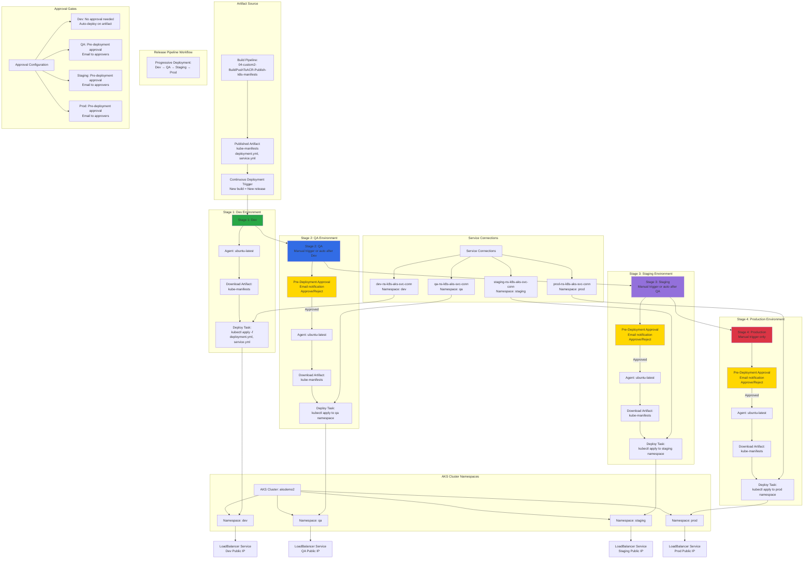

# Azure DevOps Release Pipelines

## 📊 Architecture & Workflow Diagram



### Understanding the Diagram

- **Release Pipeline Concept**: Separates **build** (compile, test, package) from **deployment** (release to environments), using **artifacts** from build pipelines to deploy the same tested version across multiple environments
- **Multi-Environment Strategy**: Deploys the **same artifact** progressively through **four environments** (Dev, QA, Staging, Prod), each in its own **Kubernetes namespace**, ensuring environment isolation
- **Namespace Isolation**: Each environment uses a **dedicated namespace** in the same AKS cluster, providing **logical separation** of resources, configs, and secrets while sharing cluster infrastructure
- **Service Connection per Environment**: Each environment has its own **service connection** scoped to a specific namespace, providing **namespace-level RBAC** and preventing accidental cross-environment deployments
- **Continuous Deployment to Dev**: Dev stage has **automatic trigger** enabled - every new build artifact automatically deploys to Dev namespace **without approval**, enabling rapid iteration
- **Approval Gates**: QA, Staging, and Prod stages require **pre-deployment approvals** via email notifications, ensuring human verification before promoting to higher environments
- **Progressive Deployment**: Application moves through environments in sequence (**Dev → QA → Staging → Prod**), with each stage validating the release before proceeding to the next
- **Artifact Reuse**: The **same built artifact** is deployed to all environments, eliminating "works on my machine" issues and ensuring what's tested in QA is exactly what goes to Prod
- **Manual vs Automatic Triggers**: Dev auto-deploys, QA/Staging can be auto or manual after previous stage success, Production typically **manual trigger only** for controlled releases
- **LoadBalancer per Environment**: Each namespace gets its own **LoadBalancer service** with a **unique public IP**, allowing independent testing and access to each environment

---

## Step-01: Introduction
- Understand Release Pipelines concept
- Create Release Pipelines to Deploy to Kubernetes Dev, QA, Staging and Prod namespaces
- Add Pre-Deployment email approval for QA, Staging and Prod environment deployments

[](https://stacksimplify.com/course-images/azure-devops-release-pipelines-for-azure-aks.png)

[](https://stacksimplify.com/course-images/azure-devops-release-pipelines-demo-for-azure-aks.png)

[](https://stacksimplify.com/course-images/azure-devops-release-pipelines-releases-demo-for-azzure-aks.png)

## Step-02: Create Namespaces
```
# List Namespaces
kubectl get ns

# Create Namespaces
kubectl create ns dev
kubectl create ns qa
kubectl create ns staging
kubectl create ns prod

# List Namespaces
kubectl get ns
```

## Step-03: Create Service Connections for Dev, QA, Staging and Prod Namespaces in Kubernetes Cluster
### Dev Service Connection
- Go to Project -> azure-devops-github-acr-aks-app1 -> Project Settings -> Pipelines -> Service Connections
- Click on **New Service Connection**
- Choose a service or connection type: kubernetes
- Authentication Method: Azure Subscription
- Username: Azure Cloud Administrator
- Password: Azure Cloud Admin Password
- Cluster: aksdemo2
- Namespace: dev
- Service connection name: dev-ns-k8s-aks-svc-conn
- Description: Dev Namespace AKS Cluster Service Connection
- Security: Grant access permission to all pipelines (default Checked)
- Click on **SAVE** 

### QA Service Connection
- Go to Project -> azure-devops-github-acr-aks-app1 -> Project Settings -> Pipelines -> Service Connections
- Click on **New Service Connection**
- Choose a service or connection type: kubernetes
- Authentication Method: Azure Subscription
- Username: Azure Cloud Administrator
- Password: Azure Cloud Admin Password
- Cluster: aksdemo2
- Namespace: qa
- Service connection name: qa-ns-k8s-aks-svc-conn
- Description: QA Namespace AKS Cluster Service Connection
- Security: Grant access permission to all pipelines (default Checked)
- Click on **SAVE** 

### Staging Service Connection
- Go to Project -> azure-devops-github-acr-aks-app1 -> Project Settings -> Pipelines -> Service Connections
- Click on **New Service Connection**
- Choose a service or connection type: kubernetes
- Authentication Method: Azure Subscription
- Username: Azure Cloud Administrator
- Password: Azure Cloud Admin Password
- Cluster: aksdemo2
- Namespace: staging
- Service connection name: staging-ns-k8s-aks-svc-conn
- Description: Staging Namespace AKS Cluster Service Connection
- Security: Grant access permission to all pipelines (default Checked)
- Click on **SAVE** 


### Production Service Connection
- Go to Project -> azure-devops-github-acr-aks-app1 -> Project Settings -> Pipelines -> Service Connections
- Click on **New Service Connection**
- Choose a service or connection type: kubernetes
- Authentication Method: Azure Subscription
- Username: Azure Cloud Administrator
- Password: Azure Cloud Admin Password
- Cluster: aksdemo2
- Namespace: prod
- Service connection name: prod-ns-k8s-aks-svc-conn
- Description: Production Namespace AKS Cluster Service Connection
- Security: Grant access permission to all pipelines (default Checked)
- Click on **SAVE** 

## Step-04: Create Release Pipeline - Add Artifacts
- Release Pipeline Name: 01-app1-release-pipeline

### Add Artifact
- Source Type: Build
- Project: leave to default (azure-aks-app1-github-acr)
- Source (Build Pipeline): App1-Pipelines\04-custom2-BuildPushToACR-Publish-k8s-manifests-to-AzurePipelines
- Default Version: Latest (auto-populated)
- Source Alias: leave to default (auto-populated)
- Click on **Add**

### Continuous Deployment Trigger
- Continuous deployment trigger: Enabled


## Step-05: Release Pipeline - Create Dev Stage
- Go to Pipelines -> Releases
- Create new **Release Pipeline**
### Create Dev Stage and Test
- Stage Name: Dev
- Create Task 
- Agent Job: Change to Ubunut Linux (latest)
### Add Task: Create Secret
- Display Name: Create Secret to allow image pull from ACR
- Action: create secret
- Kubernetes service connection: dev-ns-k8s-aks-svc-conn
- Namespace: dev
- Type of secret: dockerRegistry
- Secret name: dev-aksdevopsacr-secret
- Docker registry service connection: manual-aksdevopsacr-svc
- Rest all leave to defaults
- Click on **SAVE** to save release
- Comment: Dev k8s Create Secret task added

### Add Task: Deploy to Kubernetes
- Display Name: Deploy to AKS
- Action: deploy
- Kubernetes Service Connection: dev-ns-k8s-aks-svc-conn
- Namespace: dev
- Strategy: None
- Manifest: Select 01-Deployment-and-LoadBalancer-Service.yml  from build artifacts
```
# Sample Value for Manifest after adding it
Manifest: $(System.DefaultWorkingDirectory)/_04-custom2-BuildPushToACR-Publish-k8s-manifests-to-AzurePipelines/kube-manifests/01-Deployment-and-LoadBalancer-Service.yml
```
- Container: aksdevopsacr.azurecr.io/custom2aksnginxapp1:$(Build.BuildId)
- ImagePullSecrets: dev-aksdevopsacr-secret
- Rest all leave to defaults
- Click on **SAVE** to save release
- Comment: Dev k8s Deploy task added

## Step-06: Verify k8s Deployment Manifest Image 
- Review the **image** value and update it from Container registry if required
- File: kube-manifests/01-Deployment-and-LoadBalancer-Service.yml
```yaml
    spec:
      containers:
        - name: app1-nginx
          image: aksdevopsacr.azurecr.io/custom2aksnginxapp1
          ports:
            - containerPort: 80
```

## Step-07: Check-In Code and Test
- Update index.html
```
# Commit and Push
git commit -am "V11 Commit"
git push
```
- View Build Logs
- View Dev Release logs
- Access App after successful deployment
```
# Get Public IP
kubectl get svc -n dev

# Access Application
http://<Public-IP-from-Get-Service-Output>
```

## Step-08: Update Deploy to AKS Task with Build.SourceVersion in Release Pipelines
- Go to Release Pipelines -> 01-app1-release-pipeline -> Edit -> Dev Tasks
- Go to **Deploy to AKS** Task
- Replace
```
#Before
Containers: aksdevopsacr.azurecr.io/custom2aksnginxapp1:$(Build.BuildId)

# After
Containers: aksdevopsacr.azurecr.io/custom2aksnginxapp1:$(Build.SourceVersion)
```
- Click on **SAVE** to save release
- Comment: Dev Container Tag changed from Build Id to Build Source Version


## Step-09: Check-In Code and Test
- Update index.html
```
# Commit and Push
git commit -am "V12 Commit"
git push
```
- View Build Logs
- View Dev Release logs
- Access App after successful deployment
```
# Get Public IP
kubectl get svc -n dev

# Access Application
http://<Public-IP-from-Get-Service-Output>
```
- Verify Github Commit Id on Github Repository and Container Registry

## Step-10: Create QA, Staging and Prod Release Stages
- Create QA, Staging and Prod Stages
- Add Email Approvals
- Click on **SAVE** to save release

### Clone Dev Stage to Create QA Stage
- Go to Releases -> 01-app1-release-pipeline -> Edit
- Select **Dev Stage** -> Add -> **Clone Stage**
- Stage Name: QA
#### Task-1: Create Secret
- Kubernetes service connection: qa-ns-k8s-aks-svc-conn
- Namespace: qa
- Secret name: qa-aksdevopsacr-secret
- Click SAVE
- Commit Message: QA Create Secret task updated

#### Task-2: Deploy to AKS
- Kubernetes service connection: qa-ns-k8s-aks-svc-conn
- Namespace: qa
- ImagePullSecrets: qa-aksdevopsacr-secret
- Click SAVE
- Commit Message: QA Deploy to AKS task updated


## Step-11: Check-In Code and Test
- Update index.html
```
# Commit and Push
git commit -am "V13 Commit"
git push
```
- View Build Logs
- View Dev Release logs
- Access App after successful deployment
- Approve deployment at qa, staging and prod stages
```
# Get Public IP
kubectl get svc -n dev
kubectl get svc -n qa
kubectl get svc -n staging
kubectl get svc -n prod
kubect get svc --all-namespaces

# Access Application
http://<Public-IP-from-Get-Service-Output>
```

## Step-12: Clean-Up Apps
```
# Before Clean-Up: List all Pods and Services
kubectl get pod,svc --all-namespaces

# Clean-Up all Apps in Kubernetes
kubectl delete ns dev
kubectl delete ns qa
kubectl delete ns staging
kubectl delete ns prod

# After Clean-Up: List all Pods and Services
kubectl get pod,svc --all-namespaces
```

## References
- [Release Pipelines Task - Deploy to Kubernetes](https://docs.microsoft.com/en-us/azure/devops/pipelines/ecosystems/kubernetes/deploy?view=azure-devops)
