# Azure AKS - Enable HTTP Application Routing AddOn

## 📊 Architecture & Workflow Diagram

```mermaid
graph TB
    subgraph "Enable HTTP Application Routing AddOn"
        EnableAddon[Enable Add On]
        EnableAddon --> Option1[Option 1: Azure Portal<br/>Settings -> Networking<br/>Check HTTP Application Routing]
        EnableAddon --> Option2[Option 2: Azure CLI<br/>az aks enable-addons<br/>--addons http_application_routing]
        EnableAddon --> Option3[Option 3: During Cluster Creation<br/>Networking Tab<br/>Enable checkbox]
    end
    
    subgraph "Automatically Installed Components"
        AddOn[HTTP Application Routing AddOn]
        AddOn --> AutoInstall[Automatically Installs:]
        
        AutoInstall --> IngressController[NGINX Ingress Controller<br/>Namespace: kube-system<br/>Pod: addon-http-application-routing-nginx-ingress-controller]
        
        AutoInstall --> ExternalDNS[External DNS<br/>Namespace: kube-system<br/>Pod: addon-http-application-routing-external-dns]
        
        AutoInstall --> DNSZone[Azure DNS Zone<br/>Format: <random-guid>.<region>.aksapp.io<br/>Example: a0e123.eastus.aksapp.io]
        
        IngressController --> IngressService[Service: LoadBalancer<br/>Public IP created]
    end
    
    subgraph "Application Deployment with Add On"
        App[Deploy Application]
        App --> Deployment1[Deployment: app1-nginx]
        App --> Service1[Service: app1-nginx-service<br/>Type: ClusterIP]
        
        App --> Ingress1[Ingress Resource]
        Ingress1 --> IngressSpec[spec:<br/>  ingressClassName: addon-http-application-routing<br/>  rules:<br/>    - host: app1.a0e123.eastus.aksapp.io<br/>      http:<br/>        paths:<br/>          - path: /<br/>            backend:<br/>              service:<br/>                name: app1-nginx-service]
    end
    
    subgraph "DNS & Routing Flow"
        User[User Request]
        User --> DNS[DNS Query:<br/>app1.a0e123.eastus.aksapp.io]
        DNS --> AzureDNS[Azure DNS Zone<br/>a0e123.eastus.aksapp.io]
        AzureDNS --> ARecord[A Record:<br/>app1.a0e123.eastus.aksapp.io<br/>-> Ingress Controller Public IP]
        
        ARecord --> IngressLB[Ingress Controller<br/>LoadBalancer Public IP]
        IngressLB --> IngressRules[Check Ingress Rules<br/>Match Host header]
        IngressRules --> Route[Route to Service:<br/>app1-nginx-service]
        Route --> Pod[Pod: app1-nginx]
    end
    
    subgraph "ExternalDNS Automation"
        WatchIngress[ExternalDNS watches<br/>Ingress resources]
        WatchIngress --> DetectHost[Detects new host:<br/>app1.a0e123.eastus.aksapp.io]
        DetectHost --> GetIngressIP[Get Ingress Controller<br/>Public IP]
        GetIngressIP --> CreateARecord[Auto-create A Record<br/>in Azure DNS Zone]
        CreateARecord --> UpdateDNS[DNS Record Created:<br/>app1 -> Ingress IP]
    end
    
    subgraph "Verification Commands"
        Verify[Verification]
        Verify --> CheckPods[kubectl get pods -n kube-system<br/>Shows: ingress + external-dns pods]
        Verify --> CheckSvc[kubectl get svc -n kube-system<br/>Shows: ingress LoadBalancer + Public IP]
        Verify --> CheckIngress[kubectl get ingress<br/>Shows: Ingress with ADDRESS]
        Verify --> CheckDNS[az aks show --name aksdemo2<br/>--resource-group aks-rg2<br/>--query addonProfiles.httpApplicationRouting.config]
    end
    
    subgraph "Important Notes"
        Notes[⚠️ Important Limitations]
        Notes --> DevTest[✓ Dev/Test ONLY<br/>NOT for production]
        Notes --> RandomDomain[✓ Random DNS zone name<br/>Cannot use custom domains]
        Notes --> NoSSL[✓ No built-in SSL/TLS<br/>No Let's Encrypt integration]
        Notes --> BasicIngress[✓ Basic NGINX ingress<br/>Limited customization]
        Notes --> Alternative[For Production Use:<br/>✓ Manual NGINX Ingress<br/>✓ Custom ExternalDNS<br/>✓ Cert-Manager for SSL]
    end
    
    style AddOn fill:#ffa500
    style IngressController fill:#326ce5
    style DNSZone fill:#0078d4
    style Notes fill:#ff6b6b
```



### Understanding the Diagram

- **HTTP Application Routing AddOn**: Azure-managed add-on that **automatically installs Ingress Controller and ExternalDNS** for quick dev/test setup
- **Automatic Installation**: Enabling the add-on automatically deploys **NGINX Ingress Controller and ExternalDNS** Pods in kube-system namespace
- **Azure DNS Zone**: Add-on creates an **Azure DNS Zone** with a random name like `<guid>.<region>.aksapp.io` for hosting application DNS records
- **ExternalDNS Automation**: ExternalDNS watches Ingress resources and **automatically creates A records** in the Azure DNS Zone pointing to Ingress IP
- **IngressClassName**: Must specify `ingressClassName: addon-http-application-routing` in Ingress resources to use the add-on's Ingress Controller
- **Host Format**: Ingress hosts must use the format `<subdomain>.<guid>.<region>.aksapp.io` using the cluster's assigned DNS zone
- **LoadBalancer Public IP**: Ingress Controller Service creates an **Azure Load Balancer with Public IP** for incoming traffic
- **DNS Resolution**: User requests resolve via Azure DNS Zone -> A Record -> Ingress Controller Public IP -> Pod
- **Dev/Test Only**: Add-on is **NOT recommended for production** due to random DNS zone, no SSL support, and limited customization options
- **Production Alternative**: For production, manually install **NGINX Ingress + custom ExternalDNS + Cert-Manager** with your own domain and Let's Encrypt SSL certificates

---

## Step-01: Introduction
- Enable HTTP Application Routing Add On
- Ingress and External DNS will be automatically installed and configured on Azure AKS Cluster
- **Important Note:** HTTP application routing is only recommended for dev/test clusters

[](https://stacksimplify.com/course-images/azure-kubernetes-service-http-application-routing-addon-ingress-externaldns.png)

[](https://stacksimplify.com/course-images/azure-kubernetes-service-addons.png)

## Step-02: Option-1: For existing Cluster Enable HTTP Application Routing Add On
- To enable **HTTP Application Routing Add On** we have two options
### Option-1A: Using Azure Portal 
- For existing clusters, enable HTTP Application Routing Add On using Azure Portal
- Go to All Services -> Kubernetes Services -> aksdemo2
- Go to Settings -> Networking 
- Enable HTTP application routing: Check the box 
- Click on **SAVE**
- Verify the same in AKS Cluster using kubectl
```t
# Configure Command Line Credentials
az aks get-credentials --name aksdemo2 --resource-group aks-rg2

# Verify Nodes
kubectl get nodes 
kubectl get nodes -o wide

# Before Enablement of HTTP Application Routing Add On
kubectl get svc -n kube-system
kubectl get pod -n kube-system

# After Enablement of HTTP Application Routing Add On
kubectl get svc -n kube-system
kubectl get pod -n kube-system
```
- **Ingress Pods:** You should see Ingress and external DNS Pods running in kube-system namespaces
- **Ingress Services:** You should see Ingress and external DNS Services running in kube-system namespaces

### Option-1B: Using Azure CLI
- For existing clusters, enable HTTP Application Routing Add On using Azure CLI
```t
# Enable HTTP Application Routing 
az aks enable-addons --resource-group myResourceGroup --name myAKSCluster --addons http_application_routing

# Replace Resource Group and Cluster Name
az aks enable-addons --resource-group aks-rg2 --name aksdemo2 --addons http_application_routing
```
- Verify the same in AKS Cluster using kubectl
```t
# Configure Command Line Credentials
az aks get-credentials --name aksdemo2 --resource-group aks-rg2

# Verify Nodes
kubectl get nodes 
kubectl get nodes -o wide

# Before Enablement of HTTP Application Routing Add On
kubectl get svc -n kube-system
kubectl get pod -n kube-system

# After Enablement of HTTP Application Routing Add On
kubectl get svc -n kube-system
kubectl get pod -n kube-system
```
- **Ingress Pods:** You should see Ingress and external DNS Pods running in kube-system namespaces
- **Ingress Services:** You should see Ingress and external DNS Services running in kube-system namespaces


## Step-03: Option-2: Create AKS Cluster with HTTP Application Routing Enabled
- Create Cluster with HTTP Application Routing Enabled
- In Networking tab, enable HTTP Application Routing
- Rest all is same
- **Basics**
  - **Subscription:** Free Trial or Pay-as-you-go
  - **Resource Group:** Creat New: aks-rg3
  - **Kubernetes Cluster Name:** aksdemo3
  - **Region:** (US) Central US
  - **Kubernetes Version:** Select what ever is latest stable version
  - **Node Size:** Standard DS2 v2 (Default one)
  - **Node Count:** 1
- **Node Pools**
  - **Virtual Nodes:** Enabled / Disabled (Our choice)
  - leave to defaults
- **Authentication**
  - Authentication method: 	System-assigned managed identity
  - Rest all leave to defaults
- **Networking**
  - **Network Configuration:** Advanced
  - **Network Policy:** Azure
  - **HTTP Application Routing:** Enabled
  - Rest all leave to defaults
- **Integrations**
  - Azure Container Registry: None
  - leave to defaults
- **Tags**
  - leave to defaults
- **Review + Create**
  - Click on **Create**

## Step-04: Configure AKS Credentials for kubectl
- **Ingress Pods:** You should see Ingress and external DNS Pods running in kube-system namespaces
- **Ingress Services:** You should see Ingress and external DNS Services running in kube-system namespaces
```t
# Configure Command Line Credentials
az aks get-credentials --name aksdemo2 --resource-group aks-rg2

# Verify Nodes
kubectl get nodes 
kubectl get nodes -o wide

# Verify additional Pods and SVC related to HTTP Application Routing Add On
kubectl get svc -n kube-system
kubectl get pod -n kube-system
```


## Step-05: List DNS Zone associated with AKS Cluster
### From Azure CLI
```t
# List DNS Zone
az aks show --resource-group myResourceGroup --name myAKSCluster --query addonProfiles.httpApplicationRouting.config.HTTPApplicationRoutingZoneName -o table

# Replace Resource Group and Cluster Name
az aks show --resource-group aks-rg2 --name aksdemo2 --query addonProfiles.httpApplicationRouting.config.HTTPApplicationRoutingZoneName -o table
```
- **Sample Output**
```t
Result
----------------------------------------
7b8803340f38495c8402.centralus.aksapp.io
```
### From Azure Portal
- Go to All Services -> DNS Zones -> Get the DNS Zone Name
```
# Example DNS Zone name
7b8803340f38495c8402.centralus.aksapp.io
```

## Step-06: Review kube-manifests
- 01-NginxApp1-Deployment.yml
- 02-NginxApp1-ClusterIP-Service.yml
- 03-Ingress-HTTPApplicationRouting-ExternalDNS.yml
### Changes in Ingress Manifest (03-Ingress-HTTPApplicationRouting-ExternalDNS.yml)
```yaml
# Change-1: Add Annotation related to HTTP Application Routing
  annotations:
    kubernetes.io/ingress.class: addon-http-application-routing

# Change-2: Update DNS Zone name with additional App Name as host
spec:
  rules:
  - host: app1.7b8803340f38495c8402.centralus.aksapp.io
    http:
```
## Step-07: Deploy, Verify & Test
```t
# Deploy
kubectl apply -f kube-manifests/

# List Pods
kubectl get pods

# List Ingress Service (Wait for Public IP to be assigned)
kubectl get ingress

# Verify new Recordset added in DNS Zones
Go to Services -> DNS Zones -> 7b8803340f38495c8402.centralus.aksapp.io
REFRESH to see DNS A and TXT records

# nslookup test
nslookup app1.7b8803340f38495c8402.centralus.aksapp.io


# Access Application
http://app1.7b8803340f38495c8402.centralus.aksapp.io/app1/index.html

# Verify External DNS Log
kubectl -n kube-system logs -f $(kubectl -n kube-system get po | egrep -o 'addon-http-application-routing-external-dns-[A-Za-z0-9-]+')
```
- **Important Note:** If immediately application via DNS doesnt work, wait for 10 to 20 minutes for all the DNS changes to kick-in

## Step-08: Clean Up Apps
```t
# Delete Apps
kubectl delete -f  kube-manifests/

# Verify Recordset added in DNS Zones got deleted
Go to Services -> DNS Zones -> 7b8803340f38495c8402.centralus.aksapp.io
REFRESH to see DNS A and TXT records for app1 got deleted
```
## Step-09: Disable HTTP Application Routing Add On
### Disable using Azure Portal
- Go to All Services -> Kubernetes Services -> aksdemo2 -> Settings -> Networking
- Enable HTTP application routing: Disable check box
- Click on **SAVE**
```t
# Verify Ingress related Pods and SVC related to HTTP Application Routing Add On will be deleted
kubectl get svc -n kube-system
kubectl get pod -n kube-system
```
### Disable using Azure CLI
```t
# Disable Add-On HTTP Application Routing to AKS cluster
az aks disable-addons --addons http_application_routing --name aksdemo2 --resource-group aks-rg2 --no-wait

# Verify Ingress related Pods and SVC related to HTTP Application Routing Add On will be deleted
kubectl get svc -n kube-system
kubectl get pod -n kube-system
```
