# Azure AKS Cluster Access with Multiple Clusters

## 📊 Architecture & Workflow Diagram

```mermaid
graph TB
    subgraph "Local Development Machine"
        KubectlCLI[kubectl CLI]
        KubeConfig[Kubeconfig File<br/>$HOME/.kube/config]
        KubectlCLI --> KubeConfig
    end
    
    subgraph "Kubeconfig Structure"
        KubeConfig --> Clusters[clusters:<br/>- aksdemo3<br/>- aksdemo4]
        KubeConfig --> Users[users:<br/>- clusterUser_aks-rg3_aksdemo3<br/>- clusterUser_aks-rg4_aksdemo4]
        KubeConfig --> Contexts[contexts:<br/>- aksdemo3<br/>- aksdemo4]
        KubeConfig --> CurrentContext[current-context: aksdemo3]
    end
    
    subgraph "Azure AKS Clusters"
        AKSDEMO3[AKS Cluster: aksdemo3<br/>Resource Group: aks-rg3<br/>Location: Central US<br/>Nodes: 1]
        
        AKSDEMO4[AKS Cluster: aksdemo4<br/>Resource Group: aks-rg4<br/>Location: Central US<br/>Nodes: 1]
    end
    
    subgraph "Configure Cluster Access"
        CreateClusters[Create Clusters]
        CreateClusters --> Create3[az aks create --name aksdemo3<br/>--resource-group aks-rg3<br/>--generate-ssh-keys]
        CreateClusters --> Create4[az aks create --name aksdemo4<br/>--resource-group aks-rg4<br/>--ssh-key-value ~/.ssh/id_rsa.pub]
        
        Create3 --> GetCreds3[az aks get-credentials<br/>--name aksdemo3<br/>--resource-group aks-rg3]
        Create4 --> GetCreds4[az aks get-credentials<br/>--name aksdemo4<br/>--resource-group aks-rg4]
        
        GetCreds3 --> AddContext3[Add context to kubeconfig:<br/>aksdemo3]
        GetCreds4 --> AddContext4[Add context to kubeconfig:<br/>aksdemo4]
        
        AddContext3 --> KubeConfig
        AddContext4 --> KubeConfig
    end
    
    subgraph "Kubectl Context Management"
        ViewConfig[kubectl config view<br/>Shows all clusters, users, contexts]
        CurrentCtx[kubectl config current-context<br/>Shows: aksdemo3]
        UseContext[kubectl config use-context aksdemo4<br/>Switch to aksdemo4]
        
        ViewConfig --> KubeConfig
        CurrentCtx --> KubeConfig
        UseContext --> SwitchContext[Current context changed to:<br/>aksdemo4]
    end
    
    subgraph "Kubectl Commands"
        CurrentContext --> ActiveCluster{Which cluster<br/>is active?}
        
        ActiveCluster -->|aksdemo3| RunCommand3[kubectl get nodes<br/>kubectl get pods]
        ActiveCluster -->|aksdemo4| RunCommand4[kubectl get nodes<br/>kubectl get pods]
        
        RunCommand3 --> AKSDEMO3
        RunCommand4 --> AKSDEMO4
        
        AKSDEMO3 --> Response3[Returns resources<br/>from aksdemo3]
        AKSDEMO4 --> Response4[Returns resources<br/>from aksdemo4]
    end
    
    subgraph "SSH Keys Management"
        GenerateKeys[--generate-ssh-keys]
        GenerateKeys --> SSHKeys[SSH Keys stored:<br/>$HOME/.ssh/id_rsa<br/>$HOME/.ssh/id_rsa.pub]
        
        SSHKeys --> BackupKeys[Backup SSH keys<br/>mkdir BACKUP-SSH-KEYS<br/>cp id_rsa* BACKUP-SSH-KEYS/]
        
        BackupKeys --> ReuseKeys[Reuse same keys<br/>--ssh-key-value for aksdemo4]
    end
    
    subgraph "Use Cases"
        UseCases[Multiple Clusters Scenarios]
        UseCases --> UC1[✓ Dev, Staging, Prod clusters<br/>Switch contexts per environment]
        UseCases --> UC2[✓ Multi-tenant clusters<br/>Different clusters per customer]
        UseCases --> UC3[✓ Multi-region clusters<br/>Global deployments]
        UseCases --> UC4[✓ Testing & Experimentation<br/>Isolate test clusters]
    end
    
    style KubeConfig fill:#ffa500
    style AKSDEMO3 fill:#326ce5
    style AKSDEMO4 fill:#326ce5
    style SwitchContext fill:#28a745
```



### Understanding the Diagram

- **Kubeconfig File**: Central configuration file at `$HOME/.kube/config` storing **clusters, users, contexts, and current-context** for kubectl
- **Multiple Clusters**: Can manage **multiple AKS clusters** (aksdemo3, aksdemo4) from a single kubectl CLI using different contexts
- **Context**: Combination of **cluster + user + namespace** - switching contexts changes which cluster kubectl commands target
- **az aks get-credentials**: Command that **downloads cluster credentials** and adds a new context to kubeconfig for the specified cluster
- **current-context**: The **active cluster** that kubectl commands will execute against - shown by `kubectl config current-context`
- **kubectl config use-context**: Command to **switch active cluster** by changing the current-context in kubeconfig
- **SSH Keys**: First cluster uses `--generate-ssh-keys` to create new keys in `$HOME/.ssh/`, subsequent clusters can **reuse same keys** with `--ssh-key-value`
- **kubectl config view**: Shows **all configured clusters, users, and contexts** in the kubeconfig file for reference
- **Context Switching**: Use `kubectl config use-context <context-name>` to **switch between clusters** without reconfiguring credentials
- **Use Cases**: Essential for **multi-environment** (dev/staging/prod), **multi-tenant**, **multi-region**, or **test/production** cluster management

---

## Step-01: Introduction
- Azure AKS Cluster Access
- Create Clusters using Command Line
- Understand kube config file $HOME/.kube/config
- Understand kubectl config command
  - kubectl config view
  - kubectl config current-context
  - kubectl config use-context <context-name>

[](https://stacksimplify.com/course-images/azure-kubernetes-service-access-multiple-clusters.png)


## Step-02: Create AKSDEMO3 cluster using AKS CLI
- Generates SSH Keys with option **--generate-ssh-keys** 
- They will be stored in **$HOME/.ssh** folder in your local desktop
- Backup them if required
```
# Create AKSDEMO3 Cluster
az group create --location centralus --name aks-rg3
az aks create --name aksdemo3 \
              --resource-group aks-rg3 \
              --node-count 1 \
              --enable-managed-identity \
              --generate-ssh-keys

# Backup SSH Keys
cd $HOME/.ssh
mkdir BACKUP-SSH-KEYS-AKSDEMO-Clusters
cp id_rsa* BACKUP-SSH-KEYS-AKSDEMO-Clusters
ls -lrt BACKUP-SSH-KEYS-AKSDEMO-Clusters
```

## Step-03: Create AKSDEMO4 cluster using AKS CLI
- Use same SSH keys for AKSDEMO4 cluster using **--ssh-key-value**
```
# Create AKSDEMO4 Cluster
az group create --location centralus --name aks-rg4
az aks create --name aksdemo4 \
              --resource-group aks-rg4 \
              --node-count 1 \
              --enable-managed-identity \
              --ssh-key-value /Users/kalyanreddy/.ssh/id_rsa.pub              
```

## Step-04: Configure AKSDEMO3 Cluster Access for kubectl
- Understand commands 
  - kubectl config view
  - kubectl config current-context
```
# View kubeconfig
kubectl config view

# Clean existing kube configs
cd $HOME/.kube
>config
cat config

# View kubeconfig
kubectl config view

# Configure AKSDEMO3 & 4 Cluster Access for kubectl
az aks get-credentials --resource-group aks-rg3 --name aksdemo3

# View kubeconfig
kubectl config view

# View Cluster Information
kubectl cluster-info

# View the current context for kubectl
kubectl config current-context
```

## Step-05: Configure AKSDEMO4 Cluster Access for kubectl
```
# Configure AKSDEMO4 Cluster Access for kubectl
az aks get-credentials --resource-group aks-rg4 --name aksdemo4

# View the current context for kubectl
kubectl config current-context

# View Cluster Information
kubectl cluster-info

# View kubeconfig
kubectl config view
```

## Step-06: Switch Contexts between clusters
- Understand the kubectl config command **use-context**
```
# View the current context for kubectl
kubectl config current-context

# View kubeconfig
kubectl config view 
Get contexts.context.name to which you want to switch 

# Switch Context
kubectl config use-context aksdemo3

# View the current context for kubectl
kubectl config current-context

# View Cluster Information
kubectl cluster-info
```