# Azure AD Authentication for AKS Cluster Admins

## 📊 Architecture & Workflow Diagram

```mermaid
graph TB
    subgraph "Azure Active Directory"
        AAD[Azure AD Tenant<br/>stacksimplifygmail.onmicrosoft.com]
        
        AAD --> ADGroup[Azure AD Group:<br/>k8sadmins<br/>Type: Security]
        
        ADGroup --> ADUser1[Azure AD User:<br/>user1aksadmin@stacksimplifygmail.onmicrosoft.com<br/>Member of: k8sadmins]
    end
    
    subgraph "AKS Cluster Configuration"
        AKSCluster[AKS Cluster: aksdemo3]
        
        AKSCluster --> EnableAAD[Enable Azure AD Integration:<br/>az aks update<br/>--enable-aad<br/>--aad-admin-group-object-ids <GROUP_ID>]
        
        EnableAAD --> AADEnabled[Azure AD Managed Integration<br/>✓ Cannot be disabled<br/>✓ Requires RBAC enabled<br/>✓ Tenant cannot be changed]
    end
    
    subgraph "Create Azure AD Resources"
        CreateGroup[Create AD Group]
        CreateGroup --> GroupDetails[Group Type: Security<br/>Name: k8sadmins<br/>Description: AKS Cluster Admins]
        
        CreateUser[Create AD User]
        CreateUser --> UserDetails[Username: user1aksadmin<br/>Name: User1 AKSAdmin<br/>Initial Password: @AKSDemo123]
        
        UserDetails --> AssignGroup[Add user to group:<br/>k8sadmins]
        AssignGroup --> FirstLogin[First login:<br/>User must change password<br/>New Password: @AKSADAuth1011]
    end
    
    subgraph "Link AD Group to AKS"
        GetGroupID[az ad group show --group k8sadmins<br/>--query objectId -o tsv]
        GetGroupID --> GroupObjectID[Group Object ID:<br/><GUID>]
        
        GroupObjectID --> UpdateAKS[az aks update<br/>--resource-group aks-rg3<br/>--name aksdemo3<br/>--enable-aad<br/>--aad-admin-group-object-ids <GROUP_ID>]
        
        UpdateAKS --> ClusterRoleBinding[Automatic ClusterRoleBinding:<br/>Group: k8sadmins<br/>Role: cluster-admin<br/>Full cluster access]
    end
    
    subgraph "User Authentication Flow"
        UserLogin[User: user1aksadmin logs in]
        UserLogin --> GetCreds[az aks get-credentials<br/>--resource-group aks-rg3<br/>--name aksdemo3<br/>--overwrite-existing]
        
        GetCreds --> KubectlCmd[kubectl get nodes]
        KubectlCmd --> DeviceCode[Device Code Flow Triggered<br/>https://microsoft.com/devicelogin<br/>Enter code: XXXXXXX]
        
        DeviceCode --> AADLogin[Login with Azure AD:<br/>user1aksadmin@stacksimplifygmail.onmicrosoft.com<br/>Password: @AKSADAuth1011]
        
        AADLogin --> AADToken[Azure AD issues OAuth token<br/>Token contains group membership]
        
        AADToken --> K8sAPI[Kubernetes API Server<br/>Validates token with Azure AD]
        
        K8sAPI --> CheckGroup{Is user member<br/>of k8sadmins?}
        CheckGroup -->|Yes| ClusterAdminAccess[Grant cluster-admin role<br/>Full cluster access]
        CheckGroup -->|No| DenyAccess[Access Denied]
        
        ClusterAdminAccess --> ExecuteCommand[Execute kubectl command<br/>Returns: Node list]
    end
    
    subgraph "Verification Commands"
        Verify[Verification]
        Verify --> GetNodes[kubectl get nodes<br/>Triggers AD auth if not cached]
        Verify --> GetPods[kubectl get pods --all-namespaces<br/>Full access as admin]
        Verify --> ShowCluster[az aks show --name aksdemo3<br/>--resource-group aks-rg3<br/>--query aadProfile]
    end
    
    subgraph "Key Concepts"
        Concepts[Azure AD Integration Benefits]
        Concepts --> C1[✓ Centralized identity management<br/>Users managed in Azure AD]
        Concepts --> C2[✓ Multi-factor authentication<br/>Enforce MFA policies]
        Concepts --> C3[✓ Group-based access control<br/>Manage via AD groups]
        Concepts --> C4[✓ Audit & compliance<br/>Azure AD logs all auth events]
        Concepts --> C5[✓ Single sign-on experience<br/>No separate K8s credentials]
        Concepts --> C6[❌ Cannot disable once enabled<br/>Permanent cluster setting]
    end
    
    style AADEnabled fill:#326ce5
    style ClusterAdminAccess fill:#28a745
    style DenyAccess fill:#ff6b6b
    style AADToken fill:#9370db
```



### Understanding the Diagram

- **Azure AD Integration**: Enable **AKS-managed Azure AD authentication** to use Azure AD users and groups for cluster access instead of certificate-based auth
- **k8sadmins Group**: Create **Azure AD security group** (k8sadmins) to manage AKS cluster administrators - all members get cluster-admin role
- **Azure AD User**: Create users in Azure AD, add to k8sadmins group - users **must change password** on first login
- **aad-admin-group-object-ids**: Parameter that **links Azure AD group** to AKS cluster, granting all group members cluster-admin privileges
- **Device Code Flow**: When user runs kubectl, triggers **OAuth device code flow** - user visits microsoft.com/devicelogin, enters code, and authenticates with Azure AD
- **OAuth Token**: Azure AD issues **OAuth token** containing user identity and group memberships, kubectl includes this in requests to Kubernetes API
- **API Server Validation**: Kubernetes API Server **validates token with Azure AD** and checks if user is member of configured admin group (k8sadmins)
- **cluster-admin Role**: Members of aad-admin-group automatically get **cluster-admin ClusterRoleBinding**, providing full cluster access
- **Cannot Disable**: Azure AD integration is **permanent** - once enabled, cannot be disabled or changed to a different Azure AD tenant
- **Benefits**: Centralized **identity management**, **MFA support**, **group-based RBAC**, **audit logging**, and **SSO experience** for cluster access

---

## Step-00: Pre-requisites
- We should have Azure AKS Cluster Up and Running.
```
# Configure Command Line Credentials for kubectl
az aks get-credentials --name aksdemo3 --resource-group aks-rg3

# Verify Nodes
kubectl get nodes 
kubectl get nodes -o wide

# Get Cluster Information
kubectl cluster-info
```

## Step-01: Introduction
- We can use Azure AD Users and Groups to Manage AKS Clusters
- We can create Admin Users in Azure AD and Associate to Azure AD Group named `k8sadmins` and those users can access Azure AKS Cluster using kubectl. 
- [Three important things](https://docs.microsoft.com/en-us/azure/aks/managed-aad#limitations) we need to remember before making any changes to our existing AKS Clusters
- **Important Note-1:** AKS-managed Azure AD integration can't be disabled
- **Important Note-2:** non-RBAC enabled clusters aren't supported for AKS-managed Azure AD integration
- **Important Note-3:** Changing the Azure AD tenant associated with AKS-managed Azure AD integration isn't supported

[](https://stacksimplify.com/course-images/azure-kubernetes-service-ad-authentication-part-1.png)

[](https://stacksimplify.com/course-images/azure-kubernetes-service-ad-authentication-part-2.png)


## Step-02: Create Azure AD Group and User in Azure AD 
### Create Azure AD Group 
- Group Type: security 
- Group Name: k8sadmins
- Group Description: AKS Cluster Admins who has full access to Kubernetes Clusters 
- Click on **Create**

### Create Azure AD User & Associate User to Group
- Create User in Azure Active Directory &  Associate User to **k8sadmins** group
- Go to All Services -> Azure Active Directory -> Users -> New User
- **Identity**
  - Username: user1aksadmin
  - Name: User1 AKSAdmin
  - First Name: User1
  - Last Name: AKSAdmin
- **Password**
  - Let me create the password: check the radio button
  - Initial Password: @AKSDemo123
- **Groups & Role**
  - Groups: k8sadmins
  - Roles: User
- Rest all leave to defaults
- Click on **Create**

### Complete First Time user Password Change
- Gather Full username from AD
- URL: https://portal.azure.com
- Username: user1aksadmin@stacksimplifygmail.onmicrosoft.com 
- Current Password: @AKSDemo123
- New Password: @AKSADAuth1011
- Confirm Password: @AKSADAuth1011

### Final Username and Password
- Username: user1aksadmin@stacksimplifygmail.onmicrosoft.com 
- Password: @AKSADAuth1011


## Step-03: Enable AKS Cluster with AKS-managed Azure Active Directory feature
- Go to All Services -> Kubernetes Services -> aksdemo3 -> Settings -> Configuration
- **AKS-managed Azure Active Directory:** Select **Enabled** radio button
- **Admin Azure AD groups:** k8sadmins
- Click on **SAVE**


## Step-04: Access an Azure AD enabled AKS cluster using Azure AD User
- **Important Note:** Once we do **devicelogin** credentials are cached for all subsequent kubectl commands.
```
# Configure kubectl
az aks get-credentials --resource-group aks-rg3 --name aksdemo3 --overwrite-existing

# View Cluster Information
kubectl cluster-info
URL: https://microsoft.com/devicelogin
Code: H8VP9YE7F (Sample)(View on terminal)
Username: user1aksadmin@stacksimplifygmail.onmicrosoft.com 
Password: @AKSADAuth1011

# List Nodes
kubectl get nodes

# List Pods
kubectl get pods -n kube-system

# List Everything
kubectl get all --all-namespaces
```

## Step-05: How to re-login with different user for kubectl ?
- **Important Note:** The moment we change the `$HOME/.kube/config` you will be re-prompted for Azure Device Login for all kubectl commands
- We need to overwrite the $HOME/.kube/config to re-login with different user or same user
```
# Overwrite kubectl credentials 
az aks get-credentials --resource-group aks-rg3 --name aksdemo3 --overwrite-existing

# View kubectl config (Observe aksdemo3 user)
kubectl config view 

# List Nodes
kubectl get nodes
URL: https://microsoft.com/devicelogin
Code: H8VP9YE7F (Sample)
Username: user1aksadmin@stacksimplifygmail.onmicrosoft.com 
Password: @AKSADAuth1011

# View kubectl config (Observe aksdemo3 user - Access Token & Refresh token)
kubectl config view 
```

## Step-06: How to bypass or Override AD Authentication and use k8s admin?
- If we have issues with AD Users or Groups and want to override that we can use **--admin** to override and directly connect to AKS Cluster
```
# Template
az aks get-credentials --resource-group myResourceGroup --name myManagedCluster --admin

# Replace RG and Cluster Name
az aks get-credentials --resource-group aks-rg3 --name aksdemo3 --admin

# List Nodes
kubectl get nodes

# List Pods
kubectl get pods -n kube-system
```

## References
- [AKS Managed AAD](https://docs.microsoft.com/en-us/azure/aks/managed-aad)
- [Azure AD RBAC](https://docs.microsoft.com/en-us/azure/aks/azure-ad-rbac)
- [Azure AKS Identity](https://docs.microsoft.com/en-us/azure/aks/concepts-identity)