# Azure AKS - Cluster Autoscaler

## 📊 Architecture & Workflow Diagram

```mermaid
graph TB
    subgraph "AKS Cluster with Cluster Autoscaler"
        AKSCluster[AKS Cluster<br/>--enable-cluster-autoscaler<br/>--min-count 1<br/>--max-count 5]
        
        AKSCluster --> NodePool[Node Pool: agentpool<br/>Current: 1 node<br/>Min: 1 node<br/>Max: 5 nodes]
        
        NodePool --> Node1[Node 1<br/>Running Pods]
    end
    
    subgraph "Scale-Up Scenario"
        DeployPods[Deploy Application<br/>30 replicas requested]
        DeployPods --> PendingPods[20 Pods Running<br/>10 Pods Pending<br/>Status: Insufficient resources]
        
        PendingPods --> CADetects[Cluster Autoscaler detects<br/>Pending Pods<br/>Insufficient node capacity]
        
        CADetects --> EvaluateScale{Can add nodes<br/>within max-count?}
        EvaluateScale -->|Yes, current=1, max=5| ProvisionVMs[Provision additional nodes<br/>Add 2-3 VMs to node pool]
        EvaluateScale -->|No, at max| CannotScale[Cannot scale up<br/>Pods remain Pending]
        
        ProvisionVMs --> VMProvision[Azure provisions VMs<br/>Joins cluster as nodes<br/>~3-5 minutes]
        
        VMProvision --> SchedulePending[Scheduler assigns<br/>Pending Pods to new nodes]
        SchedulePending --> AllRunning[All 30 Pods Running<br/>Across 3-4 nodes]
    end
    
    subgraph "Scale-Down Scenario"
        LowUtilization[Node utilization drops<br/>Pods scaled down or deleted]
        LowUtilization --> CAMonitors[Cluster Autoscaler monitors<br/>Node utilization < threshold<br/>For 10+ minutes]
        
        CAMonitors --> CheckEvict{Can evict Pods<br/>from underutilized node?}
        CheckEvict -->|Yes| EvictPods[Evict Pods from node<br/>Reschedule to other nodes]
        CheckEvict -->|No| KeepNode[Keep node<br/>- DaemonSets<br/>- Local storage<br/>- Pod anti-affinity]
        
        EvictPods --> DrainNode[Drain node gracefully<br/>Wait for Pod termination]
        DrainNode --> RemoveNode[Remove node from pool<br/>Deallocate VM]
        RemoveNode --> ScaledDown[Node pool scaled down<br/>Back to minimum count]
    end
    
    subgraph "Cluster Autoscaler Configuration"
        CreateCluster[Create Cluster with CA]
        CreateCluster --> AZCommands[az aks create<br/>--enable-cluster-autoscaler<br/>--min-count 1<br/>--max-count 5<br/>--node-count 1]
        
        UpdateCluster[Update Existing Cluster]
        UpdateCluster --> EnableCA[az aks update<br/>--enable-cluster-autoscaler<br/>--min-count 1<br/>--max-count 5]
        
        UpdateCluster --> DisableCA[az aks update<br/>--disable-cluster-autoscaler]
        
        UpdateCluster --> UpdateRange[az aks update<br/>--update-cluster-autoscaler<br/>--min-count 2<br/>--max-count 10]
    end
    
    subgraph "Portal Configuration"
        PortalConfig[Azure Portal<br/>Kubernetes Services -> Nodepools]
        PortalConfig --> ScaleMethod[Scale Method:<br/>Manual vs Automatic]
        PortalConfig --> AutoConfig[Automatic:<br/>Node count range: 1-5<br/>Current node count: 1]
    end
    
    subgraph "How Cluster Autoscaler Works"
        CALogic[Cluster Autoscaler Logic]
        CALogic --> ScaleUpTrigger[Scale-Up Trigger:<br/>✓ Pods in Pending state<br/>✓ Reason: Insufficient resources<br/>✓ Can add nodes within max]
        CALogic --> ScaleDownTrigger[Scale-Down Trigger:<br/>✓ Node utilization < 50%<br/>✓ For 10+ minutes<br/>✓ Pods can be evicted<br/>✓ Above minimum count]
        CALogic --> SafetyChecks[Safety Checks:<br/>✓ Respect Pod Disruption Budgets<br/>✓ Don't evict Pods with local storage<br/>✓ Don't evict DaemonSet Pods<br/>✓ Honor Pod anti-affinity]
    end
    
    subgraph "Use Cases"
        UseCases[Cluster Autoscaler Use Cases]
        UseCases --> UC1[✓ Variable workloads<br/>Traffic spikes during day]
        UseCases --> UC2[✓ CI/CD pipelines<br/>Burst build capacity]
        UseCases --> UC3[✓ Cost optimization<br/>Scale down during off-hours]
        UseCases --> UC4[✓ Unpredictable demand<br/>Automatic capacity management]
    end
    
    style ProvisionVMs fill:#28a745
    style ScaledDown fill:#28a745
    style CannotScale fill:#ff6b6b
    style CADetects fill:#326ce5
```



### Understanding the Diagram

- **Cluster Autoscaler**: AKS feature that **automatically adjusts the number of nodes** in a node pool based on resource demands and Pod scheduling status
- **Scale-Up Trigger**: CA detects **Pods in Pending state** due to insufficient node capacity and provisions additional VMs (within max-count limit)
- **Scale-Down Trigger**: CA monitors **underutilized nodes** (< 50% utilization for 10+ minutes) and removes them if Pods can be safely evicted
- **Min/Max Count**: Cluster Autoscaler operates within **configured boundaries** - minimum nodes always present, maximum nodes limit scale-out
- **Enable at Creation**: Use `az aks create --enable-cluster-autoscaler --min-count 1 --max-count 5` to enable CA when creating cluster
- **Enable on Existing**: Use `az aks update --enable-cluster-autoscaler` to add CA to existing cluster, or `--disable-cluster-autoscaler` to turn off
- **VM Provisioning Time**: Adding new nodes takes **3-5 minutes** for Azure to provision VMs and join them to the cluster
- **Safety Checks**: CA respects **Pod Disruption Budgets**, doesn't evict Pods with local storage or DaemonSets, and honors Pod anti-affinity rules
- **Cost Optimization**: Automatically **scales down during low usage periods**, deallocating VMs and reducing infrastructure costs
- **Complementary to HPA**: Cluster Autoscaler adds/removes **nodes**, while Horizontal Pod Autoscaler scales **Pods** - use together for full autoscaling

---

## Step-01: Introduction
- The Kubernetes Cluster Autoscaler automatically adjusts the number of nodes in your cluster when pods fail to launch due to lack of resources or when nodes in the cluster are underutilized and their pods can be rescheduled onto other nodes in the cluster.


[](https://stacksimplify.com/course-images/azure-kubernetes-service-autoscaling-ca.png)


## Step-02: Create Cluster with Cluster Autoscaler Enabled
```
# Setup Environment Variables
export RESOURCE_GROUP=aks-rg1-autoscaling
export REGION=centralus
export AKS_CLUSTER=aks-autoscaling-demo
echo $RESOURCE_GROUP, $REGION, $AKS_CLUSTER

# Create Resource Group
az group create --location ${REGION} \
                --name ${RESOURCE_GROUP}

# Create AKS cluster and enable the cluster autoscaler
az aks create --resource-group ${RESOURCE_GROUP} \
              --name ${AKS_CLUSTER} \
              --enable-managed-identity \
              --generate-ssh-keys \
              --node-count 1 \
              --enable-cluster-autoscaler \
              --min-count 1 \
              --max-count 5 

# Configure Credentials
az aks get-credentials --name ${AKS_CLUSTER}  --resource-group ${RESOURCE_GROUP} 

# List Nodes
kubectl get nodes
kubectl get nodes -o wide

# Cluster Info
kubectl cluster-info

# kubectl Config Current Context
kubectl config current-context
```

## Step-03: Compare & Observe aksdemo2 and aks-autoscaling-demo cluster nodepools
### Cluster: aksdemo2
- Go to All Services -> Kubernetes Services -> aksdemo2 -> Settings -> Nodepools 
- Select Scale
- Compare the setting with aks-autoscaling-demo cluster
- Scale Method: Manual (Observe the setting)
- We can even enable autoscaling from here on Portal Management console 
### Cluster: aks-autoscaling-demo
- Go to All Services -> Kubernetes Services -> aksdemo2 -> Settings -> Nodepools 
- Select Scale
- Scale Method: Automatic (Nothing but --enable-cluster-autoscaler)
- Node Count Rage: 1 to 5 (Nothing but what we defined in Min and Max)
- Current Node Count: 1 (Nothing but what we defined in Node Count)

## Step-04: Review & Deploy Sample Application
```
# Deploy Application
kubectl apply -f kube-manifests/

# List Pods
kubectl get pods

# Access Application
kubectl get svc
http://<PublicIP-from-get-svc-output>/hello
curl -w "\n" http://52.154.217.196/hello
```

## Step-05: Scale our application to 20 pods
- In 2 to 3 minutes, one after the other new nodes will added and pods will be scheduled on them. 
- Our max number of nodes will be 5 which we provided during cluster creation.
```
# Scale UP the demo application to 20 pods
kubectl get pods
kubectl get nodes 
kubectl scale --replicas=20 deploy cluster-autoscaler-demoapp-deployment
kubectl get pods

# Verify nodes
kubectl get nodes -o wide

# Access Application
kubectl get svc
http://<PublicIP-from-get-svc-output>/hello
curl -w "\n" http://52.154.217.196/hello
```
## Step-06: Cluster Scale DOWN: Scale our application to 1 pod
- It might take 5 to 20 minutes to cool down and come down to minimum nodes which will be 2 which we configured during nodegroup creation
```
# Scale down the demo application to 1 pod
kubectl scale --replicas=1 deploy cluster-autoscaler-demoapp-deployment

# Verify nodes
kubectl get nodes -o wide
```

## Step-07: Clean-Up 
- We will leave cluster autoscaler and undeploy only application
```
# Delete Apps
kubectl delete -f kube-manifests/

```


## References
- [Azure AKS Cluster Autoscaler](https://docs.microsoft.com/en-us/azure/aks/cluster-autoscaler)