# Azure AKS - Horizontal Pod Autoscaling (HPA)

## 📊 Architecture & Workflow Diagram

```mermaid
graph TB
    subgraph "Metrics Server"
        MetricsServer[Metrics Server<br/>Installed in AKS by default]
        MetricsServer --> CollectMetrics[Collects resource metrics<br/>from kubelet on each node]
        CollectMetrics --> CPUMemory[CPU & Memory usage<br/>per Pod and Node]
    end
    
    subgraph "Application Deployment"
        Deployment[Deployment: hpa-demo-deployment<br/>Initial replicas: 1<br/>Resource requests:<br/>  cpu: 100m<br/>  memory: 256Mi]
        
        Deployment --> InitialPods[1 Pod Running<br/>Low traffic]
        
        Service[Service: hpa-demo-service-nginx<br/>Type: LoadBalancer<br/>Exposes deployment]
        Service --> InitialPods
    end
    
    subgraph "Create HPA Resource"
        CreateHPA[Create HPA]
        CreateHPA --> ImperativeHPA[Imperative:<br/>kubectl autoscale deployment hpa-demo-deployment<br/>--cpu-percent=20<br/>--min=1<br/>--max=10]
        
        CreateHPA --> DeclarativeHPA[Declarative:<br/>kubectl apply -f hpa-manifest.yml<br/>apiVersion: autoscaling/v2<br/>kind: HorizontalPodAutoscaler]
        
        ImperativeHPA --> HPAConfig[HPA Configuration:<br/>Target CPU: 20%<br/>Min Pods: 1<br/>Max Pods: 10<br/>Target: hpa-demo-deployment]
        DeclarativeHPA --> HPAConfig
    end
    
    subgraph "HPA Monitoring Loop"
        HPAController[HPA Controller<br/>Runs every 15 seconds]
        HPAController --> QueryMetrics[Query Metrics Server<br/>Get current CPU utilization]
        
        QueryMetrics --> CurrentCPU[Current average CPU:<br/>per Pod across deployment]
        
        CurrentCPU --> Calculate[Calculate desired replicas:<br/>desiredReplicas = ceil<br/>currentReplicas * currentMetric / targetMetric]
        
        Calculate --> Example[Example:<br/>currentReplicas: 1<br/>currentCPU: 80%<br/>targetCPU: 20%<br/>desired = ceil1 * 80 / 20 = 4]
    end
    
    subgraph "Scale-Up Scenario"
        GenerateLoad[Generate Load:<br/>kubectl run apache-bench<br/>ab -n 500000 -c 1000]
        GenerateLoad --> HighCPU[CPU usage spikes<br/>Average: 80%<br/>Target: 20%]
        
        HighCPU --> HPADecides{CPU > 20%<br/>for sustained period?}
        HPADecides -->|Yes| ScaleUp[HPA scales up deployment<br/>Increase replicas: 1 -> 4 -> 7 -> 10]
        HPADecides -->|No| MaintainCount[Maintain current replicas]
        
        ScaleUp --> NewPods[New Pods created<br/>Load distributed across Pods]
        NewPods --> CPUDrops[CPU per Pod drops<br/>Stabilizes around 20%]
    end
    
    subgraph "Scale-Down Scenario"
        StopLoad[Stop load generation<br/>Traffic decreases]
        StopLoad --> LowCPU[CPU usage drops<br/>Average: 5%<br/>Below target: 20%]
        
        LowCPU --> Cooldown[Cooldown period:<br/>5 minutes default<br/>Wait before scale-down]
        
        Cooldown --> HPAScaleDown{CPU < 20%<br/>after cooldown?}
        HPAScaleDown -->|Yes| TerminatePods[HPA scales down deployment<br/>Decrease replicas: 10 -> 5 -> 2 -> 1]
        HPAScaleDown -->|No| KeepPods[Keep current replicas]
        
        TerminatePods --> MinReplicas[Scale down to minimum:<br/>1 Pod]
    end
    
    subgraph "HPA Verification Commands"
        Verify[HPA Commands]
        Verify --> GetHPA[kubectl get hpa<br/>Shows: current/target CPU, replicas]
        Verify --> DescribeHPA[kubectl describe hpa hpa-demo-deployment<br/>Shows: events, scaling history]
        Verify --> WatchPods[kubectl get pods --watch<br/>Observe Pods being created/terminated]
        Verify --> MetricsCmd[kubectl top pods<br/>kubectl top nodes<br/>Shows: current resource usage]
    end
    
    subgraph "HPA Configuration Options"
        HPAOptions[HPA Spec Options]
        HPAOptions --> TargetMetric[Target Metrics:<br/>✓ CPU utilization %<br/>✓ Memory utilization %<br/>✓ Custom metrics<br/>✓ External metrics]
        HPAOptions --> ScaleBehavior[Scale Behavior:<br/>✓ Scale-up rate limit<br/>✓ Scale-down rate limit<br/>✓ Stabilization window<br/>✓ Cooldown period]
    end
    
    subgraph "HPA + Cluster Autoscaler"
        Combined[Combined Autoscaling]
        Combined --> HPAScale[HPA scales Pods<br/>Adds/removes Pod replicas]
        Combined --> CAScale[Cluster Autoscaler scales Nodes<br/>Adds/removes VMs when needed]
        Combined --> Together[Work together:<br/>1. HPA creates Pods<br/>2. If nodes full, CA adds nodes<br/>3. If nodes empty, CA removes nodes]
    end
    
    style ScaleUp fill:#28a745
    style TerminatePods fill:#ffa500
    style HPAController fill:#326ce5
    style NewPods fill:#28a745
```



### Understanding the Diagram

- **Horizontal Pod Autoscaler (HPA)**: Kubernetes resource that **automatically scales the number of Pods** in a Deployment based on observed CPU/memory usage or custom metrics
- **Metrics Server**: Required dependency that **collects resource metrics** from kubelets and makes them available via Metrics API for HPA decisions
- **Target CPU Utilization**: HPA aims to maintain **average CPU utilization** across all Pods at the specified percentage (e.g., 20%)
- **Create HPA**: Use `kubectl autoscale deployment` (imperative) or YAML manifest (declarative) to create HPA with **min/max replicas and target CPU**
- **Monitoring Loop**: HPA controller runs **every 15 seconds**, queries current metrics, calculates desired replica count, and updates Deployment if needed
- **Scale-Up**: When CPU usage **exceeds target** (e.g., 80% > 20%), HPA increases replicas to distribute load until average CPU reaches target
- **Scale-Down**: When CPU usage **falls below target** (e.g., 5% < 20%), HPA waits for **5-minute cooldown**, then decreases replicas to minimum count
- **Replica Calculation**: Formula: `desiredReplicas = ceil(currentReplicas * currentMetric / targetMetric)` - automatically calculates optimal Pod count
- **Resource Requests Required**: Pods **must have CPU requests** defined - HPA calculates percentage based on requested CPU, not node capacity
- **Combined with Cluster Autoscaler**: HPA scales **Pods**, Cluster Autoscaler scales **Nodes** - together provide **full autoscaling** (Pods + Infrastructure)

---

## Step-01: Introduction
- What is Horizontal Pod Autoscaling?
- How HPA Works?
- How HPA configured?
- Metrics Server


[](https://stacksimplify.com/course-images/azure-kubernetes-service-autoscaling-hpa-1.png)

[](https://stacksimplify.com/course-images/azure-kubernetes-service-autoscaling-hpa-2.png)


## Step-02: Review Deploy our Application
```
# Deploy
kubectl apply -f kube-manifests/apps

# List Pods, Deploy & Service
kubectl get pod
kubect get svc

# Access Application (Only if our Cluster is Public Subnet)
http://<PublicIP-from-Get-SVC-Output>
```

## Step-03: Create a Horizontal Pod Autoscaler resource for the "hpa-demo-deployment" 
- This command creates an autoscaler that targets 20 percent CPU utilization for the deployment, with a minimum of one pod and a maximum of ten pods. 
- When the average CPU load is below 20 percent, the autoscaler tries to reduce the number of pods in the deployment, to a minimum of one. 
- When the load is greater than 20 percent, the autoscaler tries to increase the number of pods in the deployment, up to a maximum of ten
```
# HPA Imperative - Template
kubectl autoscale deployment <deployment-name> --cpu-percent=20 --min=1 --max=10

# HPA Imperative - Replace
kubectl autoscale deployment hpa-demo-deployment --cpu-percent=20 --min=1 --max=10

# HPA Declarative (Optional - If you use above imperative command this is just for reference)
kubectl apply -f kube-manifests/hpa-manifest/hpa-manifest.yml

# Describe HPA
kubectl describe hpa/hpa-demo-deployment 

# List HPA
kubectl get horizontalpodautoscaler.autoscaling/hpa-demo-deployment 
```

## Step-04: Create the load & Verify how HPA is working
```
# Generate Load (new Terminal)
kubectl run apache-bench -i --tty --rm --image=httpd -- ab -n 500000 -c 1000 http://hpa-demo-service-nginx.default.svc.cluster.local/ 

# List all HPA
kubectl get hpa

# List specific HPA
kubectl get hpa hpa-demo-deployment 

# Describe HPA
kubectl describe hpa/hpa-demo-deployment 

# List Pods
kubectl get pods
```

## Step-05: Cooldown / Scaledown
- Default cooldown period is 5 minutes. 
- Once CPU utilization of pods is less than 20%, it will starting terminating pods and will reach to minimum 1 pod as configured.


## Step-06: Clean-Up
```
# Delete HPA
kubectl delete hpa hpa-demo-deployment

# Delete Deployment & Service
kubectl delete -f kube-manifests/apps 
```

## Step-07: Deploy App and HPA Declarative Manifest
```
# Deploy App
kubectl apply -f kube-manifests/apps 

# Deploy HPA Manifest
kubectl apply -f kube-manifests/hpa-manifest
```

## Step-08: Create the load & Verify how HPA is working
```
# Generate Load
kubectl run apache-bench -i --tty --rm --image=httpd -- ab -n 500000 -c 1000 http://hpa-demo-service-nginx.default.svc.cluster.local/ 

# List all HPA
kubectl get hpa

# List specific HPA
kubectl get hpa hpa-demo-declarative

# Describe HPA
kubectl describe hpa/hpa-demo-declarative

# List Pods
kubectl get pods
```


## Step-09: Clean-Up 
```
# Delete HPA & Apps
kubectl delete -R -f kube-manifests/

# Delete Cluster, Resource Group  (Optional)
echo $RESOURCE_GROUP
az group delete -n ${RESOURCE_GROUP}
```


## Referencess
- [Azure AKS - Horizontal Pod Autoscaler](https://docs.microsoft.com/en-us/azure/aks/tutorial-kubernetes-scale#autoscale-pods)