# Create Azure AKS Cluster using AZ AKS CLI

## 📊 Architecture & Workflow Diagram

```mermaid
graph TB
    subgraph "Pre-requisite 1: Resource Group"
        RG[az group create<br/>Resource Group: aks-prod<br/>Location: centralus]
    end
    
    subgraph "Pre-requisite 2: Virtual Network Setup"
        VNet[az network vnet create<br/>VNet: aks-vnet<br/>Address: 10.0.0.0/8]
        VNet --> Subnet1[Subnet: aks-subnet-default<br/>10.240.0.0/16<br/>For AKS Nodepools]
        VNet --> Subnet2[Subnet: aks-subnet-virtual-nodes<br/>10.241.0.0/16<br/>For Virtual Nodes ACI]
    end
    
    subgraph "Pre-requisite 3: Azure AD Integration"
        AAD[Azure Active Directory]
        AAD --> ADGroup[az ad group create<br/>Group: aksadmins<br/>For cluster admin access]
        AAD --> ADUser[az ad user create<br/>User: aksadmin1<br/>Password: @AKSDemo123]
        ADUser --> AddToGroup[az ad group member add<br/>Add user to aksadmins group]
    end
    
    subgraph "Pre-requisite 4: SSH Key"
        SSH[ssh-keygen -t rsa -b 4096<br/>Location: ~/.ssh/aks-prod-sshkeys/<br/>For SSH access to worker nodes]
    end
    
    subgraph "Pre-requisite 5: Log Analytics"
        LogAnalytics[az monitor log-analytics workspace create<br/>Workspace: aksprod-workspace<br/>For cluster monitoring & logs]
    end
    
    subgraph "Pre-requisite 6: Windows Support"
        WinCreds[Set Windows Admin Credentials<br/>Username: azureuser<br/>Password: @Win1Pass234<br/>For future Windows node pools]
    end
    
    subgraph "Production AKS Cluster Creation"
        AKSCreate[az aks create --name aksprod1]
        AKSCreate --> SystemPool[System Node Pool:<br/>Name: systempool<br/>VM Size: Standard_DS2_v2<br/>Min: 3, Max: 10<br/>Enable Autoscaler]
        
        AKSCreate --> Features[Enabled Features]
        Features --> F1[--enable-addons monitoring<br/>Azure Monitor Container Insights]
        Features --> F2[--enable-aad<br/>Azure AD Integration]
        Features --> F3[--network-plugin azure<br/>Azure CNI networking]
        Features --> F4[--enable-managed-identity<br/>System-assigned managed identity]
        Features --> F5[--enable-cluster-autoscaler<br/>Auto-scale system pool]
        Features --> F6[--aad-admin-group-object-ids<br/>Link to aksadmins AD group]
    end
    
    subgraph "Created Azure Resources"
        ResourceGroups[Two Resource Groups Created]
        ResourceGroups --> UserRG[aks-prod<br/>User-managed RG<br/>Contains AKS resource]
        ResourceGroups --> NodeRG[MC_aks-prod_aksprod1_centralus<br/>Node Resource Group<br/>Contains infrastructure]
        
        NodeRG --> InfraResources[Infrastructure Resources:<br/>✓ VMSS for nodes<br/>✓ Load Balancers<br/>✓ Public IPs<br/>✓ Network Security Groups<br/>✓ Route Tables<br/>✓ Disks]
    end
    
    subgraph "Post-Creation Setup"
        GetCreds[az aks get-credentials<br/>--name aksprod1<br/>--resource-group aks-prod]
        GetCreds --> KubeConfig[Updates ~/.kube/config<br/>kubectl context configured]
        
        Verify[Verification Commands]
        Verify --> V1[kubectl get nodes<br/>Verify node pool]
        Verify --> V2[kubectl get pods -n kube-system<br/>Check system pods]
        Verify --> V3[az aks show<br/>View cluster details]
    end
    
    RG --> AKSCreate
    Subnet1 --> AKSCreate
    ADGroup --> AKSCreate
    SSH --> AKSCreate
    LogAnalytics --> AKSCreate
    WinCreds --> AKSCreate
    
    SystemPool --> NodeRG
    AKSCreate --> GetCreds
    
    style RG fill:#0078d4
    style VNet fill:#326ce5
    style AAD fill:#00bcf2
    style AKSCreate fill:#28a745
    style SystemPool fill:#9370db
    style LogAnalytics fill:#ff8c00
    style InfraResources fill:#ffd700
```



### Understanding the Diagram

- **Production-Grade Prerequisites**: Creating a production AKS cluster requires **six key prerequisites** - resource group, virtual network with subnets, Azure AD integration, SSH keys, log analytics workspace, and Windows credentials
- **Dual Subnet Design**: Virtual network has **two subnets** - one for **regular AKS node pools** (10.240.0.0/16) and another for **serverless virtual nodes** (10.241.0.0/16), enabling hybrid workload deployment
- **Azure AD Integration**: Cluster integrates with **Azure Active Directory** using an **aksadmins group** for RBAC, enabling **enterprise authentication** and **fine-grained access control** using AD users and groups
- **SSH Key Creation**: Generate **4096-bit RSA keys** for secure SSH access to worker nodes, essential for troubleshooting, debugging, and direct node access in production scenarios
- **Monitoring with Log Analytics**: **Azure Monitor Container Insights** enabled via log analytics workspace provides **cluster metrics**, **container logs**, **performance monitoring**, and **alerting capabilities**
- **Windows Workload Support**: Setting **Windows admin credentials** during cluster creation enables future addition of **Windows node pools** for running .NET Framework applications alongside Linux workloads
- **System Node Pool**: Production cluster starts with a **system node pool** (3-10 nodes, auto-scaling enabled) dedicated to running **critical system pods** like CoreDNS, metrics-server, and tunnel-front
- **Azure CNI Networking**: Uses **Azure CNI** (Container Network Interface) where pods get IPs directly from the VNet subnet, enabling **direct pod-to-pod** communication and **integration with Azure services**
- **Managed Identity**: **System-assigned managed identity** automatically manages credentials for AKS to interact with Azure resources (Load Balancers, Disks, ACR) without manual key management
- **Dual Resource Groups**: AKS creates **two resource groups** - user-managed **aks-prod** (contains AKS resource) and Azure-managed **MC_*** (contains VMSS, Load Balancers, disks, networking infrastructure)

---

## Step-01: Introduction
- Design a Production grade cluster using command line
- az aks cli

### Pre-requisite Items for AKS Cluster Design
- Create Resource Group
- Create Azure Virtual Network
  - Create default Subnet for AKS Nodepools
  - Create separate Subnet for Virtual Nodes (Serverless)
- Create Azure AD User, Group for managing AKS Clusters using Azure AD Users
- Create SSH Keys to enable and access Kubernetes Workernodes via SSH Terminal
- Create Log Analytics Workspace for enabling Monitoring Add On during AKS Cluster creation  
- Set Windows Username and Password during AKS Cluster creation to have AKS Cluster support future Windows Nodepools


## Step-02: Pre-requisite-1: Create Resource Group
```
# Edit export statements to make any changes required as per your environment
# Execute below export statements
AKS_RESOURCE_GROUP=aks-prod
AKS_REGION=centralus
echo $AKS_RESOURCE_GROUP, $AKS_REGION

# Create Resource Group
az group create --location ${AKS_REGION} \
                --name ${AKS_RESOURCE_GROUP}
```


## Step-02: Pre-requisite-2: Create Azure Virtual Network and Two Subnets
- Create Azure Virtual Network
- Create Two subnets one for regular AKS Cluster and second one for Azure Virtual Nodes 
  - Subnet-1: aks-prod-default
  - Subnet-2: aks-prod-virtual-nodes
```
# Edit export statements to make any changes required as per your environment
# Execute below export statements 
AKS_VNET=aks-vnet
AKS_VNET_ADDRESS_PREFIX=10.0.0.0/8
AKS_VNET_SUBNET_DEFAULT=aks-subnet-default
AKS_VNET_SUBNET_DEFAULT_PREFIX=10.240.0.0/16
AKS_VNET_SUBNET_VIRTUALNODES=aks-subnet-virtual-nodes
AKS_VNET_SUBNET_VIRTUALNODES_PREFIX=10.241.0.0/16

# Create Virtual Network & default Subnet
az network vnet create -g ${AKS_RESOURCE_GROUP} \
                       -n ${AKS_VNET} \
                       --address-prefix ${AKS_VNET_ADDRESS_PREFIX} \
                       --subnet-name ${AKS_VNET_SUBNET_DEFAULT} \
                       --subnet-prefix ${AKS_VNET_SUBNET_DEFAULT_PREFIX} 

# Create Virtual Nodes Subnet in Virtual Network
az network vnet subnet create \
    --resource-group ${AKS_RESOURCE_GROUP} \
    --vnet-name ${AKS_VNET} \
    --name ${AKS_VNET_SUBNET_VIRTUALNODES} \
    --address-prefixes ${AKS_VNET_SUBNET_VIRTUALNODES_PREFIX}

# Get Virtual Network default subnet id
AKS_VNET_SUBNET_DEFAULT_ID=$(az network vnet subnet show \
                           --resource-group ${AKS_RESOURCE_GROUP} \
                           --vnet-name ${AKS_VNET} \
                           --name ${AKS_VNET_SUBNET_DEFAULT} \
                           --query id \
                           -o tsv)
echo ${AKS_VNET_SUBNET_DEFAULT_ID}
```


## Step-02: Pre-requisite-3: Create Azure AD Group & Admin User
- Create Azure AD Group: aksadmins
- Create Azure AD User: aksadmin1 and associate to aksadmins ad group
```
# Create Azure AD Group
AKS_AD_AKSADMIN_GROUP_ID=$(az ad group create --display-name aksadmins --mail-nickname aksadmins --query objectId -o tsv)    
echo $AKS_AD_AKSADMIN_GROUP_ID

# Create Azure AD AKS Admin User 
# Replace with your AD Domain - aksadmin1@stacksimplifygmail.onmicrosoft.com
AKS_AD_AKSADMIN1_USER_OBJECT_ID=$(az ad user create \
  --display-name "AKS Admin1" \
  --user-principal-name aksadmin1@stacksimplifygmail.onmicrosoft.com \
  --password @AKSDemo123 \
  --query objectId -o tsv)
echo $AKS_AD_AKSADMIN1_USER_OBJECT_ID

# Associate aksadmin User to aksadmins Group
az ad group member add --group aksadmins --member-id $AKS_AD_AKSADMIN1_USER_OBJECT_ID

# Make a note of Username and Password
Username: aksadmin1@stacksimplifygmail.onmicrosoft.com
Password: @AKSDemo123
```

## Step-04: Pre-requisite-4: Create SSH Key
```
# Create Folder
mkdir $HOME/.ssh/aks-prod-sshkeys

# Create SSH Key
ssh-keygen \
    -m PEM \
    -t rsa \
    -b 4096 \
    -C "azureuser@myserver" \
    -f ~/.ssh/aks-prod-sshkeys/aksprodsshkey \
    -N mypassphrase

# List Files
ls -lrt $HOME/.ssh/aks-prod-sshkeys

# Set SSH KEY Path
AKS_SSH_KEY_LOCATION=/Users/kalyanreddy/.ssh/aks-prod-sshkeys/aksprodsshkey.pub
echo $AKS_SSH_KEY_LOCATION
```
- Reference for [Create SSH Key](https://docs.microsoft.com/en-us/azure/virtual-machines/linux/create-ssh-keys-detailed)

## Step-05: Pre-requisite-5: Create Log Analytics Workspace
```
# Create Log Analytics Workspace
AKS_MONITORING_LOG_ANALYTICS_WORKSPACE_ID=$(az monitor log-analytics workspace create               --resource-group ${AKS_RESOURCE_GROUP} \
                                           --workspace-name aksprod-loganalytics-workspace1 \
                                           --query id \
                                           -o tsv)

echo $AKS_MONITORING_LOG_ANALYTICS_WORKSPACE_ID
```


## Step-06: Pre-requisite-5: Get Azure AD Tenant ID and Set Windows Username Passwords
```
# List Kubernetes Versions available as on today
az aks get-versions --location ${AKS_REGION} -o table

# Get Azure Active Directory (AAD) Tenant ID
AZURE_DEFAULT_AD_TENANTID=$(az account show --query tenantId --output tsv)
echo $AZURE_DEFAULT_AD_TENANTID
or
Go to Services -> Azure Active Directory -> Properties -> Tenant ID


# Set Windows Server/Node Username & Password
AKS_WINDOWS_NODE_USERNAME=azureuser
AKS_WINDOWS_NODE_PASSWORD="P@ssw0rd1234"
echo $AKS_WINDOWS_NODE_USERNAME, $AKS_WINDOWS_NODE_PASSWORD
```


## Step-07: Create Cluster with System Node Pool
```
# Set Cluster Name
AKS_CLUSTER=aksprod1
echo $AKS_CLUSTER

# Upgrade az CLI  (To latest version)
az --version
az upgrade

# Create AKS cluster 
az aks create --resource-group ${AKS_RESOURCE_GROUP} \
              --name ${AKS_CLUSTER} \
              --enable-managed-identity \
              --ssh-key-value  ${AKS_SSH_KEY_LOCATION} \
              --admin-username aksnodeadmin \
              --node-count 1 \
              --enable-cluster-autoscaler \
              --min-count 1 \
              --max-count 100 \
              --network-plugin azure \
              --service-cidr 10.0.0.0/16 \
              --dns-service-ip 10.0.0.10 \
              --docker-bridge-address 172.17.0.1/16 \
              --vnet-subnet-id ${AKS_VNET_SUBNET_DEFAULT_ID} \
              --enable-aad \
              --aad-admin-group-object-ids ${AKS_AD_AKSADMIN_GROUP_ID}\
              --aad-tenant-id ${AZURE_DEFAULT_AD_TENANTID} \
              --windows-admin-password ${AKS_WINDOWS_NODE_PASSWORD} \
              --windows-admin-username ${AKS_WINDOWS_NODE_USERNAME} \
              --node-osdisk-size 30 \
              --node-vm-size Standard_DS2_v2 \
              --nodepool-labels nodepool-type=system nodepoolos=linux app=system-apps \
              --nodepool-name systempool \
              --nodepool-tags nodepool-type=system nodepoolos=linux app=system-apps \
              --enable-addons monitoring \
              --workspace-resource-id ${AKS_MONITORING_LOG_ANALYTICS_WORKSPACE_ID} \
              --enable-ahub \
              --zones {1,2,3}
```

## Step-08: Configure Credentials & test
```
# Configure Credentials
az aks get-credentials --name ${AKS_CLUSTER}  --resource-group ${AKS_RESOURCE_GROUP} 

# List Nodes
kubectl get nodes
URL: https://microsoft.com/devicelogin
Code: HL724557M
Username: aksadmin1@stacksimplifygmail.onmicrosoft.com
Password: @AKSDemo123

# Cluster Info
kubectl cluster-info

# List Node Pools
az aks nodepool list --cluster-name ${AKS_CLUSTER} --resource-group ${AKS_RESOURCE_GROUP} -o table

# List which pods are running in system nodepool from kube-system namespace
kubectl get pod -o=custom-columns=NODE-NAME:.spec.nodeName,POD-NAME:.metadata.name -n kube-system
```

## Step-09: Verify Cluster Creation successfull with MSI
- Review cluster creating output which came from command line
```
A successful cluster creation using managed identities contains this service principal profile information:

"servicePrincipalProfile": {
    "clientId": "msi"
  }
```

## Step-10: Review the below message and fix it in next few steps
```
# Message
The cluster is an MSI cluster, please manually grant Network Contributor role to the system assigned identity after the cluster is created, see https://docs.microsoft.com/en-us/azure/aks/use-managed-identit
```

## Step-11: Get the Managed Service Identity (MSI) to our AKS Cluster
- Make a note of **principalId** primarily
```
# Get the MSI of our AKS cluster
az aks show -g ${AKS_RESOURCE_GROUP} -n ${AKS_CLUSTER} --query "identity"


# Make a note of Info
{
  "principalId": "dc80eb15-8121-469b-b038-46a32cd180b0",
  "tenantId": "c81f465b-99f9-42d3-a169-8082d61c677a",
  "type": "SystemAssigned",
  "userAssignedIdentities": null
}

# Get MSI Principal ID
AKS_CLUSTER_MSI_PRINCIPALID=$(az aks show -g ${AKS_RESOURCE_GROUP} -n ${AKS_CLUSTER} --query "identity.principalId" -o tsv)
echo $AKS_CLUSTER_MSI_PRINCIPALID
```

## Step-12: Provide Access to AKS Cluster to access VNET (Optional for us)
- **Important Note-1:** For creating and using your own VNet, static IP address, or attached Azure disk where the resources are outside of the worker node resource group, use the PrincipalID of the cluster System Assigned Managed Identity to perform a role assignment. For more information on role assignment
- **Important Note-2:** Permission grants to cluster Managed Identity used by Azure Cloud provider may take up 
60 minutes to populate.
- This is optional and not needed for us. This is required only when our AKS VNET and AKS Worker Nodes both are in different resource groups
- Example: VNET is in RG1 and AKS Cluster in RG2 then we need this step.
```
# Get VNET ID
AKS_VNET_ID=$(az network vnet show --resource-group ${AKS_RESOURCE_GROUP} \
                     --name ${AKS_VNET} \
                     --query id \
                     -o tsv)
echo $AKS_VNET_ID

# Template
az role assignment create --assignee <appId> --scope <resourceScope> --role Contributor

# Replace values appID and Resource Scope
# appId = ${AKS_CLUSTER_MSI_PRINCIPALID}
# resourceScope = ${AKS_VNET_ID}
az role assignment create --assignee ${AKS_CLUSTER_MSI_PRINCIPALID} \
                          --scope ${AKS_VNET_ID} \
                          --role Contributor
```

## Step-13: Discuss below options

```
# Additional Options (for discussion)
              --api-server-authorized-ip-ranges 0.0.0.0/0 \ # For K8S Public API Server restrict Access
              --kubernetes-version \
              --enable-private-cluster \ #Optional
              --load-balancer-sku standard \
              --load-balancer-managed-outbound-ip-count 5 \
              --load-balancer-idle-timeout 5 \
              --load-balancer-outbound-ports 1024 \
              --outbound-type loadBalancer \              
```


## References
- [Azure AKS Managed Identity](https://docs.microsoft.com/en-us/azure/aks/use-managed-identity)
- [Delegate Access to Other Azure Resources](https://docs.microsoft.com/en-us/azure/aks/kubernetes-service-principal#delegate-access-to-other-azure-resources)