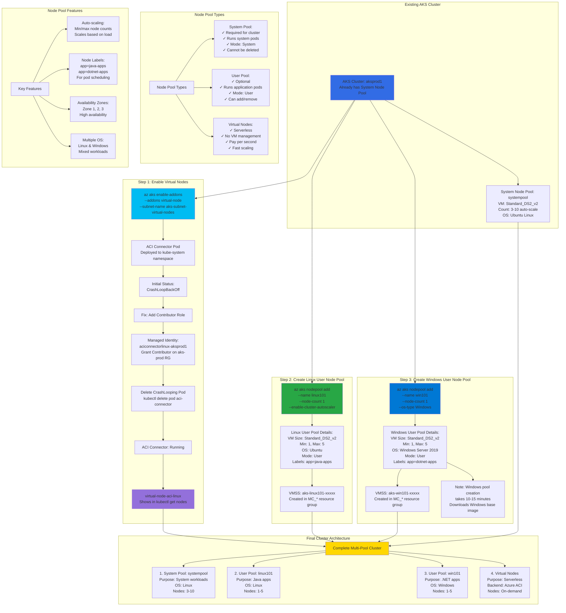

# Create Azure AKS Linux, Windows and Virtual Node Pools

## 📊 Architecture & Workflow Diagram



### Understanding the Diagram

- **Multi-Pool Architecture**: Production AKS cluster supports **multiple node pools** - one **system pool** (required), multiple **user pools** (optional for workload isolation), and **virtual nodes** (serverless)
- **System vs User Pools**: **System pools** (mode: System) run critical **Kubernetes components** and cannot be deleted, while **user pools** (mode: User) run **application workloads** and can be added/removed freely
- **Virtual Nodes Enablement**: Enable **serverless virtual nodes** addon to schedule pods on **Azure Container Instances** (ACI) instead of VMs, providing **rapid scaling** and **pay-per-second** billing
- **ACI Connector Fix**: The **aci-connector-linux pod** initially crashes due to missing permissions; fix by granting **Contributor role** to the **aciconnectorlinux managed identity** on the resource group
- **Linux User Pool**: Create dedicated **Linux node pool** (linux101) with **custom labels** (app=java-apps) for running Java applications, with **auto-scaling** from 1 to 5 nodes
- **Windows User Pool**: Add **Windows Server 2019 node pool** (win101) for .NET Framework apps, note that Windows pools take **10-15 minutes** to provision due to large Windows container image download
- **Node Pool Labels**: Each user pool has **custom node labels** (app=java-apps, app=dotnet-apps) used by **nodeSelector** in pod specs to schedule workloads on specific pool types
- **Auto-scaling per Pool**: Each node pool has **independent auto-scaling** configuration with min/max node counts, allowing different scaling profiles for different workload types
- **Availability Zones**: Node pools deployed across **multiple availability zones** (1, 2, 3) for **high availability**, ensuring pods survive datacenter-level failures
- **Mixed OS Support**: AKS supports **Linux and Windows workloads** in the same cluster, enabling **lift-and-shift** of Windows applications while running modern Linux microservices

---

## Step-01: Introduction
- Enable Virtual Nodes (Serverless)
- Create Linux User Node pool
- Create Windows User Node pool


## Step-02: Enable Virtual Nodes on our AKS Cluster
### Step-02-01: Enable Virtual Nodes Add-On on our AKS Cluster
```
# Verify Environment Variables
echo ${AKS_CLUSTER}, ${AKS_VNET_SUBNET_VIRTUALNODES}

# Enable Virtual Nodes on AKS Cluster
az aks enable-addons \
    --resource-group ${AKS_RESOURCE_GROUP} \
    --name ${AKS_CLUSTER} \
    --addons virtual-node \
    --subnet-name ${AKS_VNET_SUBNET_VIRTUALNODES}

# List Nodes
kubectl get nodes   

# List Virtual Nodes ACI Pods
kubectl get pods -n kube-system

# Sample Output for Reference
Kalyans-Mac-mini:~ kalyanreddy$ kubectl get pods -n kube-system
NAME                                         READY   STATUS             RESTARTS   AGE
aci-connector-linux-6d57ccbf8b-bj6rk         0/1     CrashLoopBackOff   8          17m
azure-cni-networkmonitor-pmbvh               1/1     Running            0          33m
azure-ip-masq-agent-rjvbd                    1/1     Running            0          33m


# Verify Logs ACI Connector
kubectl get pods -n kube-system
kubectl -n kube-system logs -f $(kubectl get po -n kube-system | egrep -o 'aci-connector-linux-[A-Za-z0-9-]+')
```
### Step-02-02: Fix ACI Connector CrashLoopBackOff Issue
- Go to Services -> Managed Identities -> aciconnectorlinux-aksprod1 
- Azure Role Assignments
    - Add Role Assignment
    - Scope: Resource Group
    - Subscription: Pay-As-You-Go
    - Resource Group: aks-prod
    - Role: Contributor
- Click on **SAVE**

### Step-02-03: Delete ACI Connector Pod to recreate it 
```
# List Pods
kubectl get pods -n kube-system

# Delete aci-connector-linux pod to recreate it
kubectl -n kube-system delete pod <ACI-Connector-Pod-Name>
kubectl -n kube-system delete pod $(kubectl get po -n kube-system | egrep -o 'aci-connector-linux-[A-Za-z0-9-]+')

# List Pods (ACI Connector Pod should be running)
kubectl get pods -n kube-system
```

### Step-02-04: List Virtual Nodes and See if listed
```
# List Nodes
kubectl get nodes

# Sample Output
Kalyans-Mac-mini:~ kalyanreddy$ kubectl get nodes
NAME                                 STATUS   ROLES   AGE     VERSION
aks-systempool-35488542-vmss000000   Ready    agent   43m     v1.17.11
virtual-node-aci-linux               Ready    agent   6m53s   v1.14.3-vk-azure-aci-vv1.3.0
Kalyans-Mac-mini:~ kalyanreddy$ 
```

## Step-03: Create Linux User Node Pool

### Step-03-01: Create Linux User Node Pool
```
# Create New Linux Node Pool 
az aks nodepool add --resource-group ${AKS_RESOURCE_GROUP} \
                    --cluster-name ${AKS_CLUSTER} \
                    --name linux101 \
                    --node-count 1 \
                    --enable-cluster-autoscaler \
                    --max-count 5 \
                    --min-count 1 \
                    --mode User \
                    --node-vm-size Standard_DS2_v2 \
                    --os-type Linux \
                    --labels nodepool-type=user environment=production nodepoolos=linux app=java-apps \
                    --tags nodepool-type=user environment=production nodepoolos=linux app=java-apps \
                    --zones {1,2,3}

```
### Step-03-02: List Node Pools & Nodes
```
# List Node Pools
az aks nodepool list --cluster-name ${AKS_CLUSTER} --resource-group ${AKS_RESOURCE_GROUP} -o table
Note: Understand the mode System vs User

# List Nodes using Labels
kubectl get nodes -o wide -l nodepoolos=linux
kubectl get nodes -o wide -l app=java-apps
```


## Step-04: Create a Node Pool for Windows Apps
- To run an AKS cluster that supports node pools for Windows Server containers, your cluster needs to use a network policy that uses [Azure CNI](https://docs.microsoft.com/en-us/azure/aks/concepts-network#azure-cni-advanced-networking) (advanced) network plugin
- Default windows Node size is Standard_D2s_v3 as on today
- The following limitations apply to Windows Server node pools:
  - The AKS cluster can have a maximum of 10 node pools.
  - The AKS cluster can have a maximum of 100 nodes in each node pool.
  - The Windows Server node pool name has a limit of 6 characters.

### Step-04-01: Create Windows Node Pool
```
# Create New Windows Node Pool 
az aks nodepool add --resource-group ${AKS_RESOURCE_GROUP} \
                    --cluster-name ${AKS_CLUSTER} \
                    --os-type Windows \
                    --name win101 \
                    --node-count 1 \
                    --enable-cluster-autoscaler \
                    --max-count 5 \
                    --min-count 1 \
                    --mode User \
                    --node-vm-size Standard_DS2_v2 \
                    --labels environment=production nodepoolos=windows app=dotnet-apps nodepool-type=user \
                    --tags environment=production nodepoolos=windows app=dotnet-apps nodepool-type=user \
                    --zones {1,2,3}
```
### Step-04-02: List Node Pools & Nodes
```
# List Node Pools
az aks nodepool list --cluster-name ${AKS_CLUSTER} --resource-group ${AKS_RESOURCE_GROUP} --output table

# List Nodes using Labels
kubectl get nodes -o wide
kubectl get nodes -o wide -l nodepoolos=linux
kubectl get nodes -o wide -l nodepoolos=windows
kubectl get nodes -o wide -l environment=production
```

```
# List Node Pools
az aks nodepool list --cluster-name ${AKS_CLUSTER} --resource-group ${AKS_RESOURCE_GROUP} --output table

# Sample Output (for reference)
Name        OsType    KubernetesVersion    VmSize           Count    MaxPods    ProvisioningState    Mode
----------  --------  -------------------  ---------------  -------  ---------  -------------------  ------
linux101    Linux     1.17.13              Standard_DS2_v2  1        30         Succeeded            User
systempool  Linux     1.17.13              Standard_DS2_v2  1        30         Succeeded            System
win101      Windows   1.17.13              Standard_DS2_v2  1        30         Succeeded            User

```


## References
- [Windows Node Pools](https://docs.microsoft.com/en-us/azure/aks/windows-container-cli)