# Deploy Apps to Azure AKS Linux, Windows and Virtual Node Pools

## 📊 Architecture & Workflow Diagram

```mermaid
graph TB
    subgraph "Multi-Pool AKS Cluster"
        SystemNodePool[System Node Pool: systempool<br/>Label: app=system-apps]
        LinuxNodePool[Linux Node Pool: linux101<br/>Label: app=java-apps]
        WindowsNodePool[Windows Node Pool: win101<br/>Label: app=dotnet-apps]
        VirtualNodes[Virtual Nodes<br/>Label: type=virtual-kubelet]
    end
    
    subgraph "App 1: Webserver - System Pool"
        App1Deploy[01-Webserver-Apps<br/>Deployment]
        App1Deploy --> App1Selector[nodeSelector:<br/>app: system-apps]
        App1Selector --> App1Pods[Nginx Pods<br/>Scheduled on systempool]
        App1Deploy --> App1Svc[Service: LoadBalancer<br/>Public IP]
        App1Pods --> App1Svc
    end
    
    subgraph "App 2: Java App - Linux Pool"
        App2Deploy[02-Java-Apps<br/>Deployment]
        App2Deploy --> App2Selector[nodeSelector:<br/>app: java-apps]
        App2Selector --> App2Pods[Java Pods<br/>Scheduled on linux101]
        App2Deploy --> App2Svc[Service: LoadBalancer<br/>Public IP]
        App2Pods --> App2Svc
    end
    
    subgraph "App 3: .NET App - Windows Pool"
        App3Deploy[03-Windows-DotNet-Apps<br/>Deployment]
        App3Deploy --> App3Selector[nodeSelector:<br/>app: dotnet-apps]
        App3Selector --> App3Pods[.NET Pods<br/>Scheduled on win101<br/>Windows Server 2019]
        App3Deploy --> App3Svc[Service: LoadBalancer<br/>Public IP]
        App3Pods --> App3Svc
    end
    
    subgraph "App 4: Virtual Node App - Serverless"
        App4Deploy[04-VirtualNode-Apps<br/>Deployment]
        App4Deploy --> App4Selector[nodeSelector:<br/>type: virtual-kubelet<br/>kubernetes.io/role: agent<br/>beta.kubernetes.io/os: linux]
        App4Deploy --> App4Tolerations[tolerations:<br/>- virtual-kubelet.io/provider<br/>- azure.com/aci]
        App4Selector --> App4Pods[Nginx Pods<br/>Scheduled on Virtual Nodes<br/>Azure Container Instances]
        App4Deploy --> App4Svc[Service: LoadBalancer<br/>Public IP]
        App4Pods --> App4Svc
    end
    
    subgraph "NodeSelector Concept"
        NodeSelectorConcept[NodeSelector Mechanism]
        NodeSelectorConcept --> NS1[Pod spec defines nodeSelector]
        NS1 --> NS2[Scheduler matches pod labels<br/>with node labels]
        NS2 --> NS3[Pod scheduled on<br/>matching node only]
    end
    
    subgraph "Tolerations Concept"
        TolerationsConcept[Tolerations for Virtual Nodes]
        TolerationsConcept --> T1[Virtual Nodes have taints]
        T1 --> T2[Pods need matching tolerations<br/>to be scheduled]
        T2 --> T3[Prevents accidental<br/>serverless scheduling]
    end
    
    subgraph "Deployment Commands"
        Deploy[kubectl apply -R -f kube-manifests/]
        Deploy --> DeployAll[Deploys all 4 applications]
        DeployAll --> Verify[kubectl get pods -o wide<br/>See NODE column]
        Verify --> CustomOutput[kubectl get pod -o=custom-columns=<br/>NODE-NAME:.spec.nodeName,<br/>POD-NAME:.metadata.name]
    end
    
    subgraph "Application Access"
        GetServices[kubectl get svc<br/>Get public IPs for each app]
        GetServices --> Access1[Webserver: http://IP/app1/index.html<br/>Running on systempool]
        GetServices --> Access2[Java App: http://IP<br/>Running on linux101<br/>Login: admin101/password101]
        GetServices --> Access3[.NET App: http://IP<br/>Running on win101]
        GetServices --> Access4[Virtual App: http://IP<br/>Running on ACI]
    end
    
    App1Selector --> SystemNodePool
    App2Selector --> LinuxNodePool
    App3Selector --> WindowsNodePool
    App4Selector --> VirtualNodes
    App4Tolerations --> VirtualNodes
    
    style SystemNodePool fill:#326ce5
    style LinuxNodePool fill:#28a745
    style WindowsNodePool fill:#0078d4
    style VirtualNodes fill:#9370db
    style App1Svc fill:#ffd700
    style App2Svc fill:#ffd700
    style App3Svc fill:#ffd700
    style App4Svc fill:#ffd700
```



### Understanding the Diagram

- **NodeSelector Mechanism**: Pods use **nodeSelector** field in spec to define **required node labels**, and Kubernetes scheduler **matches pod requirements** with **node labels** to place pods on appropriate nodes
- **System Pool Targeting**: **Webserver app** uses `nodeSelector: app=system-apps` to schedule on the **system node pool**, demonstrating that system pools can also run user workloads if needed
- **Linux Pool Targeting**: **Java application** uses `nodeSelector: app=java-apps` to ensure pods run exclusively on the **linux101 node pool**, providing workload isolation and dedicated resources
- **Windows Pool Targeting**: **.NET application** uses `nodeSelector: app=dotnet-apps` to schedule on **Windows Server 2019 nodes** (win101 pool), enabling legacy .NET Framework apps in Kubernetes
- **Virtual Node Requirements**: Scheduling pods on **virtual nodes** requires **both nodeSelector AND tolerations** because virtual nodes have **taints** that prevent accidental serverless scheduling
- **Tolerations Explained**: Virtual nodes have **taints** (virtual-kubelet.io/provider, azure.com/aci) that **repel** pods by default; pods need matching **tolerations** to overcome these taints and schedule on serverless nodes
- **Multi-App Deployment**: Deploy all four applications with **single command** (kubectl apply -R -f kube-manifests/), and each app automatically routes to its **designated node pool** based on selectors
- **LoadBalancer per App**: Each application gets its own **LoadBalancer service** with a **unique public IP**, allowing **independent access** and **traffic management** for each workload type
- **Verification Strategy**: Use `kubectl get pods -o wide` to see the **NODE column** showing which node each pod is scheduled on, confirming the **nodeSelector** strategy is working correctly
- **Workload Segregation Benefits**: This architecture provides **resource isolation**, **independent scaling**, **OS-specific optimizations**, and **cost optimization** by routing workloads to appropriate compute resources

---

## Step-01: Introduction
- Understand Kubernetes Node Selector concept
- Deploy Apps to different nodepools based on Node Selectors

## Step-02: Review Kubernetes Manifests

### 01-Webserver-Apps: Schedule on System NodePool
- Review kubernetes manifests from **kube-manifests/01-Webserver-Apps**
```yaml
# To schedule pods on based on NodeSelectors
      nodeSelector:
        app: system-apps
```

### 02-Java-Apps: Schedule on Linux101 NodePool
- Review kubernetes manifests from **kube-manifests/02-Java-Apps**
```yaml
# To schedule pods on based on NodeSelectors
      nodeSelector:
        app: java-apps            
```
### 03-Windows-DotNet-Apps: Schedule on Win101 NodePool
```yaml
# To schedule pods on based on NodeSelectors
      nodeSelector:
        #"beta.kubernetes.io/os": windows
        app: dotnet-apps
```
### 04-VirtualNode-Apps : Schedule on Virtual Nodes (Serverless)
```yaml
# To schedule pods on Azure Virtual Nodes            
      nodeSelector:
        kubernetes.io/role: agent
        beta.kubernetes.io/os: linux
        type: virtual-kubelet
      tolerations:
      - key: virtual-kubelet.io/provider
        operator: Exists
      - key: azure.com/aci
        effect: NoSchedule   
```

## Step-03: Deploy Apps based on NodeSelectors and Verify
```
# Deploy Apps
kubectl apply -R -f kube-manifests/

# List Pods
kubectl get pods -o wide
Note-1: Review the Node section in the output to understand on which node each pod is scheduled
Note-2: Windows app tool 12 minutes to download the image and start (sometimes).

# List Pods with Node Name where it scheduled
kubectl get pod -o=custom-columns=NODE-NAME:.spec.nodeName,POD-NAME:.metadata.name 
```

## Step-04: Access Applications
```
# List Services to get Public IP for each service we deployed 
kubectl get svc

# Access Webserver App (Running on System Nodepool)
http://<public-ip-of-webserver-app>/app1/index.html

# Access Java-App (Running on linux101 nodepool)
http://<public-ip-of-java-app>
Username: admin101
Password: password101

# Access Windows App (Running on win101 nodepool)
http://<public-ip-of-windows-app>

# Access App deployed on Virtual Nodes (Running on ACI Virtual Nodes)
http://<public-ip-of-webserver-app>
```

## Step-05: Clean-Up
```
# Delete Apps
kubectl delete -R -f kube-manifests/

# Delete Resource Group to delete all NodePools and Cluster
az group delete -n ${AKS_RESOURCE_GROUP}

# Delete Users and Groups in AD
Group: aksadmins
User: aksadmin1@stacksimplifygmail.onmicrosoft.com
```

