# Terraform Command Basics

## 📊 Architecture & Workflow Diagram

```mermaid
graph TB
    subgraph "Terraform Installation & Setup"
        Install[Install Terraform]
        Install --> Verify[terraform version<br/>Check installation]
        Verify --> InstallAzCLI[Install Azure CLI<br/>az --version]
        InstallAzCLI --> AzLogin[az login<br/>Authenticate to Azure]
    end
    
    subgraph "Terraform Configuration Files"
        TFFiles[Terraform Files .tf]
        TFFiles --> Provider[provider.tf:<br/>Configure azurerm provider<br/>Define version constraints]
        TFFiles --> Main[main.tf:<br/>Define resources<br/>Resource groups, networks, etc.]
        TFFiles --> Variables[variables.tf:<br/>Input variables<br/>Parameterize configurations]
        TFFiles --> Outputs[outputs.tf:<br/>Output values<br/>Export resource attributes]
    end
    
    subgraph "terraform init - Initialize"
        Init[terraform init]
        Init --> DownloadProviders[Download Providers<br/>Installs azurerm provider<br/>Stores in .terraform/ folder]
        DownloadProviders --> LockFile[terraform.lock.hcl<br/>Lock provider versions]
        DownloadProviders --> TFFolder[.terraform/ directory<br/>Contains provider binaries]
    end
    
    subgraph "terraform validate - Syntax Check"
        Validate[terraform validate]
        Validate --> CheckSyntax[Check Configuration Syntax]
        CheckSyntax --> ValidResult{Valid?}
        ValidResult -->|Yes| ValidOK[✓ Configuration valid]
        ValidResult -->|No| Errors[Show syntax errors]
    end
    
    subgraph "terraform plan - Preview Changes"
        Plan[terraform plan]
        Plan --> ReadState[Read terraform.tfstate<br/>Current state]
        Plan --> CompareDesired[Compare desired vs current state]
        CompareDesired --> ShowChanges[Show execution plan:<br/>+ Create<br/>~ Modify<br/>- Delete]
        ShowChanges --> SavePlan[Optional: -out=plan.tfplan<br/>Save plan for apply]
    end
    
    subgraph "terraform apply - Execute Changes"
        Apply[terraform apply]
        Apply --> ConfirmPrompt[Show plan<br/>Ask for confirmation:<br/>yes/no]
        ConfirmPrompt -->|yes| ExecuteChanges[Execute Changes<br/>Create/modify/delete resources]
        ConfirmPrompt -->|no| Cancel[Cancel operation]
        ExecuteChanges --> UpdateState[Update terraform.tfstate<br/>Record new state]
    end
    
    subgraph "terraform show - Inspect State"
        Show[terraform show]
        Show --> DisplayState[Display current state<br/>Show all managed resources<br/>and their attributes]
    end
    
    subgraph "terraform refresh - Sync State"
        Refresh[terraform refresh]
        Refresh --> QueryAzure[Query Azure resources<br/>Get current state from cloud]
        QueryAzure --> UpdateStateFile[Update terraform.tfstate<br/>Sync with reality]
    end
    
    subgraph "terraform providers - List Providers"
        Providers[terraform providers]
        Providers --> ListProviders[List required providers:<br/>hashicorp/azurerm<br/>hashicorp/random<br/>etc.]
    end
    
    subgraph "terraform destroy - Clean Up"
        Destroy[terraform destroy]
        Destroy --> DestroyPlan[Show destroy plan<br/>List resources to delete]
        DestroyPlan --> ConfirmDestroy[Confirm: yes/no]
        ConfirmDestroy -->|yes| DeleteResources[Delete all managed resources]
        DeleteResources --> ClearState[Clear terraform.tfstate]
    end
    
    subgraph "State Management"
        StateFile[terraform.tfstate]
        StateFile --> S1[Tracks managed resources]
        StateFile --> S2[Maps config to real resources]
        StateFile --> S3[Stores resource metadata]
        StateFile --> S4[Critical for team collaboration]
        StateFile --> S5[Backend: local or remote<br/>Azure Storage, S3, Terraform Cloud]
    end
    
    TFFiles --> Init
    Init --> Validate
    Validate --> Plan
    Plan --> Apply
    Apply --> Show
    Show --> Refresh
    Refresh --> Destroy
    
    UpdateState --> StateFile
    UpdateStateFile --> StateFile
    
    style Install fill:#5c4ee5
    style Init fill:#326ce5
    style Plan fill:#00bcf2
    style Apply fill:#28a745
    style Destroy fill:#dc3545
    style StateFile fill:#ffd700
```



### Understanding the Diagram

- **Terraform Installation**: Install Terraform binary and verify with `terraform version`, then install **Azure CLI** for authenticating to Azure, and run **az login** to set up credentials
- **terraform init**: The **first command** to run, downloads provider plugins (azurerm) and stores them in **.terraform/ directory**, creating a **terraform.lock.hcl** to lock provider versions
- **terraform validate**: Validates **configuration syntax** without accessing any remote services, checking for errors in **.tf files** like missing required arguments or invalid attribute names
- **terraform plan**: Creates an **execution plan** showing what Terraform will do before making changes - displays resources to **create (+)**, **modify (~)**, or **delete (-)**, without actually changing anything
- **terraform apply**: **Executes the plan** to create, update, or delete infrastructure, prompts for confirmation (unless **-auto-approve** flag used), and updates **terraform.tfstate** with new resource information
- **terraform.tfstate**: The **state file** that tracks all managed resources, maps Terraform config to real Azure resources, and is **critical for knowing** what exists and detecting drift
- **terraform show**: Displays the **current state** in human-readable format, showing all resources Terraform is managing and their current attribute values
- **terraform refresh**: Queries **Azure directly** to get current resource state and updates **terraform.tfstate** to match reality, useful when resources are modified outside Terraform
- **terraform providers**: Lists all **required providers** and their versions, useful for understanding dependencies and troubleshooting provider-related issues
- **terraform destroy**: **Deletes all resources** managed by Terraform, shows a plan of what will be destroyed, requires confirmation, and cleans up **terraform.tfstate** file

---

## Step-01: Introduction
- Install Terraform
- Understand what is Terraform
- Understand Terrafom basic / essential commands
  - terraform version
  - terraform init
  - terraform plan
  - terraform validate
  - terraform apply
  - terraform show
  - terraform refresh
  - terraform providers
  - terraform destroy


## Pre-requisite-1: Install Visual Studio Code (VS Code Editor)
- [Download Visual Studio Code](https://code.visualstudio.com/download)

## Pre-requisite-2: Install HashiCorp Terraform plugin for VS Code
- [Install Terraform Plugin for VS Code](https://marketplace.visualstudio.com/items?itemName=HashiCorp.terraform)

## Step-02: Terraform Install
- **Referene Link:**
- [Download Terraform](https://www.terraform.io/downloads.html)
- [Install Terraform](https://learn.hashicorp.com/tutorials/terraform/install-cli)

### MAC OS
```
# Install on MAC OS
brew install hashicorp/tap/terraform

# Verify Terraform Version
terraform version

# To Upgrade on MAC OS
brew upgrade hashicorp/tap/terraform

# Verify Terraform Version
terraform version

# Verify Installation
terraform help
terraform help plan

# Enable Tab Completion
terraform -install-autocomplete
```

## Step-03: Install Azure CLI
```
# AZ CLI Current Version (if installed)
az --version

# Install Azure CLI (if not installed)
brew update && brew install azure-cli

# Upgrade az cli version
az --version
brew upgrade azure-cli 
[or]
az upgrade
az --version

# Azure CLI Login
az login

# List Subscriptions
az account list

# Set Specific Subscription (if we have multiple subscriptions)
az account set --subscription="SUBSCRIPTION_ID"
```

## Step-04: Understand terrafrom init & provider azurerm
- Understand about [Terraform Providers](https://www.terraform.io/docs/providers/index.html)
- Understand about [azurerm terraform provider](https://registry.terraform.io/providers/hashicorp/azurerm/latest/docs), version and features
- terraform init: Initialize a Terraform working directory
- terraform apply: Builds or changes infrastructure
```
# Change Directory to v1 folder
cd v1-terraform-azurerm-provider

# Initialize Terraform
terraform init

# Explore ".terraform" folder
cd .terraform
Go inside folders and review (.terraform/plugins/registry.terraform.io/hashicorp/azurerm/2.35.0/darwin_amd64)

# Execute terraform apply
terraform apply 
ls -lrta
discuss about "terraform.tfstate"

# Delete .terraform folder (Understand what happens)
rm -rf .terraform 
terraform apply (Should say could not load plugin)
To fix execute "terraform init" 

# Clean-Up V1 folder
rm terraform.tfstate
ls -lrta
```

## Step-04: Understand terraform plan, apply & Create Azure Resource Group
- Authenticate to Azure using Azure CLI `az login`
- Understand about `terraform plan`
- Understand about `terraform apply`
- Create Azure Resource Group using Terraform
- terraform init: Initialize a Terraform working directory
- terraform plan: Generate and show an execution plan
- terraform apply: Builds or changes infrastructure
```
# Change Directory to v2 folder
cd ../
cd v2-terraform-azurerm-resource-group

# Initialize Terraform
terraform init

# Validate terraform templates
terraform validate

# Dry run to see what resources gets created
terraform plan

# Create Resource Group in Azure
terraform apply
```
- Verify if resource group created in Azure using Management Console


## Step-05: Make changes to Resource Group and Deploy
- Add tags to Resource Group as below
```
# Create a Azure Resource Group
resource "azurerm_resource_group" "aksdev" {
  name     = "aks-rg2-tf"
  location = "Central US"

# Add Tags
  tags = {
    "environment" = "k8sdev"
  }
}
```
- Run terraform plan and apply
```
# Dry run to see what resources gets created
terraform plan

# Create Resource Group in Azure
terraform apply
```
- Verify if resource group created in Azure using Management Console

## Step-06: Modify Resource Group Name and Understand what happens
- Change Resource Group name from `aks-rg2-tf` to `aks-rg2-tf2` in main.tf
```
# Understand what happens with this change
terraform plan

# Apply changes
terraform apply
```
- Verify if resource group with new name got re-created in Azure using Management Console


## Step-07: Understand terraform refresh in detail
- **terraform refresh:** Update local state file against real resources in cloud
- **Desired State:** Local Terraform Manifest (main.tf)
- **Current State:**  Real Resources present in your cloud
- **Command Order of Execution:** refresh, plan, make a decision, apply
- Why? Lets understand that in detail about this order of execution
### Step-07-01: Add a new tag to Resource Group using Azure Portal Management console 
```
demotag: refreshtest
```

### Step-07-02: Execute terraform plan  
- You should observe no changes to local state file because plan does the comparison in memory 
- no update to tfstate file locally about the change 
```
# Execute Terraform plan
terraform plan 
```
### Step-07-03: Execute terraform refresh 
- You should see local state file updated with new demo tag
```
# Execute terraform refresh
ls -lrta
terraform refresh
diff terraform.tfstate.backup terraform.tfstate
```
### Step-07-04: Why you need to the execution in this order (refresh, plan, make a decision, apply) ?
- There are changes happened in your infra manually and not via terraform.
- Now decision to be made if you want those changes or not.
- **Choice-1:** If you dont want those changes proceed with terraform apply so manual changes will be removed.
- **Choice-2:** If you want those changes, refer terraform.tfstate file about changes and embed them in your terraform manifests (example: main.tf) and proceed with flow (referesh, plan, review execution plan and apply)

### Step-07-05: I picked choice-2, so i will update the tags in main.tf
- Update in main.tf
```
  tags = {
    "environment" = "k8sdev"
    "demotag"     = "refreshtest"
  }
```
### Step-07-06: Execute the commands to make our manual change official in terraform manifests and tfstate files perspective  
```
# Execute commands
ls -lrta
terraform refresh
diff terraform.tfstate.backup terraform.tfstate
terraform plan
terraform apply
```

## Step-08: Understand terraform show, providers
- **terraform show:** Inspect Terraform state or plan
- **terraform providers:** Prints a tree of the providers used in the configuration
```
# Terraform Show
terraform show

# Terraform Providers
terraform providers
```


## Step-09: Understand terraform destroy
- Understand about `terraform destroy`
```
# Delete newly created Resource Group in Azure 
terraform destroy

# Delete State (Deleting for github repo case for course purpose)
rm -rf .terraform
rm -rf terraform.tfstate
```


## References
- [Main Azure Resource Manager Reference](https://www.terraform.io/docs/providers/azurerm/index.html)
- [Azure Get Started on Terraform](https://learn.hashicorp.com/collections/terraform/azure-get-started)
- [Terraform Resources and Modules](https://www.terraform.io/docs/configuration/index.html#resources-and-modules)
