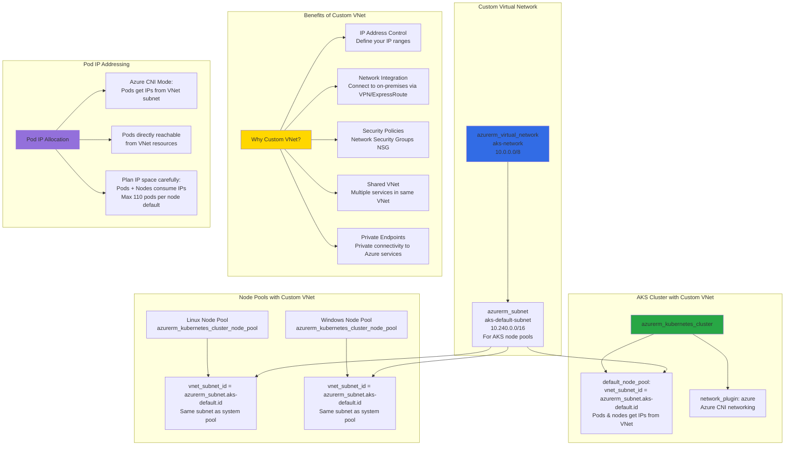

# Create Azure AKS Cluster using Custom Virtual Network

## 📊 Architecture & Workflow Diagram



### Understanding the Diagram

- **Custom Virtual Network**: Create dedicated **VNet** (10.0.0.0/8) and **subnet** (10.240.0.0/16) via Terraform for full control over IP addressing and network topology
- **VNet Subnet Reference**: All node pools (system, linux, windows) use **vnet_subnet_id** parameter referencing the custom subnet, ensuring all nodes deploy into the same network
- **Azure CNI Networking**: With **network_plugin: azure**, pods receive **IP addresses directly from the VNet subnet**, not from an overlay network, enabling direct connectivity
- **IP Address Planning**: Each **node consumes 1 IP**, and with default max **110 pods per node**, plan subnet size accordingly (e.g., 10 nodes × 111 IPs = 1110 IPs minimum)
- **Enterprise Integration**: Custom VNet enables **VPN/ExpressRoute** connectivity to on-premises networks, **private endpoints** for Azure services, and **NSG rules** for traffic filtering
- **Shared VNet Scenario**: Deploy AKS in existing VNet alongside **VMs**, **databases**, and other Azure services for unified network architecture and centralized management
- **Pod-to-Pod Communication**: Pods can directly communicate using **VNet IPs** without NAT, simplifying network troubleshooting and enabling seamless integration with Azure services
- **Network Security Groups**: Apply **NSG rules** to the AKS subnet for controlling inbound/outbound traffic, implementing network-level security policies across all nodes and pods
- **State Storage Key**: Use different **backend storage key** (prodtfstatecustomvnet) for this cluster to maintain separate Terraform state from previous deployments
- **Deployment Benefits**: Custom VNet provides **production-grade networking**, **IP address control**, **security boundaries**, and **hybrid connectivity** for enterprise AKS deployments

---

## Step-01: Introduction
- Create a Custom Virtual Network and Subnet
- Reference the same in AKS Cluster and Node Pools linux and windows
- Create the AKS Cluster with nodepools on custom vnet
- Deploy sample Apps and test
- Destroy the cluster after tests

## Step-02: Create Virtual Network and AKS Default Subnet
- Create [Virtual Network using Terraform](https://registry.terraform.io/providers/hashicorp/azurerm/latest/docs/resources/virtual_network)
- Create a separate subnet for AKS Nodepools
- Create a file named **11-virtual-network.tf**
```
# Create Virtual Network
resource "azurerm_virtual_network" "aksvnet" {
  name                = "aks-network"
  location            = azurerm_resource_group.aks_rg.location
  resource_group_name = azurerm_resource_group.aks_rg.name
  address_space       = ["10.0.0.0/8"]
}

# Create a Subnet for AKS
resource "azurerm_subnet" "aks-default" {
  name                 = "aks-default-subnet"
  virtual_network_name = azurerm_virtual_network.aksvnet.name
  resource_group_name  = azurerm_resource_group.aks_rg.name
  address_prefixes     = ["10.240.0.0/16"]
}
```

## Step-03: Update 01-main.tf to change the state storage key name
- We are going to change the state storage key name considering this as a separate cluster for us because old cluster we destroyed using terraform destroy
```
# Configure Terraform State Storage
terraform {
  backend "azurerm" {
    resource_group_name   = "terraform-storage-rg"
    storage_account_name  = "terraformstatexlrwdrzs"
    container_name        = "prodtfstate"
    key                   = "terraform-custom-vnet.tfstate"
  }
}
```

## Step-04: Update variables.tf with environment name
- We are also going to change cluster environment name as dev2
```
# Azure AKS Environment Name
variable "environment" {
  type = string  
  description = "This variable defines the Environment"  
  default = "dev2"
}
```

## Step-05: Add below for default system, Linux, windows nodepools
- We will add this in following files
  - 07-aks-cluster.tf in default node pool
  - 08-aks-cluster-linux-user-nodepools.tf
  - 09-aks-cluster-windows-user-nodepools.tf
```
# AKS Default Subnet ID
vnet_subnet_id        = azurerm_subnet.aks-default.id 
```

## Step-06: Deploy Terraform Resources
```
# Change Directory to Terraform Manifests folder
cd 24-05-Create-AKS-Cluster-Custom-VNET/terraform-manifests-aks-custom-vnet

# Initialize Terraform
terraform init

# Validate Terraform manifests
terraform validate

# Review the Terraform Plan
terraform plan   # Verify terraform storage account in Azure to see if new file got created

# Deploy Terraform manifests
terraform apply 
```


## Step-07: Verify if Nodepools added successfully
```
# List Node Pools
az aks nodepool list --resource-group terraform-aks-dev2 --cluster-name  terraform-aks-dev2-cluster --output table

# Configure kubectl with Default Admin Credentials
az aks get-credentials --resource-group terraform-aks-dev2 --name  terraform-aks-dev2-cluster --admin

# List Nodes using Labels
kubectl get nodes -o wide
kubectl get nodes -o wide -l nodepoolos=linux
kubectl get nodes -o wide -l nodepoolos=windows
kubectl get nodes -o wide -l environment=dev2
```


## Step-06: Deploy Sample Applications for all 3 node pools
- Webserver App to System Nodepool
- Sample Java App to Linux Nodepool
- Dotnet App to Windows Nodepool
```
# Change Directory 
cd 24-05-Create-AKS-Cluster-Custom-VNET/

# Deploy All Apps
kubectl apply -R -f kube-manifests/

# List Pods
kubectl get pods -o wide
```

## Step-07: Access Applications
```
# List Services to get Public IP for each service we deployed 
kubectl get svc

# Access Webserver App (Running on System Nodepool)
http://<public-ip-of-webserver-app>/app1/index.html

# Access Java-App (Running on linux101 nodepool)
http://<public-ip-of-java-app>
Username: admin101
Password: password101

# Access Windows App (Running on win101 nodepool)
http://<public-ip-of-windows-app>
```

## Step-08: Destroy our Terraform Cluster
```
# Clean-Up Applications deployed
kubectl delete -R -f kube-manifests

# Change Directory 
cd 24-05-Create-AKS-Cluster-Custom-VNET/terraform-manifests-aks-custom-vnet

# Destroy all our Terraform Resources
terraform destroy
```