# Provision Azure AKS Cluster using Terraform and Azure DevOps

## 📊 Git Repository Workflow Diagram

```mermaid
graph TB
    subgraph "Repository Purpose"
        Purpose[This Git Repository]
        Purpose --> Contains[Contains Files for Pipeline]
        Contains --> TerraformFiles[Terraform Configuration Files<br/>Infrastructure as Code]
        Contains --> PipelineFile[azure-pipelines.yaml<br/>CI/CD Pipeline Definition]
    end
    
    subgraph "Usage Instructions"
        Usage[How to Use These Files]
        Usage --> Step1[1. Fork/Clone this repository]
        Step1 --> Step2[2. Create GitHub repository]
        Step2 --> Step3[3. Push files to your GitHub]
        Step3 --> Step4[4. Connect Azure DevOps to GitHub]
        Step4 --> Step5[5. Create pipeline from YAML]
        Step5 --> Step6[6. Configure variables & run]
    end
    
    subgraph "File Overview"
        Files[Repository Files]
        Files --> TF[Terraform Files: *.tf<br/>Define AKS infrastructure]
        Files --> YAMLPipeline[azure-pipelines.yaml<br/>DevOps automation]
        Files --> Docs[README.md<br/>Instructions & documentation]
    end
    
    style Purpose fill:#28a745
    style Usage fill:#0078d4
    style Files fill:#ffd700
```

### Understanding the Diagram

- **Repository Contents**: This folder contains **template files** to be checked into your own Git repository for Azure DevOps pipeline execution
- **Terraform Files**: Infrastructure as Code **.tf files** defining **AKS cluster**, **resource groups**, **Log Analytics**, and **Azure AD groups**
- **Pipeline YAML**: **azure-pipelines.yaml** orchestrates Terraform deployment across **Dev and QA environments** automatically
- **Git Workflow**: **Fork or copy** these files, create your **GitHub repository**, push files, and connect to **Azure DevOps**
- **Multi-Stage Deployment**: Pipeline validates Terraform, deploys to **Dev environment**, then deploys to **QA environment** sequentially
- **Variable Configuration**: Configure **environment** and **ssh_public_key** variables in Azure DevOps before running pipeline
- **Full Instructions**: See parent **README.md** for complete **step-by-step instructions** on setting up the entire workflow
- **Reusable Template**: Use these files as a **starting point** for your own AKS Terraform automation

---

## For Step by Step Instructions
- [Step by Step Instructions](https://github.com/stacksimplify/azure-aks-kubernetes-masterclass/tree/master/25-Azure-DevOps-Terraform-Azure-AKS)