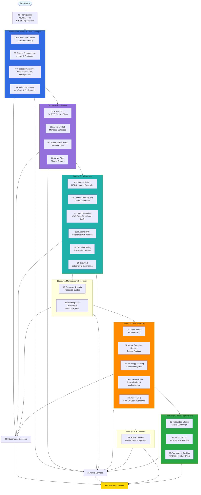

# Azure Kubernetes Service with Azure DevOps and Terraform 

## 📊 Course Architecture & Learning Path Diagram

### Understanding the Learning Path

- **Prerequisites Foundation**: Start with **Azure account setup** and **forking GitHub repositories** containing all course materials and code examples
- **Foundation Phase**: Master **Docker fundamentals**, create your first **AKS cluster**, and learn both **imperative** (kubectl) and **declarative** (YAML) approaches
- **Storage Phase**: Implement **persistent storage** using **Azure Disks**, **Azure Files**, **Azure MySQL**, and manage **secrets** for database credentials
- **Networking Phase**: Progress from basic **Ingress** to advanced features like **SSL/TLS certificates**, **ExternalDNS**, and **domain-based routing**
- **Resource Management**: Learn to **isolate workloads** using **namespaces** and control resource consumption with **requests, limits, and quotas**
- **Advanced Features**: Explore **Virtual Nodes** (serverless), **Azure Container Registry**, **Azure AD authentication**, and **autoscaling** (HPA & Cluster Autoscaler)
- **CI/CD Integration**: Build **end-to-end pipelines** with **Azure DevOps** for automated building, testing, and deployment to AKS clusters
- **Production Deployments**: Design **production-grade clusters** using **az aks CLI** and **Terraform**, implementing infrastructure as code best practices
- **30+ Kubernetes Concepts**: Master Pods, Deployments, Services, Ingress, Secrets, ConfigMaps, PV/PVC, RBAC, HPA, Cluster Autoscaler, and more
- **21 Azure Services**: Hands-on experience with AKS, Load Balancer, DNS, ACR, MySQL, Storage, Virtual Networks, Active Directory, DevOps, and more

---

## Course Modules 

| S.No | Azure Service Name |
| ---- | ---------------- |
| 1.   | Create Azure AKS Cluster using Azure Portal |
| 2.   | [Docker Fundamentals](https://github.com/stacksimplify/docker-fundamentals) |
| 3.   | Imperative Method: Kubernetes Fundamentals using kubectl |
| 4.   | Declarative Method: Kubernetes Fundamentals using YAML |
| 5.   | Azure Disks for AKS Storage |
| 5.1  | Custom Storage Class, PVC and PV |
| 5.2  | AKS default Storage class, PVC and PV |
| 5.3  | User Management Web Application Deployment with MySQL as storage using Storage Class, PVC and PV |
| 6.   | Azure MySQL for AKS Storage |
| 7.   | Kubernetes Secrets |
| 8.   | Azure Files for AKS Storage |
| 9.   | Ingress Basics |
| 10.  | Ingress Context path based Routing |
| 11.  | Azure DNS Zones - Delegate domain from AWS to Azure |
| 12.  | Ingress and External DNS with Azure DNS Zones|
| 13.  | Ingress Domain Name based Routing with External DNS |
| 14.  | Ingress SSL with LetsEncrypt |
| 15.  | Kubernetes Requests & Limits |
| 16.  | Kubernetes Namespaces |
| 16.1 | Kubernetes Namespaces - Imperative |
| 16.2 | Kubernetes Namespaces - Limit Range |
| 16.3 | Kubernetes Namespaces - Resource Quota |
| 17   | Azure Virtual Nodes for AKS |
| 17.1 | Azure Virtual Nodes Basics |
| 17.2 | Azure AKS Virtual Nodes Mixed Mode Deployments |
| 18   | Azure Container Registry for AKS |
| 18.1 | Integrate Azure Container Registry ACR with AKS |
| 18.2 | Azure AKS Pull Docker Images from ACR using Service Principal |
| 18.3 | Pull Docker Images from ACR using Service Principal and Run on Azure Virtual Nodes |
| 19   | Azure DevOps with AKS Cluster |
| 19.1 | Azure DevOps - Build and Push Docker Image to Azure Container Registry |
| 19.2 | Azure DevOps - Build, Push to ACR and Deploy to AKS |
| 19.3 | Azure DevOps - Create Starter Pipeline |
| 19.4 | Azure DevOps - Release Pipelines |
| 20   | Azure AKS - Enable HTTP Application Routing AddOn |
| 21   | Azure AKS Authentication with Azure AD and Kubernetes RBAC |
| 21.1 | Azure AKS Cluster Access with Multiple Clusters |
| 21.2 | Azure AD Integration with Azure AKS for Authentication |
| 21.3 | Kubernetes RBAC Role & Role Binding with Azure AD on AKS |
| 21.4 | Kubernetes RBAC Cluster Role & Role Binding with AD on AKS |
| 22   | Azure AKS Cluster Autoscaling |
| 22.1 | Azure AKS - Cluster Autoscaler |
| 22.2 | Azure AKS - Horizontal Pod Autoscaler HPA |
| 23   | Azure AKS Production Grade Cluster Design using AZ AKS CLI |
| 23.1 | Create Azure AKS Cluster using AZ AKS CLI |
| 23.2 | Create Azure AKS Linux, Windows and Virtual Node Pools |
| 23.3 | Deploy Apps to Azure AKS Linux, Windows and Virtual Node Pools|
| 24   | Provision Azure AKS Clusters using Terraform |
| 24.1 | Terraform Command Basics |
| 24.2 | Terraform Language Basics |
| 24.3 | Provision AKS Cluster using Terraform |
| 24.4 | Create AKS Cluster Linux and Windows Node Pools |
| 24.5 | Create Azure AKS Cluster using Custom Virtual Network |
| 25   | Provision Azure AKS using Terraform & Azure DevOps |

## Azure Services Covered

| S.No | Azure Service Name |
| -----| ------------------ |
| 01.  | Azure AKS  |
| 02.  | Azure Disks  |
| 03.  | Azure Files  |
| 04.  | Azure MySQL Database  |
| 05.  | Azure Storage Accounts  |
| 06.  | Azure Cloud Shell  |
| 07.  | Azure Load Balancer  |
| 08.  | Azure DNS Zones  |
| 09.  | Azure Container Registries ACR  |
| 10.  | Azure Container Registries ACR with Azure Service Principal |
| 11.  | Azure DevOps - Build Pipelines with ACR & Github Repositories |
| 12.  | Azure DevOps - Release Pipelines with AKS|
| 13.  | Azure Public IP Address|
| 14.  | Azure Standard Load Balancer|
| 15.  | Azure Virtual Networks|
| 16.  | Azure Active Directory|
| 17.  | Azure Container Instances - Virtual Nodes|
| 18.  | Azure AKS Windows and Linux User NodePools|
| 19.  | Azure Managed Service Identity - MSI|
| 20.  | Azure Virtual Machine Scale Sets|
| 21.  | Azure Log Analytics Workspaces for Azure Monitor|

## Kubernetes Concepts Covered

| S.No | Kubernetes Concept Name |
| ---- | ------------------- |
| 1.   | Kubernetes Architecture  |
| 2.   | Pods  |
| 3.   | ReplicaSets  |
| 4.   | Deployments  |
| 5.   | Services - Load Balancer Service  |
| 6.   | Services - Cluster IP Service  |
| 7.   | Services - External Name Service  |
| 8.   | Services - Ingress Service  |
| 9.   | Services - Ingress SSL & SSL Redirect  |
| 10.  | Services - Ingress & External DNS  |
| 11.  | Services - Domain Name based Routing  |
| 12.  | Imperative - with kubectl  |
| 13.  | Declarative - Declarative with YAML  |
| 14.  | Secrets |
| 15.  | Init Containers |
| 16.  | Requests & Limits |
| 17.  | Namespaces - Imperative |
| 18.  | Namespaces - Limit Range |
| 19.  | Namespaces - Resource Quota |
| 20.  | Storage Classes |
| 21.  | Persistent Volumes |
| 22.  | Persistent Volume Claims |
| 23.  | Services - Load Balancers |
| 24.  | Annotations |
| 25.  | HPA - Horizontal Pod Autoscaler |
| 26.  | CA - Cluster Autoscaler |
| 27.  | Config Maps |
| 28.  | RBAC - Role & Role Bindings |
| 29.  | RBAC - Cluster Role & Cluster Role Bindings |
| 30.  | Virtual Kubelet |
| 31.  | Secrets - Image Pull Secrets |

## List of Docker Images  on Docker Hub

| Application Name  | Docker Image Name |
| ----------------- | ----------------- |
| Simple Nginx V1  | stacksimplify/kubenginx:1.0.0  |
| Spring Boot Hello World API  | stacksimplify/kube-helloworld:1.0.0  |
| Simple Nginx V2  | stacksimplify/kubenginx:2.0.0  |
| Simple Nginx V3  | stacksimplify/kubenginx:3.0.0  |
| Simple Nginx V4  | stacksimplify/kubenginx:4.0.0  |
| Backend Application  | stacksimplify/kube-helloworld:1.0.0  |
| Frontend Application  | stacksimplify/kube-frontend-nginx:1.0.0  |
| Kube Nginx App1  | stacksimplify/kube-nginxapp1:1.0.0  |
| Kube Nginx App2  | stacksimplify/kube-nginxapp2:1.0.0  |
| User Management Web Application  | stacksimplify/kube-usermgmt-webapp:1.0.0-MySQLDB  |

## List of Docker Images you build in Azure Container Registry

| Application Name  | Docker Image Name |
| ----------------- | ----------------- |
| ACR attached to AKS  | YOUR_ACR_REPO.azurecr.io/app1/kube-nginx-acr:v1  |
| ACR with Service Principal | YOUR_ACR_REPO.azurecr.io/app2/acr-app2:v1   |
| ACR with Service Principal | YOUR_ACR_REPO.azurecr.io/custom2aksnginxapp1:BUILDID   |

## Sample Applications
- Nginx Applications
- User Management Web Application built using Spring Boot using MySQL as underlying storage

## What will students learn in your course?
- You will learn to build Azure AKS Production grade clusters using Azure AKS CLI
- You will learn terraform from basics and create terraform manifests for provisioning Azure AKS Production grade clusters
- You will learn to provision Azure AKS Clusters using Terraform and Azure DevOps. 
- You will learn 30+ kubernetes concepts and use 21 Azure Services in combination with Azure AKS
- You will implement DevOps concepts with Azure DevOps Continuous Integration Pipelines and Continuous Deliver Pipelines also called Release Pipelines
- You will write Azure DevOps CI Pipelines from scratch using Starter Pipelines
- You will write kubernetes manifests with confidence after going through live template writing sections
- You will learn Kubernetes Fundamentals in both imperative and declarative approaches
- You will learn writing & deploying k8s manifests for storage concepts like storage class, persistent volume claim pvc, mysql 
- You will learn to switch from native Azure Disks to Azure MySQL Database using k8s external name service
- You will learn writing and deploying load balancer k8s manifests for Azure Standard Load Balancer
- You will learn writing ingress k8s manifests by enabling features like context path based routing, domain name based routing,  SSL with LetsEncrypt and External DNS. 
- You will learn writing k8s manifests for Azure Virtual Nodes (serverless)  and do mixed mode workload deployments in both Azure Linux NodePools and Virtual Nodes. 
- You will learn using ACR - Azure Container Registry in combination with AKS in 3 ways (ACR Attach, using Service Principal, on Virtual Nodes). 
- You will learn to enable Autoscaling features like HPA & Cluster Autoscaler
- You will learn Docker fundamentals by implementing usecases like download image from Docker Hub and run on local desktop and build an image locally, test and push to Docker Hub.
- You will master many kubectl commands over the process
- You will learn to integrate Azure AKS with Azure Active Directory for AKS Admins to be created managed in Azure Active Directory
- You will learn Kubernetes RBAC concepts like role, role-binding, cluster role, cluster role binding in combination with Azure AD for Azure AKS granular level access

## Are there any course requirements or prerequisites?
- You must have an Azure Cloud account to follow with me for hands-on activities.
- You dont need to have any basic Docker or kubernetes knowledge to start this course.  

## Who are your target students?
- Azure Architects or Sysadmins or Developers who are planning to master Azure Kubernetes Service (AKS) for running applications on Kubernetes
- Any beginner who is interested in learning kubernetes on cloud using Azure AKS. 
- Any beginner who is interested in learning Azure DevOps, Terraform to provision Azure Kubernetes Clusters

## Github Repositories used for this course
- [Azure Kubernetes Service with Azure DevOps and Terraform](https://github.com/stacksimplify/azure-aks-kubernetes-masterclass)
- [Azure DevOps for Kubernetes Workloads running on Azure AKS Cluster](https://github.com/stacksimplify/azure-devops-github-acr-aks-app1)
- [Provision Azure AKS Cluster using Terraform and Azure DevOps](https://github.com/stacksimplify/azure-devops-aks-kubernetes-terraform-pipeline)
- [Docker Fundamentals](https://github.com/stacksimplify/docker-fundamentals)
- [Presentation with 250 Slides outlining the various architectures and designs we are going to do in this course](https://github.com/stacksimplify/azure-aks-kubernetes-masterclass/tree/master/ppt-presentation)
- **Important Note:** Please go to these repositories and FORK these repositories and make use of them during the course.

## Each of my courses come with
- Amazing Hands-on Step By Step Learning Experiences
- Real Implementation Experience
- Friendly Support in the Q&A section
- 30 Day "No Questions Asked" Money Back Guarantee!

## My Other AWS Courses
- [Udemy Enroll](https://github.com/stacksimplify/udemy-enroll)

## Stack Simplify Udemy Profile
- [Udemy Profile](https://www.udemy.com/user/kalyan-reddy-9/)

# AWS EKS - Elastic Kubernetes Service - Masterclass

