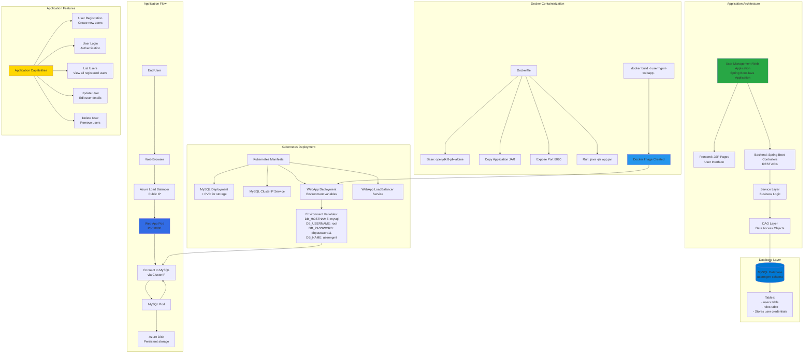

# Azure AKS User Management WebApp Demo

## 📊 Architecture & Workflow Diagram

### Understanding the Diagram

- **Spring Boot Application**: Full-stack **Java web application** built with **Spring Boot framework** featuring user registration, login, and CRUD operations for user management
- **Three-Tier Architecture**: Frontend (**JSP pages**) → Backend (**Spring Boot controllers**) → Database (**MySQL**), following standard enterprise application architecture patterns
- **MySQL Database**: Backend stores user data in **MySQL database** with **usermgmt schema** containing users and roles tables for persistent storage
- **Docker Containerization**: Application packaged as **Docker image** using **openjdk:8-jdk-alpine** base image, making it portable and deployable to any container platform
- **Kubernetes Deployment**: Complete **K8s manifests** for deploying MySQL (with persistent volume), ClusterIP service, web app deployment, and LoadBalancer service
- **Environment Variables**: App connects to database using **environment variables** (DB_HOSTNAME, DB_USERNAME, DB_PASSWORD, DB_NAME) injected into pods via deployment manifest
- **Internal Communication**: Web app connects to MySQL via **ClusterIP service** named "mysql", leveraging Kubernetes **internal DNS** for service discovery
- **Persistent Storage**: MySQL data stored on **Azure Disk** via **Persistent Volume Claim**, ensuring data survives pod restarts and rescheduling
- **External Access**: Users access application via **LoadBalancer service** with **public IP**, while MySQL remains internal (ClusterIP) for security
- **Demo Purpose**: This application demonstrates **end-to-end containerized application deployment** on AKS with database connectivity and persistent storage

---